 
EnergyPlus Version {{ engine.config["EnergyPlusVersion"] }}  
Automatically Generated {{ engine.month_year() }}


Prepared for:

U.S. Department of Energy  
Energy Efficiency and Renewable Energy  
Office of Building Technologies  
Washington, D.C.

Original Prepared by:

Robert H. Henninger and Michael J. Witte  
115 S. Wilke Road, Suite 105  
Arlington Heights, IL 60005-1500  
USA  
www.gard.com

This report was developed based upon funding from the Alliance for Sustainable Energy, LLC, Managing and Operating Contractor for the
National Renewable Energy Laboratory for the U.S. Department of Energy. Any opinions, findings, and conclusions or recommendations expressed in
this material are those of the author(s) and do not necessarily reflect those of the sponsor. Earlier work was supported by the Ernest Orlando Lawrence Berkeley National Laboratory, and by the National Energy Technology Laboratory and the National Renewable Energy Laboratory by
subcontract through the University of Central Florida/Florida Solar Energy Center.

This report was prepared as an account of work sponsored by an agency of the United States Government. Neither the United States Government nor any agency thereof, nor any of their employees, makes any warranty, express or implied, or assumes any legal liability or responsibility for the accuracy, completeness, or usefulness of any information, apparatus,
product, or process disclosed, or represents that its use would not infringe privately owned rights. Reference herein to any specific
commercial product, process, or services by trade name, trademark, manufacturer, or otherwise does not necessarily constitute or imply its endorsement, recommendation, or favoring by the United States Government or any agency thereof. The views and opinions of authors expressed herein do not necessarily state or reflect those of the United States Government or any agency thereof.


# Test Objectives and Overview

## Introduction

This report describes the modeling methodology and results for testing done of building thermal loads tests described in Section 7 of ANSI/ASHRAE Standard 140-2011 titled *Standard Method of Test for the Evaluation of Building Energy Analysis Computer Programs* with the EnergyPlus Version {{ engine.config["EnergyPlusVersion"] }}. The results of EnergyPlus are also compared with results from several other whole building energy analysis programs that simulated the same test cases.

## Test Type: Comparative - Loads

Comparative tests compare a program to itself or to other simulation programs. This type of testing accomplishes results on two different levels, both validation and debugging.

From a validation perspective, comparative tests will show that EnergyPlus is computing solutions that are reasonable compared to other
energy simulation programs. This is a very powerful method of assessment, but it is no substitute for determining if the program is absolutely correct since it may be just as equally incorrect as the benchmark program or programs. The biggest strength of comparative
testing is the ability to compare any cases that two or more programs can model. This is much more flexible than analytical tests when only
specific solutions exist for simple models, and much more flexible than empirical tests when only specific data sets have been collected for usually a very narrow band of operation. The ANSI/ASHRAE Standard 140-2011 procedures discussed below take advantage of the comparative test method and have the added advantage that for the specific tests included in ANSI/ASHRAE Standard 140-2011 have already been run by experts of the other simulation tools.

Comparative testing is also useful for field-by-field input debugging. Energy simulation programs have so many inputs and outputs that the results are often difficult to interpret. To ascertain if a given test passes or fails, engineering judgment or hand calculations are often needed. Field by field comparative testing eliminates any calculational requirements for the subset of fields that are equivalent in two or more simulation programs. The equivalent fields are exercised using equivalent inputs and relevant outputs are directly compared.

## Test Suite: ANSI/ASHRAE Standard 140-2011

The tests described in Section 7 of ANSI/ASHRAE Standard 140-2011, *Standard Method of Test for the Evaluation of Building Energy Analysis Computer Programs* (ANSI/ASHRAE 2011), were performed. This suite of tests is based on work previously performed under an earlier project sponsored by the International Energy Agency (IEA) titled *Home Energy Rating System Building Energy Simulation Test (HERS BESTEST)* (NREL 1995). As stated in its Foreword, Standard 140-2011 is a standard method of test that “can be used for identifying and diagnosing predictive
differences from whole building energy simulation software that may possibly be caused by algorithmic differences, modeling limitations, input differences, or coding errors.”

The following tests (Table 1) were performed as specified with modeling notes and other reports generated as shown in the Standard:

-   Tier I Tests – includes a base building which is a single story house with conditioned first floor, unconditioned attic, raised floor and typical glazing and insulation with variations in:

    - Infiltration
    - Wall and ceiling R-Value
    - Glazing properties, area and orientation
    - Shading by south overhang
    - Internal loads
    - Exterior surface color
    - Energy efficient building features  


-   Tier II Tests – includes passive solar design elements applied to the base building with variations in:

    - Mass
    - Glazing Orientation
    - East and west shading
    - Glazing area
    - South overhang

The EnergyPlus test results are compared to the results of other programs that completed and reported test results, including BLAST 3.0, DOE 2.1E and SERIRES.

A brief description of the BASE Case and other test cases are presented in the following sections. For further details refer to ANSI/ASHRAE Standard 140.

**Table 1 HERS Case Descriptions (ANSI/ASHRAE 2011, Table B1-5)**


### Tier I Test Cases

#### Case L100A – Base Case Building

The basic test building (Figure 1) is a rectangular single-story house
(27’ wide x 57’ long x 8’ high) with one conditioned zone (main floor, Figure 2), an unconditioned attic, and a raised floor exposed to air. The house has single-pane windows on all four exposures. For further details regarding wall, roof and floor constructions refer to ANSI/ASHRAE Standard 140-2011, Section 7.2.1. For windows details see Figure 4 and Table 2.

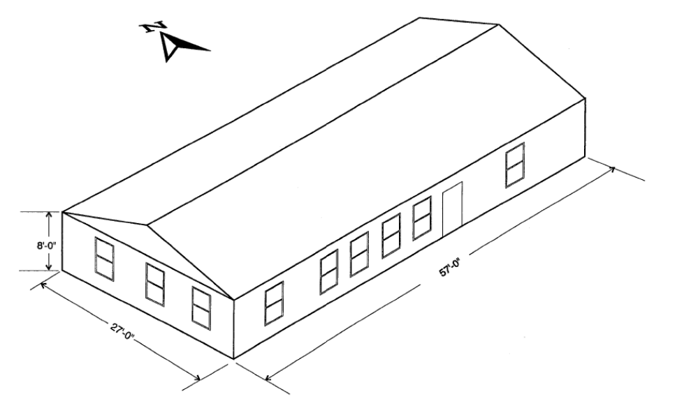

**Figure 1 Base Building (Case L100A) - Isometric View of Southeast Corner (ANSI/ASHRAE 2011, Figure 7-1)**

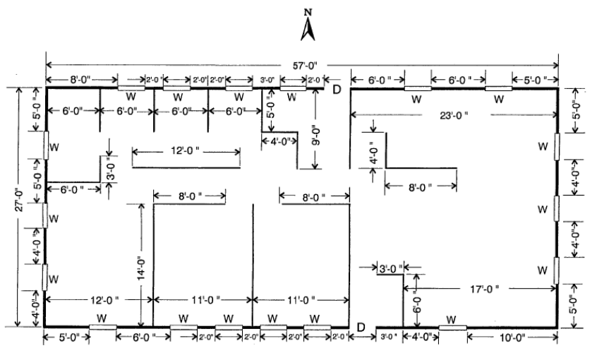


**Figure 2 Base Building (Case L100A) – Main Floor Plan (ANSI/ASHRAE 2011, Figure 7-2)**

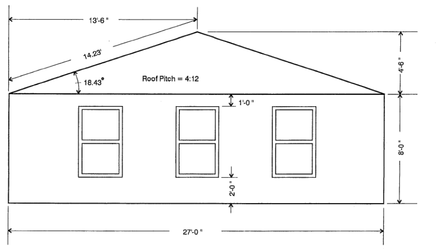

**Figure 3 Base Building (Case L100A) – East Wall Elevation View (ANSI/ASHRAE 2011, Figure 7-3)**


**Figure 4 Base Building (Case L100A) – Window Details (ANSI/ASHRAE 2011, Figure 7-8)**

**Table 2 Base Building (Case L100A) Window Characteristics**


<table>
<tr>
  <th></th>
  <th>Area ( ${ft}^2$ )</th>
  <th>U ( $\frac{Btu}{h\cdot {ft}^2\cdot F }$ )</th>
  <th>SHGC (dir. Nor.)</th>
  <th>Trans (dir Nor.)</th>
  <th>SC</th>
</tr>
<tr>
  <td>Glass Pane</td>
  <td>10.96</td>
  <td>1.064</td>
  <td>0.857</td>
  <td>0.857</td>
  <td>1.0</td>
</tr>
<tr>
  <td>Alum. Sash w/ thermal break</td>
  <td>4.04</td>
  <td>0.971</td>
  <td></td>
  <td></td>
  <td></td>
</tr>
</table>


Other characteristics of the base building included:

**Infiltration:**

- Conditioned zone 0.67 air change/hour  
- Attic 2.4 air changes/hour

**Internal Load:**


**Mechanical System:** 100% convective air system, heating capacity 3,413 million Btu/h, cooling capacity 3,413 million Btu/h, 100% efficient with no duct losses, no latent heat extraction,
non-proportional-type dual setpoint thermostat with deadband, heating on <68°F, cooling on >78°F, and no fan heat added to supply air.


#### Case L110A – High Infiltration

Case L110A uses the Base Building modeled in Case L100A but changes the conditioned zone infiltration rate from 0.67 air changes/hr to 1.5 air changes/hr.


#### Case L120A – Well Insulated Walls and Roof

Case L120A uses the Base Building modeled in Case L100A with the  following changes:

- Exterior walls have 2” x 6” 24” O.C. framing and R-18 batt insulation with R-7.2 polyisocyanurate exterior board insulation (Figure 5)
- An extra layer of R-38 batt insulation is added to the ceiling (Figure 6)

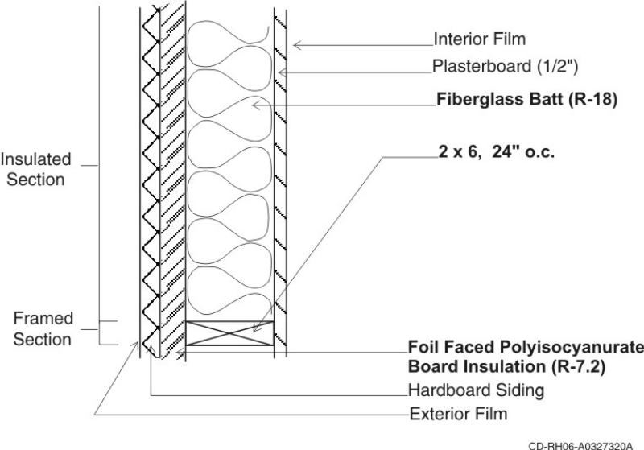

**Figure 5 Case L120A Exterior Wall Construction (ANSI/ASHRAE 2011, Figure 7-9**

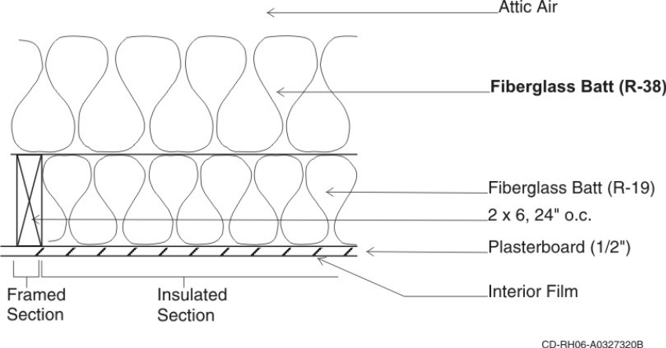

**Figure 6 Case L120A Ceiling Construction (ANSI/ASHRAE 2011, Figure 7-10)**


#### Case L130A – Double-Pane Low-Emissivity Windows with Wood Frame

Case L130A is exactly the same as Case L100A except all single-pane windows are replaced with double-pane low-emissivity windows with wood frame spacers. The basic properties of the window are shown below.

**Table 3 Case L130A Window Characteristics**

<table>
<tr>
  <th></th>
  <th>Area ( ${ft}^2} )</th>
  <th>U ( $\frac{Btu}{h\cdot {ft}^2\cdot F}$ )</th>
  <th>SHGC (dir. Nor.)</th>
  <th>Trans (dir Nor.)</th>
  <th>SC</th>
</tr>
<tr>
  <td>Dbl-pane, low-e, argon</td>
  <td>10.96</td>
  <td>0.247</td>
  <td>0.432</td>
  <td>0.387</td>
  <td>0.504</td>
</tr>
<tr>
  <td>Wood frame w/inuslated spacer</td>
  <td>4.04</td>
  <td>0.446</td>
  <td></td>
  <td></td>
  <td></td>
</tr>
<tr>
  <td>Window composite air-air</td>
  <td>15.00</td>
  <td>0.300</td>
  <td>0.335</td>
  <td>0.283</td>
  <td>0.391</td>
</tr>
</table>


#### Case L140A – Zero Window Area

Case L140A is the same as Case L100A except the gross window area (glass and frame) is replaced with the Case L100A solid exterior wall
construction.


#### Case L150A – South-Oriented Windows

Case L150A is identical to the Base Case building of Case L100A except that all windows are moved to the south wall as shown in Figure 7. The east, west and north walls have no windows. The door in the north wall remains. Window details are the same as those indicated in Figure 4 and
Table 2.


#### Case L155A – South-Oriented Windows with Overhang

Case L155A is identical to Case L150A except that an opaque overhang is included at the top of the south exterior wall (see Figure 8). The overhang traverses the entire length of the south wall extends outward from the wall by 2.5 ft.


#### Case L160A – East- and West-Oriented Windows

Case L160A uses the Base Building modeled in Case L100A except that all windows are moved to the east and west walls as shown in Figure 9. The north and south walls have no windows but the doors remain.


#### Case L170A – No Internal Loads

Case L170A is identical to Case L100A except the internal sensible and latent loads in the conditioned zone are set to zero for all hours of the year.


**Figure 7 Case L150A South Wall Elevation Showing Windows (ANSI/ASHRAE 2011, Figure 7-12)**

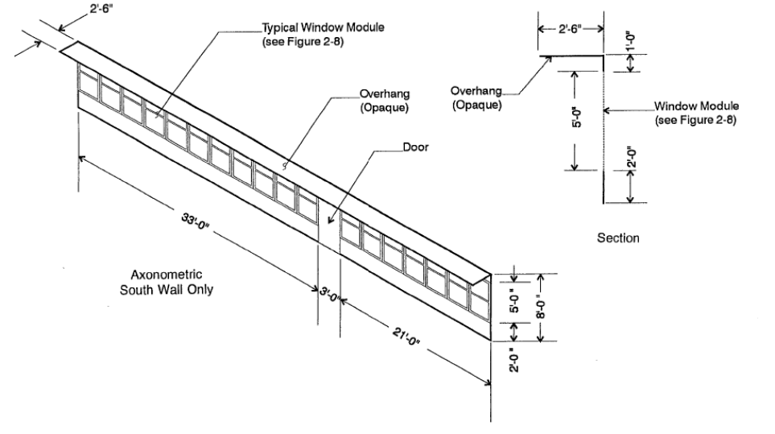

**Figure 8 Case L155A South Wall with Overhang (ANSI/ASHRAE 2011, Figure 7-13)**

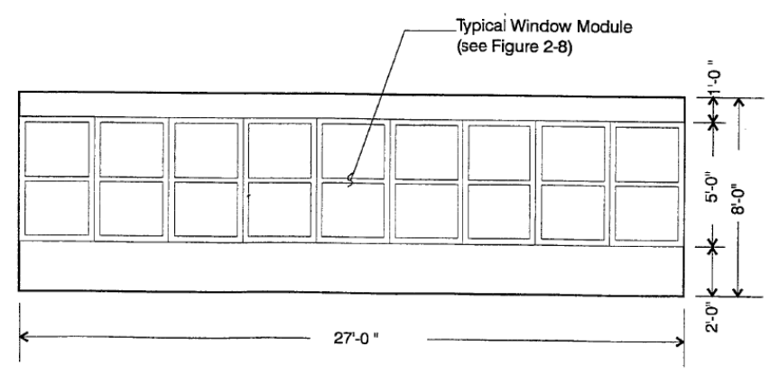

**Figure 9 Case L160A East and West Wall Elevation Showing Windows (ANSI/ASHRAE 2011, Figure 7-16)**


#### Case L200A – Energy Efficient

Case L200A is the same as the Base Building Case L100A except for the following changes:

- Infiltration for the conditioned zone is set to 1.5 air changes/hr
- Exterior wall fiberglass insulation is replaced with an air gap
- Floor fiberglass insulation is eliminated
- Ceiling fiberglass insulation is reduced from 5.5” to 3.5”


#### Case202A – Low Exterior Solar Absorptance Associated with Light Exterior Surface Color

Case L202A is the same as Case L200A except that the exterior shortwave absorptance is set to 0.2 for exterior walls, roof, end gables and
doors. Window frame absorptance remains at 0.6.


#### Case302A – Slab-on-Grade, Uninsulated ASHRAE Slab

Case L302A is the same as Base Building Case L100A except that the raised floor exposed to air is changed to an uninsulated slab-on-grade
construction as shown in Figure 10 with properties as shown in Table 4.

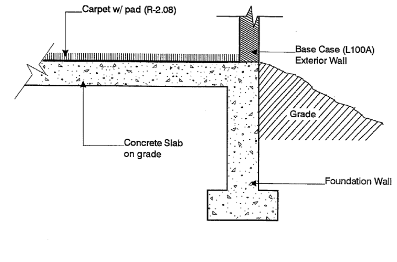

**Figure 10 Case L302A Uninsulated Slab-on-Grade Section (ANSI/ASHRAE 2011, Figure 7-20)**

**Table 4 Case L302A Slab-on-Grade Construction**

<table>
<tr>
  <th></th>
  <th>R ( $\frac{h\cdot {ft}^2\cdot F}{Btu}$ )</th>
  <th>U ( $\frac{Btu}{h\cdot {ft}^2\cdot F}$ )</th>
</tr>
<tr>
  <td>Interior Surface Coeff.</td>
  <td>0.765</td>
  <td>1.307</td>
</tr>
<tr>
  <td>Carpet w/ fibrous pad</td>
  <td>2.08</td>
  <td>0.481</td>
</tr>
<tr>
  <td>Slab Loss Coeff.</td>
  <td>6.564</td>
  <td>0.152</td>
</tr>
<tr>
  <td></td>
  <td></td>
  <td></td>
</tr>
<tr>
  <td>Total air-air</td>
  <td>9.409</td>
  <td>0.106</td>
</tr>
</table>


#### Case304A – Slab-on-Grade, Insulated ASHRAE Slab

Case L304A is the same as Case L302A except that the slab is insulated with R-5.4 perimeter insulation.

#### Case 322A – Uninsulated ASHRAE Conditioned Basement

Case L322A is the same as Base Building Case L100A but with the following changes:

- Add a separate basement conditioned zone (Figure 11) with basement walls, concrete basement floor slab and basement ceiling (Figure 12)
- Basement zone is to be controlled by the same thermostat used to control the main floor.

For further details regarding basement walls, ceiling and floor constructions refer to ANSI/ASHRAE Standard 140-2011, Section 7.2.2.12.


#### Case 324A – Insulated ASHRAE Conditioned Basement

Case L324A is the same as Case L322A except that insulation has been added to the interior side of the basement wall and rim joist (Figures 13 and 14).

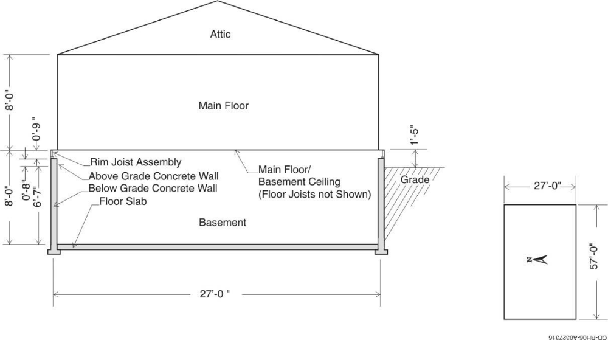

**Figure 11 Case L322A Uninsulated Basement Section (ANSI/ASHRAE 2011, Figure 7-22)**


**Figure 12 Case L322A Basement and Floor Section (ANSI/ASHRAE 2011, Figure 7-23)**

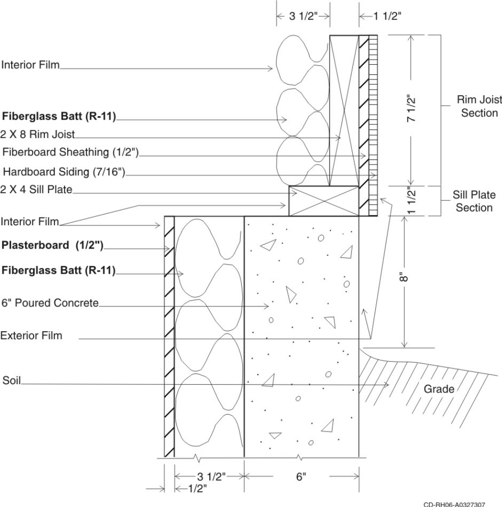

**Figure 13 Case L324A Insulated Basement Wall and Rim Joist Section (ANSI/ASHRAE 2011, Figure 7-24**

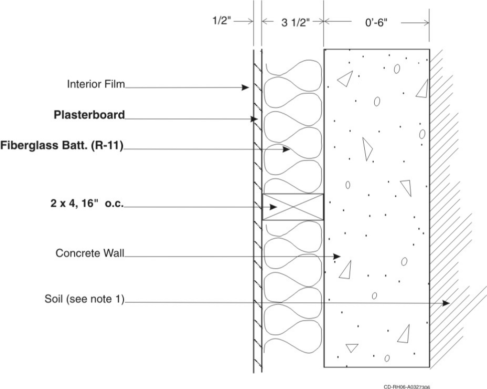

**Figure 14 Case L324A Insulated Basement Wall Section (ANSI/ASHRAE 2011, Figure 7-25)**


### Tier II Test Cases


#### Case L165A – East/West Shaded Windows

Case L165A is exactly the same as Case L160A except that an opaque overhang and ten opaque fins are added to the east and west walls as shown in Figure 15.

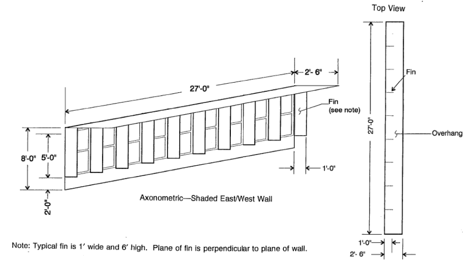

**Figure 15 Case L165A Overhang and Fin configuration for East and West Windows (ANSI/ASHRAE 2011, Figure 7-26)**

#### Case P100A – Passive Solar Base Case

Case P100A is based on Case L120A with the following changes:

- All windows are located on south wall and have increased glass area (Figure 16)
- Windows are clear double-pane with wood frame and modified geometry (Figure 17 and Table 5)
- Floor is R-23 composite floor with brick pavers for thermal mass (Table 6)
- Three of the 14’ lightweight interior walls are replaced with 14’ double brick walls for thermal mass (Figure 16 and Table 7)

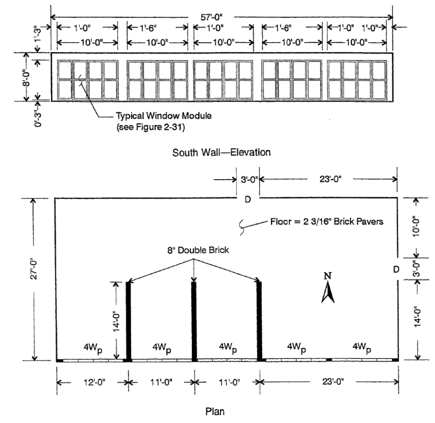

**Figure 16 Case P100A South Wall Window Configuration and Location of mass Walls(ANSI/ASHRAE 2011, Figure 7-28)**

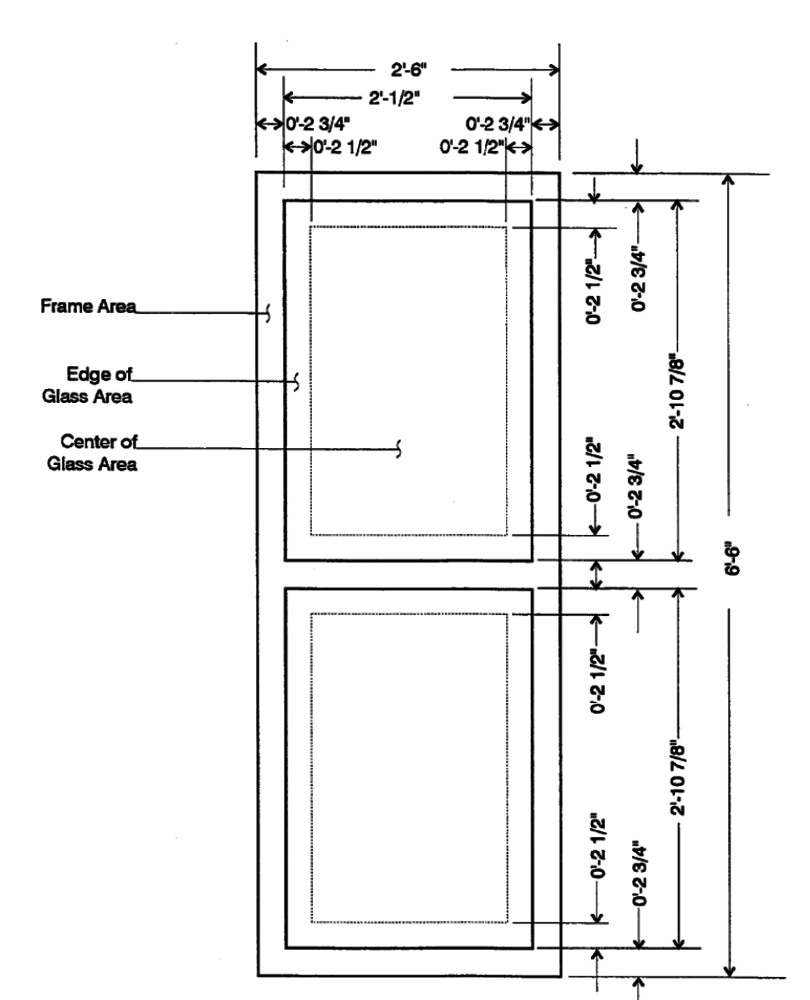

**Figure 17 Case P100A Window Details (ANSI/ASHRAE 2011, Figure 7-31)**

**Table 5 Case P100A Window Characteristics**

<table>
<tr>
  <th></th>
  <th>Area ( ${ft}^2$ )</th>
  <th>U ( $\frac{Btu}{h\cdot {ft}^2\cdot F}$ )</th>
  <th>SHGC (dir. Nor.)</th>
  <th>Trans  (dir. Nor.)</th>
  <th>SC</th>
</tr>
<tr>
  <td>Glass Pane</td>
  <td>11.87</td>
  <td>05167</td>
  <td>0.760</td>
  <td>0.705</td>
  <td>0.887</td>
</tr>
<tr>
  <td>Wood frame w/metal spacer</td>
  <td>4.38</td>
  <td>0.492</td>
  <td></td>
  <td></td>
  <td></td>
</tr>
<tr>
  <td>Window composite air-air</td>
  <td>16.25</td>
  <td>0.510</td>
  <td>0.557</td>
  <td>0.515</td>
  <td>0.672</td>
</tr>
</table>


**Table 6 Case P100A Floor Construction**

<table>
<tr>
  <th></th>
  <th>Thickness (in)</th>
  <th>R ( $\frac{h\cdot {ft}^2\cdot F}{Btu}$ )</th>
  <th>U ( $\frac{Btu}{h\cdot {ft}^2\cdot F}$ )</th>
  <th>k ( $\frac{h\cdot ft\cdot F}{Btu}$ )</th>
  <th>Density ( $\frac{lb}{{ft}^3}$ )</th>
  <th>Cp ( $\frac{Btu}{lb\cdot ft}$ )</th>
</tr>
<tr>
  <td>Int. Surf. Coeff.</td>
  <td></td>
  <td>0.765</td>
  <td>1.307</td>
  <td></td>
  <td></td>
  <td></td>
</tr>
<tr>
  <td>Brick pavers</td>
  <td>2.19</td>
  <td>0.243</td>
  <td>4.114</td>
  <td>0.7500</td>
  <td>135.0</td>
  <td>0.24</td>
</tr>
<tr>
  <td>Plywood ¾”</td>
  <td>0.75</td>
  <td>0.937</td>
  <td>1.067</td>
  <td>0.0667</td>
  <td>34.0</td>
  <td>0.29</td>
</tr>
<tr>
  <td>Fiberglass batt</td>
  <td>7.25</td>
  <td>24.00</td>
  <td>0.042</td>
  <td>00252</td>
  <td>0.66</td>
  <td>0.20</td>
</tr>
<tr>
  <td>Joists 2” x 8” 16” O.C.</td>
  <td>7.25</td>
  <td>9.058</td>
  <td>0.110</td>
  <td>0.0667</td>
  <td>32.0</td>
  <td>0.33</td>
</tr>
<tr>
  <td>Ext. Surf. Coeff.</td>
  <td></td>
  <td>0.455</td>
  <td>2.200</td>
  <td></td>
  <td></td>
  <td></td>
</tr>
<tr>
  <td></td>
  <td></td>
  <td></td>
  <td></td>
  <td></td>
  <td></td>
  <td></td>
</tr>
<tr>
  <td>Total air-air</td>
  <td></td>
  <td>23.354</td>
  <td>0.043</td>
  <td></td>
  <td></td>
  <td></td>
</tr>
</table>


**Table 7 Case P100A Interior Mass Wall Construction**

<table>
<tr>
  <th></th>
  <th>Thickness (in)</th>
  <th>R ( $\frac{h\cdot {ft}^2\cdot F}{Btu}$ )</th>
  <th>U ( $\frac{Btu}{h\cdot {ft}^2\cdot F}$ )</th>
  <th>k ( $\frac{h\cdot ft\cdot F}{Btu}$ )</th>
  <th>Density ( $\frac{lb}{{ft}^3}$ )</th>
  <th>Cp ( $\frac{Btu}{lb\cdot ft}$ )</th>
</tr>
<tr>
  <td>Int. Surf. Coeff.</td>
  <td></td>
  <td>0.685</td>
  <td>1.460</td>
  <td></td>
  <td></td>
  <td></td>
</tr>
<tr>
  <td>Face brick</td>
  <td>4.0</td>
  <td>0.444</td>
  <td>2.250</td>
  <td>0.7500</td>
  <td>130.0</td>
  <td>0.24</td>
</tr>
<tr>
  <td>Int. Surf. Coeff.</td>
  <td></td>
  <td>0.685</td>
  <td>1.460</td>
  <td></td>
  <td></td>
  <td></td>
</tr>
</table>


#### Case P105A – Passive Solar with Overhang

Case P105A is exactly the same as case P100A except that a south wall opaque overhang is included that extends outward horizontally 3.47 ft with a vertical offset of 2.08 ft. from the top of the window (Figure 18). The overhang extends the entire length of the south wall.

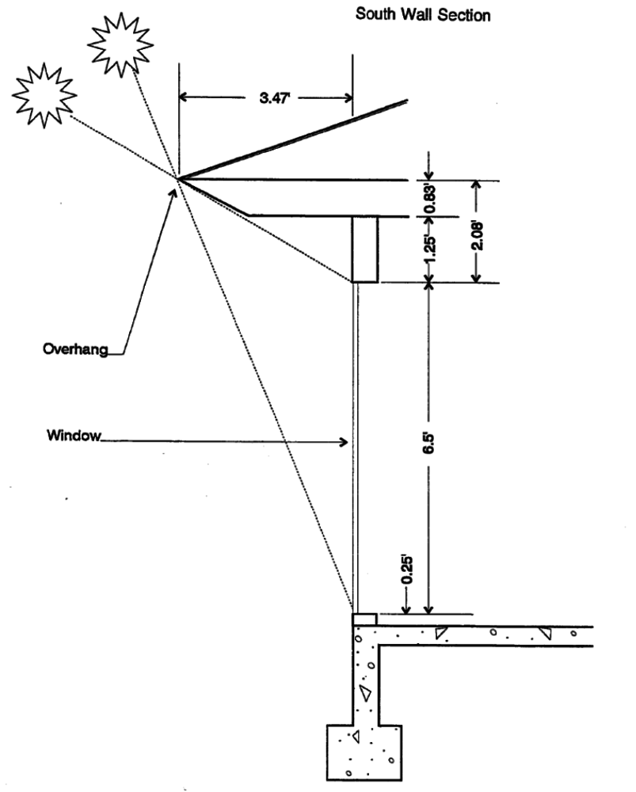

**Figure 18 Case P105A South Wall with Overhang (ANSI/ASHRAE 2011, Figure 7-32)**


#### Case P110A – Low mass Version of Case P100A

Case P110A is the same as Case P100A except for the following:

- The brick pavers have been removed from the floor and replaced with an equivalent resistance mass-less floor covering (Table 8)
- The three massive internal walls are configurated as in Case L100A


**Table 8 Case P110A Floor Construction**

<table>
<tr>
  <th></th>
  <th>Thickness (in)</th>
  <th>R ( $\frac{h\cdot {ft}^2\cdot F}{Btu}$ )</th>
  <th>U ( $\frac{Btu}{h\cdot {ft}^2\cdot F}$ )</th>
  <th>k ( $\frac{h\cdot ft\cdot F}{Btu}$ )</th>
  <th>Density ( $\frac{lb}{{ft}^3}$ )</th>
  <th>Cp ( $\frac{Btu}{lb\cdot ft}$ )</th>
</tr>
<tr>
  <td>Int. Surf. Coeff.</td>
  <td></td>
  <td>0.765</td>
  <td>1.307</td>
  <td></td>
  <td></td>
  <td></td>
</tr>
<tr>
  <td>Floor covering</td>
  <td></td>
  <td>0.243</td>
  <td>4.114</td>
  <td></td>
  <td></td>
  <td></td>
</tr>
<tr>
  <td>Plywood ¾”</td>
  <td>0.75</td>
  <td>0.937</td>
  <td>1.067</td>
  <td>0.0667</td>
  <td>34.0</td>
  <td>0.29</td>
</tr>
<tr>
  <td>Fiberglass batt</td>
  <td>7.25</td>
  <td>24.00</td>
  <td>0.042</td>
  <td>00252</td>
  <td>0.66</td>
  <td>0.20</td>
</tr>
<tr>
  <td>Joists 2” x 8” 16” O.C.</td>
  <td>7.25</td>
  <td>9.058</td>
  <td>0.110</td>
  <td>0.0667</td>
  <td>32.0</td>
  <td>0.33</td>
</tr>
<tr>
  <td>Ext. Surf. Coeff.</td>
  <td></td>
  <td>0.455</td>
  <td>2.200</td>
  <td></td>
  <td></td>
  <td></td>
</tr>
<tr>
  <td></td>
  <td></td>
  <td></td>
  <td></td>
  <td></td>
  <td></td>
  <td></td>
</tr>
<tr>
  <td>Total air-air</td>
  <td></td>
  <td>23.354</td>
  <td>0.043</td>
  <td></td>
  <td></td>
  <td></td>
</tr>
</table>


#### Case P140A – Zero Window Area Version of Case P100A

Case P140A is the same as Case P100A except the glazing is removed from the south wall such that the entire south wall is opaque with the same
construction as used in Case L120A (Figure 5).


#### Case P150A – Even Window Distribution Version of Case P100A

Case P150A is the same as Case P100A except that all windows are evenly distributed among the walls (Figure 19). The interior wall locations are
the same as in Case P100A.


**Figure 19 Case P150A Window Locations (ANSI/ASHRAE 2011, Figure 7-35)**


### Weather Data

Weather files were provided as part of the standard for Colorad.TMY and Lasvega.TMY. Colorad.TMY is a clear, cold climate and is used to simulate heating loads. Lasvega.TMY is a hot, dry climate and is used to simulate cooling loads. Both weather files were used for all test cases except for the ground-coupling cases (L302A, L304A, L322A and L324A) and passive solar cases (P100A, P105A, P110A, P140A and P150A) which did not require the use of the Lasvega.TMY weather file.


## Modeling Notes

The specifications as presented in Section 5 - Test Procedures of ANSI/ASHRAE Standard 140-2011 and Section 7.2 – Input Specifications were followed to prepare the EnergyPlus models for the test cases described above. In some cases the specification provided redundant input values for a particular element of the building due to the fact different programs require different inputs. The following notes are presented regarding preparation of EnergyPlus IDF files:

- Although the Standard spelled out in detail the exterior and interior radiative and convective surface properties, these were not used. The Standard indicated that if your program automatically calculates the exterior and interior film coefficients, then these radiative and convective input values were to be disregarded. For inside surface coefficients, the EnergyPlus SurfaceConvectionAlgorithm:Inside was set to TARP. For outside surface coefficients, the EnergyPlus SurfaceConvectionAlgorithm:Outside was set to DOE-2.

- The material layers for walls, floors and roofs were specified using the Material object except for the window aluminum frame which was described using the Material:NoMass object. The opaque surface radiative properties listed in the Material object were defined in the Standard and were set as follows:
    - Thermal Emissivity 0.90
    - Solar Absorptance 0.60
    - Visible Absorptance 0.60  

- The convergence variables in the Building object were set as follows:
    - Loads Convergence Tolerance Value 0.04
    - Temperature Convergence Tolerance Value 0.004  

- To get the shade calculations to work for the window overhang test cases, the following variables in the Building object had to be set:
    - Solar Distribution = FullInteriorAnd Exterior
    - Same was true for cases with window fins.  

- The ZoneHVAC:IdealLoadsAirSystem object was used to model the mechanical system.

- All simulations were done using a Timestep = 4; output results were reported hourly.

- Internal walls were modeled using the Energyplus InternalMass object.

- For all cases individual windows were modeled with the window frame and divider specified using the EnergyPlus WindowProperty:FrameAndDivider object. Overhangs and fins were modeled as shown in Figures 20 and 21.

- For the slab-on-grade test cases, L302A and L304A, the EnergyPlus F-factor method for simulating ground-coupled heat transfer for a slab-on-grade floor was utilized. The F-factor for the floor was set to 1.33 W/m-K for the uninsulated floor of case L302AC and 0.9326 W/m-K for the insulated floor of case L304AC.

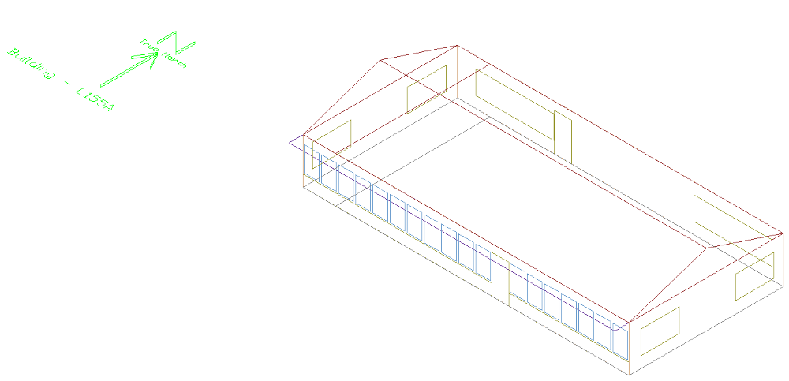

**Figure 20 Case L155A Building as Modeled with EnergyPlus with Individual Windows and Overhang on South Wall**

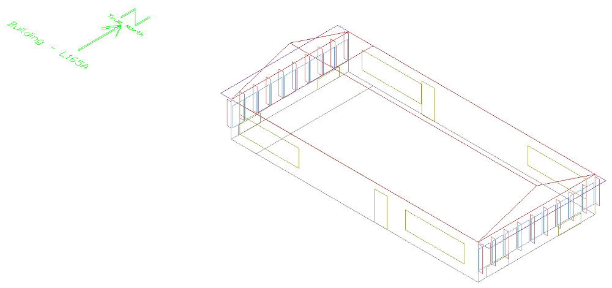

**Figure 21 Case L165A Building as Modeled with EnergyPlus with Overhang and Individual Windows with Fins on South Wall**


# Results and Discussion

The results of the EnergyPlus simulations along with other whole building energy analysis programs that participated in the comparison
are summarized in a set of charts presented in Appendix A. The nomenclature for the various programs referred to in these charts along
with the program author and modeler responsible for using the program as part of the BESTEST project are presented in the table below.


<table>
<tr>
  <th>Code Name</th>
  <th>Computer Program</th>
  <th>Developer</th>
  <th>Implemented by</th>
</tr>
<tr>
  <td>BLAST</td>
  <td>BLAST-3.0 level 215</td>
  <td>CERL, U.S.</td>
  <td></td>
</tr>
<tr>
  <td>DOE2.1E</td>
  <td>DOE2.1E</td>
  <td>LANL/LBL, U.S.</td>
  <td></td>
</tr>
<tr>
  <td>SUNCODE</td>
  <td>SERIRES/SUNCODE 5.7</td>
  <td>NREL, U.S</td>
  <td></td>
</tr>
<tr>
  <td>ENERGYPLUS</td>
  <td>EnergyPlus ver. {{ engine.config["EnergyPlusVersion"] }}</td>
  <td>U.S. Dept. of Energy</td>
  <td>GARD Analytics, U.S.</td>
</tr>
</table>


Tables 9 and 12 show a comparison of EnergyPlus results to the results of other programs as presented in ANSI/ASHRAE Standard 140. In these
tables, the column titled “Within Bounds” indicated whether the EnergyPlus results are within the simple range of results from the
reference programs.

Annex B22 of ANSI/ASHRAE Standard 140-2011 Titled *Example Procedures for Developing Acceptance Range Criteria for Section 7 Test Cases* presents a procedure which can be used to determine if a program’s results fall within acceptable ranges compared to the standard results which are from much earlier HERS testing done with BLAST 3.0, DOE-2.1E and SERIRES back in 1995. This procedure uses standard deviations and 90% confidence limits to determine an acceptable range which has limits of 90% max confidence limit + 4 million BTU and 90% min confidence limit – 4 million BTU. The results of applying this procedure and comparing EnergyPlus results are shown in Tables 13 through 16.


## EnergyPlus Issues Which Arose Due to Testing

When simulating Test Cases L322A and L324A which had basements with underground walls which had uninsulated and insulated walls using the EnergyPlus F-factor method, EnergyPlus results with EnergyPlus versions 7.2 and earlier showed only a small decrease in heating loads when the underground walls were insulated versus uninsulated. As expected, other programs showed much larger changes in heating loads. This issue was looked into in EnergyPlus 8.0.0.008 and code changes made to improve results (see Section 2.2).


## Summary of Changes that were Implemented During Testing

This section documents the changes that took place in results as modifications were made to the EnergyPlus code or changes were made in the modeling approach. The table below summarizes pertinent input file and code changes that were made as the testing progressed.

**Summary of Pertinent EnergyPlus Changes that were Implemented During Testing**

{{ engine.create_table_from_yaml("EnergyPlusChanges.yaml", ["Version", "Input-File-Changes", "Code-Changes"]) }}


In version 7.2.0.006 the model coefficients for the DOE-2 outside face convection correlations were changed which resulted in annual heating
loads increasing by as much as 4.0% which brought the EnergyPlus results closer to the range of results for other programs. The annual cooling load decreased by as much as 3.7% which moved the EnergyPlus results farther away from the range of results of other programs.

In EnergyPlus v8.0 code changes were made to correct the thermal resistance of the soil. This changed the results for Cases L322AC (uninsulated underground wall) L324AC (insulated underground wall) and increased the difference between these two cases which use the F-factor method. Where previously the annual heating load for Case L324AC was only 1.2% less than that for Case L322AC, now with EnergyPlus 8.0.0.008 and later releases that difference increased to 6.3% less.

For EnergyPlus version 8.2.0, the source code was converted from FORTRAN to C++. This produced negligible differences in results.


**Table 9 EnergyPlus HERS Tier-1 Colorado Springs Annual Heating Test Results Compared to ANSI/ASHRAE Standard 140-2011 Results**

{{ engine.create_table_from_excel_range("Comparison of HERS Parametric Run Results For Colorado Springs and LasVegas.xlsx", "Table for Report", "A5:H25") }}


**Table 10 EnergyPlus HERS Tier-2 Colorado Springs Annual Heating Test Results Compared to ANSI/ASHRAE Standard 140-2011 Results**

{{ engine.create_table_from_excel_range("Comparison of HERS Parametric Run Results For Colorado Springs and LasVegas.xlsx", "Table for Report", "A30:I41") }}

**Table 11 EnergyPlus HERS Tier-1 Las Vegas Annual Cooling Test Results Compared to ANSI/ASHRAE Standard 140-2011 Results**

{{ engine.create_table_from_excel_range("Comparison of HERS Parametric Run Results For Colorado Springs and LasVegas.xlsx", "Table for Report", "A48:H64") }}

**Table 12 EnergyPlus HERS Tier-2 Las Vegas and Colorado Springs Annual Cooling Test Results Compared to ANSI/ASHRAE Standard 140-2011 Results**

{{ engine.create_table_from_excel_range("Comparison of HERS Parametric Run Results For Colorado Springs and LasVegas.xlsx", "Table for Report", "A72:H83") }}

Suffix AL refers to Las Vegas  
Suffix AC refers to Colorado Springs


**Table 13 EnergyPlus Acceptance Test Results - HERS Tier-1 Colorado Springs Annual Heating**

{{ engine.create_table_from_excel_range("Acceptance Test Results-Colorado Springs and Las Vegas.xlsx", "ReportTable-ColoSprHeat-Tier1", "H4:AK27") }}

**Table 13 EnergyPlus Acceptance Test Results - HERS Tier-1 Colorado Springs Annual Heating (Cont’d)**

{{ engine.create_table_from_excel_range("Acceptance Test Results-Colorado Springs and Las Vegas.xlsx", "ReportTable-ColoSprHeat-Tier1", "AQ4:BS27") }}

**Table 14 EnergyPlus Acceptance Test Results - HERS Tier-2 Colorado Springs Annual Heating**

{{ engine.create_table_from_excel_range("Acceptance Test Results-Colorado Springs and Las Vegas.xlsx", "ReportTable-ColoSprHeat-Tier2 ", "H4:AB27") }}

**Table 15 EnergyPlus Acceptance Test Results - HERS Tier-1 Las Vegas Annual Cooling**

{{ engine.create_table_from_excel_range("Acceptance Test Results-Colorado Springs and Las Vegas.xlsx", "ReportTableLasVegasCool-Tier1", "H4:AK27") }}

{{ engine.create_table_from_excel_range("Acceptance Test Results-Colorado Springs and Las Vegas.xlsx", "ReportTableLasVegasCool-Tier1", "AN4:AZ27") }}


**Table 16 EnergyPlus Acceptance Test Results - HERS Tier-2 Las Vegas and Colorado Springs Annual Cooling**

{{ engine.create_table_from_excel_range("Acceptance Test Results-Colorado Springs and Las Vegas.xlsx", "ReportTable-ColoSprCool-Tier2", "H4:AB27") }}

Suffix AL refers to Las Vegas  
Suffix AC refers to Colorado Springs


# Conclusions

EnergyPlus Version  {{ engine.config["EnergyPlusVersion"] }} was used to model a range of building specifications as specified in Section 7 of the ANSI/ASHRAE Standard 140-2011 - *Standard Method of Test for the Evaluation of Building Energy Analysis Computer Programs.*

The ability of EnergyPlus to predict thermal loads was tested using a test suite of 34 test cases which included a single-story house with various design options including with and without a basement. The annual heating and cooling loads predicted by EnergyPlus were compared to results from 3 other whole building energy simulation programs that participated in an International Energy Agency (IEA) project which concluded in November 1995. When using the acceptance procedure described in ANSI/ASHRAE Standard 140-2011 Annex B22, for the 19 heating tests modeled by EnergyPlus which compare to a base case, EnergyPlus was within acceptable delta range for 12 comparisons. For the 15 cooling tests modeled by EnergyPlus which compare to a base case, EnergyPlus was within acceptable delta range for 13 comparisons.


#References

ANSI/ASHRAE 2011. Standard 140-2011, Standard Method of Test for the Evaluation of Building Energy Analysis Computer Programs, American
Society of Heating, Refrigerating and Air-Conditioning Engineers, Atlanta, GA.

EnergyPlus 2014. U.S. Department of Energy, Energy Efficiency and Renewable Energy, Office of Building Technologies.
[www.energyplus.gov](http://www.energyplus.gov)

NREL 1995. Judkoff, R. and J. Neymark. Home Energy Rating System Building Energy Simulation Test (HERS BESTEST), National Renewable Energy Laboratory, November 1995, NREL/TP-472-7332a.

 
# Appendix A

**Charts Comparing EnergyPlus Results with Other Whole Building Energy Simulation Programs**


```{exec_python}
engine.write_chart('ColumnClustered', 'Tier I Tests-Heating', 'Standard 140-2011 Comparison\nHome Energy Rating System (HERS)\nTier-1 Heating Tests - Colorado Springs', 'Test Case', 'Annual Heating (MWH)', 'Comparison Charts-Colorado and LasVegas.xlsx', 'Data', 'A7:E23', "(B7,A8:A23,B8:B23,1);(C7,A8:A23,C8:C23,2);(D7,A8:A23,D8:D23,3);(E7,A8:A23,E8:E23,4);", [])
engine.write_chart('ColumnClustered', 'Tier II Tests-Heating', 'Standard 140-2011 Comparison\nHome Energy Rating System (HERS)\nTier-2 Heating Tests - Colorado Springs', 'Test Case', 'Annual Heating (MWH)', 'Comparison Charts-Colorado and LasVegas.xlsx', 'Data', 'A28:E34', "(B28,A29:A34,B29:B34,1);(C28,A29:A34,C29:C34,2);(D28,A29:A34,D29:D34,3);(E28,A29:A34,E29:E34,4);", [])
engine.write_chart('ColumnClustered', 'Tier I Tests -Cooling', 'Standard 140-2011 Comparison\nHome Energy Rating System (HERS)\nTier-1 Cooling Tests - Las Vegas', 'Test Case', 'Annual Cooling (MWH)', 'Comparison Charts-Colorado and LasVegas.xlsx', 'Data', 'G7:K18', "(H7,G8:G18,H8:H18,1);(I7,G8:G18,I8:I18,2);(J7,G8:G18,J8:J18,3);(K7,G8:G18,K8:K18,4);", [])
engine.write_chart('ColumnClustered', 'Tier II Tests-Cooling', 'Standard 140-2011 Comparison\nHome Energy Rating System (HERS)\nTier-2 Cooling Tests - Las Vegas and Colorado Springs', 'Test Case', 'Annual Cooling (MWH)', 'Comparison Charts-Colorado and LasVegas.xlsx', 'Data', 'G28:K34', "(H28,G29:G34,H29:H34,1);(I28,G29:G34,I29:I34,2);(J28,G29:G34,J29:J34,3);(K28,G29:G34,K29:K34,4);", [])
```


# Appendix B

**ANSI/ASHRAE Standard 140-2011 Output Form – Modeling Notes** 

**STANDARD 140 OUTPUT FORM – MODELING NOTES**

SOFTWARE: EnergyPlus  
VERSION: {{ engine.config["EnergyPlusVersion"] }}

Simulated Effect:  
*Inside and outside convection algorithm*

Optional Settings or Modeling Capabilities:  

    SurfaceConvectionAlgorithm:Inside = Simple
    SurfaceConvectionAlgorithm:Inside = TARP
    SurfaceConvectionAlgorithm:Inside = Ceiling Diffuser
    SurfaceConvectionAlgorithm:Inside = AdaptiveConvectionAlgorithm*

    *SurfaceConvectionAlgorithm:Outside = SimpleCombined
    SurfaceConvectionAlgorithm:Outside = TARP
    SurfaceConvectionAlgorithm:Outside = MoWitt
    SurfaceConvectionAlgorithm:Outside = DOE-2
    SurfaceConvectionAlgorithm:Outside = AdaptiveConvectionAlgorithm*

Setting or Capability Used:  

    SurfaceConvectionAlgorithm:Inside = TARP
    SurfaceConvectionAlgorithm:Outside = DOE-2


Physical Meaning of Option Used:  
*TARP uses variable natural convection based on temperature difference.DOE-2 is based on correlations from measurements for rough surfaces.*

--------------------------------------------------

Simulated Effect:  
*Solar distribution effects for shade surfaces*

Optional Settings or Modeling Capabilities:  

    SOLAR DISTRIBUTION = MinimalShadowing
    SOLAR DISTRIBUTION = FullExterior
    SOLAR DISTRIBUTION = FullInteriorAndExterior
    SOLAR DISTRIBUTION = FullExteriorWithReflections
    SOLAR DISTRIBUTION = FullInteriorAndExteriorWithReflections*


Setting or Capability Used:  

    SOLAR DISTRIBUTION = FullInteriorAndExterior

Physical Meaning of Option Used:  
*Full interior and exterior shadow calculations are performed each hour.*

---------------------------------------------------

Simulated Effect:  
*Calculating resulting zone temperature.*

Optional Settings or Modeling Capabilities:  

    ZoneCapacitanceMultiplier:ResearchSpecial,
    Temperature capacity Multiplier > 0,
    Humidity Capacity Multiplier > 0,
    Carbon Dioxide Capacity Multiplier >0


Setting or Capability Used:    
*Let default to*  

    ZoneCapacitanceMultiplier:ResearchSpecial
    Temperature capacity Multiplier =1,
    Humidity Capacity Multiplier =1,
    Carbon Dioxide Capacity Multiplier =1


Physical Meaning of Option Used:  
*Used for stability in predictor corrector step by increasing reactive capacity of zone*

---------------------------------------------------

Simulated Effect:  
*Various variables used to describe properties of surfaces.*

Optional Settings or Modeling Capabilities:  

    Visible Absorptance = 0.0 to 1.0


Setting or Capability Used:  

    *Visible Absorptance = Solar Absorptance = 0.6


Physical Meaning of Option Used:  
*Solar Absorptance – property of surface describing ability to absorb incident solar radiation*

--------------------------------------------------

Simulated Effect:  
*Simulation time increment.*

Optional Settings or Modeling Capabilities:  

    *TimeStep = whole number between 1 and 60 evenly divisible into 60


Setting or Capability Used:  

    TimeStep = 4


Physical Meaning of Option Used:  
*The simulation time increment is 15 minutes. Outputs were set to report hourly.*

---------------------------------------------------

Simulated Effect:  
*Frequency of solar and shadow calculations.*

Optional Settings or Modeling Capabilities:  

    ShadowCalculation >= 1 (default = 20, every 20 days)


Setting or Capability Used:  

    ShadowCalculation = 1


Physical Meaning of Option Used:  
*Solar and shadow calculations frequency done based on value set.*

---------------------------------------------------

Simulated Effect:  
*Window properties for double pane glazing made of standard 1/8”(3mm) clear glass with ½” (13mm) air gap.*

Optional Settings or Modeling Capabilities:  
*EnergyPlus requires window properties for front and back of window surface.*

Setting or Capability Used:  
*Window properties were described as follows:*


    WindowMaterial:Glazing,
     Glass Type 1, !- Name
     SpectralAverage, !- Optical Data Type
     , !- Window Glass Spectral Data Set Name
     0.003175, !- Thickness {m}
     0.86156, !- Solar Transmittance at Normal Incidence
     0.07846, !- Front Side Solar Reflectance at Normal Incidence
     0.07846, !- Back Side Solar Reflectance at Normal Incidence
     0.91325, !- Visible Transmittance at Normal Incidence
     0.08200, !- Front Side Visible Reflectance at Normal Incidence
     0.08200, !- Back Side Visible Reflectance at Normal Incidence
     0.0, !- Infrared Transmittance at Normal Incidence
     0.84, !- Front Side Infrared Hemispherical Emissivity
     0.84, !- Back Side Infrared Hemispherical Emissivity
     1.06; !- Conductivity {W/m-K}


    WindowMaterial:Gas,
     Air Space Resistance, !- Name
     AIR, !- Gas Type
     0.013; !- Thickness {m}

    Construction,
     Double Pane Window, !- Name
     Glass Type 1, !- Outside Layer
     Air Space Resistance, !- Layer 2
     Glass Type 1; !- Layer 3


Physical Meaning of Option Used:  
*Description of window properties for double pane clear glass window for determining solar and conduction heat gain.*

---------------------------------------------------

Simulated Effect:  
*Ground Reflectance.*

Optional Settings or Modeling Capabilities:  

    Site:GroundReflectance = 0.0 to 1.0*


Setting or Capability Used:  

    Site:GroundReflectance = 0.20


Physical Meaning of Option Used:  
*Property of ground surface describing amount of incident solar that is reflected.*


