EnergyPlus Version {{ engine.config["EnergyPlusVersion"] }}  
Automatically Generated {{ engine.month_year() }}


Prepared for:

U.S. Department of Energy  
Energy Efficiency and Renewable Energy  
Office of Building Technologies  
Washington, D.C.

Originally Prepared by:

Robert H. Henninger and Michael J. Witte  
GARD Analytics, Inc.  
115 S. Wilke Road, Suite 105  
Arlington Heights, IL 60005-1500  
USA  
www.gard.com

This report was developed based upon funding from the Alliance for Sustainable
Energy, LLC, Managing and Operating Contractor for the National Renewable
Energy Laboratory for the U.S. Department of Energy. Any opinions, findings,
and conclusions or recommendations expressed in this material are those of the
author(s) and do not necessarily reflect those of the sponsor. Earlier work was
supported by the Ernest Orlando Lawrence Berkeley National Laboratory, and by
the National Energy Technology Laboratory and the National Renewable Energy
Laboratory by subcontract through the University of Central Florida/Florida
Solar Energy Center.

This report was prepared as an account of work sponsored by an agency of the
United States Government. Neither the United States Government nor any agency
thereof, nor any of their employees, makes any warranty, express or implied, or
assumes any legal liability or responsibility for the accuracy, completeness,
or usefulness of any information, apparatus, product, or process disclosed, or
represents that its use would not infringe privately owned rights. Reference
herein to any specific commercial product, process, or services by trade name,
trademark, manufacturer, or otherwise does not necessarily constitute or imply
its endorsement, recommendation, or favoring by the United States Government or
any agency thereof. The views and opinions of authors expressed herein do not
necessarily state or reflect those of the United States Government or any
agency thereof.


# Test Objectives and Overview


## Introduction

This report describes the modeling methodology and results for comparative
testing done for the *IEA Mechanical Equipment & Control Strategies for a
Chilled Water and a Hot Water System,* (Felsmann 2008) which were simulated
using the EnergyPlus software. Although both empirical and comparative test
cases are described for a chilled water system and hot water system, only the
comparative tests for the chilled water coil and hot water coil were performed.
The specifications for these tests are described in Part I. Chilled Water
System, Section 4.4 Cooling Coil Comparative Test and in Part II. Heating Water
System, Section 4.5 Heating Coil Comparative Test of that report. The results
of EnergyPlus are compared with results for other whole building energy
simulation programs (Table 1) which simulated all of the same test cases.

**Table 1 Participating Programs and Organizations**

<table>
<tr>
  <th>Simulation Program</th>
  <th>Implemented by</th>
  <th>Abbreviation</th>
</tr>
<tr>
  <td>EnergyPlus</td>
  <td>GARD Analytics, Inc., United States</td>
  <td>EnergyPlus</td>
</tr>
<tr>
  <td>EES</td>
  <td>University of Liege, Belgium</td>
  <td>ESP-r/ESRU</td>
</tr>
<tr>
  <td>TRNSYS-TUD</td>
  <td>Technical University Dresden, Germany</td>
  <td>TRNSYS-TUD</td>
</tr>
<tr>
  <td>Matlab/Simulink</td>
  <td>ITG Dresden, Germany</td>
  <td>Matlab/Simulink</td>
</tr>
<tr>
  <td>VA114</td>
  <td>VABI Software BV, Delft, The Netherlands</td>
  <td>VABI</td>
</tr>
</table>


## Test Type: Comparative

Comparative tests compare a program to itself or to other simulation programs.
This type of testing accomplishes results on two different levels, both
validation and debugging.

From a validation perspective, comparative tests will show that EnergyPlus is
computing solutions that are reasonable compared to other energy simulation
programs. This is a very powerful method of assessment, but it is no substitute
for determining if the program is absolutely correct since it may be just as
equally incorrect as the benchmark program or programs. The biggest strength of
comparative testing is the ability to compare any cases that two or more
programs can model. This is much more flexible than analytical tests when only
specific solutions exist for simple models, and much more flexible than
empirical tests when only specific data sets have been collected for usually a
very narrow band of operation.

Comparative testing is also useful for field-by-field input debugging.  Energy
simulation programs have so many inputs and outputs that the results are often
difficult to interpret. To ascertain if a given test passes or fails,
engineering judgment or hand calculations are often needed. Field by field
comparative testing eliminates any calculational requirements for the subset of
fields that are equivalent in two or more simulation programs. The equivalent
fields are exercised using equivalent inputs and relevant outputs are directly
compared.


## Test Suite: IEA Mechanical Equipment & Control Strategies for a Chilled Water and a Hot Water System

The tests described in Part I. Section 4.4 Cooling Coil Comparative Test
and Part II. Section 4.5 Heating Coil Comparative Test (Felsmann 2008)
of the referenced IEA final report were performed using EnergyPlus.
Although additional empirical tests are also described for the chiller,
chilled water coil, chilled water hydraulic circuit, boiler, hot water
coil and hot water hydraulic circuit, these empirical tests and certain
comparative tests could not be run with EnergyPlus because internal code
changes would have to be made to accommodate the field test data or
because:

- Only water can currently be modeled as the chilled water fluid. The
    ability to model glycol solutions has not yet been added to chillers
    and chilled water coils in EnergyPlus

- Varying water supply temperatures to cooling coils and heating coils
    with constant water flow rates cannot currently be modeled by
    EnergyPlus

The test cases are designed for testing the capability of building energy simulation programs to predict the performance of the mechanical
equipment of buildings including their control systems.


### Cooling Coil Comparative Tests

There are in general two methods for controlling the performance or
discharge air temperature coming off of a chilled water coil:

1.  Variable water flow rate with constant water inlet temperature ( $m_{var}$ )
    Constant temperature chilled water is supplied to the cooling coil.
    Control of the desired leaving air temperature is achieved by
    bypassing a portion of the supply water around the cooling coil and
    thereby varying the chilled water flow rate ( $m_{var}$ ) through the
    coil (see Figure 1).

2.  Constant water flow rate with a variable water inlet temperature
    ( $T_{var}$ )
    Constant chilled water flow rate is maintained through the cooling
    coil while the chiller supply water is mixed with warm coil return
    water to achieve the required coil inlet water temperature ( $T_{var}$ ) in order to maintain the desired leaving discharge air temperature
    (see Figure 2).

For each of the flow configurations described above there are 8 test
cases which are to be simulated for different air flow arrangements,
water mixtures and discharge air temperature setpoints as described in
Table 2.

The cooling coil nominal performance data as provided by the
manufacturer is shown in Table 3. The EnergyPlus chilled water coil
model required some of this data as input.

The following additional requirements were provided by the specification
in regards to modeling the cooling coil comparative tests:

-   For test cases with a variable water flow rate and constant water
    inlet temperature, the maximum water flow rate is 1.77  $\frac{l}{s}$

-   For test cases with a constant water flow rate and variable water
    inlet temperature the water flow rate is fixed at 1.77 $\frac{l}{s}$

-   For test cases with constant air volume (CAS), the air flow rate is
    fixed at 3000 $\frac{m^3}{h}$ at all times

-   For test cases with quasi-variable flow volume (VAV), the air flow
    switches between 2000 \frac{m^3}{h}$ (6 PM to 7 AM) and 5000 \frac{m^3}{h}$ (7 AM to 6
    PM)

-   Cases are run for two discharge air temperatures: 13°C, which cause
    the cooling coil to operate in the wet regime and 18°C which should
    cause the cooling coil to operate predominately in the dry regime.
    Discharge air temperatures are held constant throughout the entire
    simulation

-   For all test cases the chilled water supply temperature and entering
    coil water temperature is held constant at 6°C

-   The cooling coil is processing 100% outside air with no recirculation through the coil

-   A TMY2 weather file for Des Moines, Iowa was provided for use in
    simulating all test cases

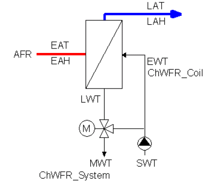

**Figure 1 – Schematic Diagram of Cooling Coil with Variable Water Flow
Rate (Part I - Figure 4-7, Felsmann 2008)**

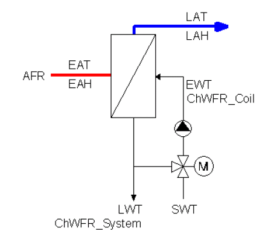

**Figure 2 – Schematic Diagram of Cooling Coil with Constant Water Flow
Rate (Part I - Figure 4-8, Felsmann 2008)**

**Table 2 – Cooling Coil Comparative Test Cases (Part I - Table 4-3, Felsmann 2008)**


**Table 3 – Cooling Coil Nominal Performance Data (Part I - Table 4-2, Felsmann 2008)**

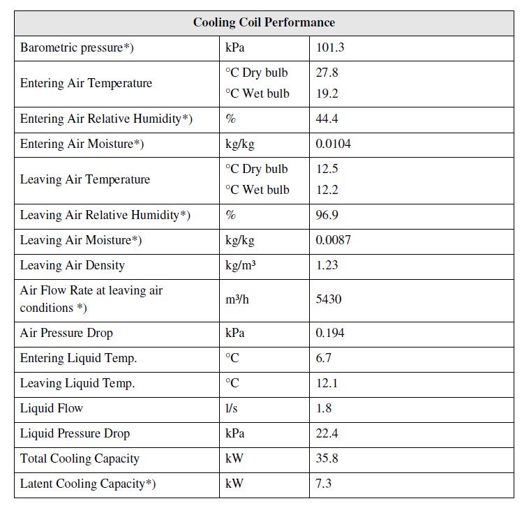

> Data marked with an (*) were calculated from manufacturer’s data

The following outputs are to be provided for each simulation time increment:

- EAT Entering air dry-bulb temperature, °C  
- EArH Entering air relative humidity, %  
- EAH Entering air humidity ratio, kg/kg  
- LAT Discharge/Leaving air dry-bulb temperature, °C  
- LArH Discharge/Leaving air relative humidity, %  
- LAH Discharge/Leaving air humidity ratio, kg/kg  
- AFR Air flow rate, $\frac{m^3}{h}$  
- EWT Chilled water coil entering water temperature, °C  
- LWT Chilled water coil leaving water temperature, °C  
- ChWFRcoil Chilled water flow rate through the coil, $\frac{l}{s}$  
- UA Overall UA-value of the coil, $\frac{kW}{K}$  
- CLT Total cooling load, kW  
- CLS Sensible cooling load, kW  
- CLL Latent cooling load, kW


The Overall UA was to be calculated as:

> $UA=\frac{CLS}{\Delta T_m}$
> 
> where
>
> 

### Heating Coil Comparative Tests

Similar to the cooling coil comparative tests, there are in general two
methods for controlling the performance or discharge air temperature
coming off of a hot water heating coil:

1.  Variable water flow rate with constant water inlet temperature
    ( $m_{var}$ )
    Constant temperature hot water is supplied to the heating coil.
    Control of the desired leaving air temperature is achieved by
    bypassing a portion of the supply water around the heating coil and
    thereby varying the hot water flow rate ( $m_{var}$ ) through the coil
    (see Figure 3).

2.  Constant water flow rate with a variable water inlet temperature
    ( $T_{var}$ )
    Constant hot water flow rate is maintained through the heating coil
    while the boiler supply water is mixed with cooler coil return water
    to achieve the required coil inlet water temperature ( $T_{var}$ ) in
    order to maintain the desired leaving air discharge temperature (see Figure 4).

For each of the flow configurations described above there are 4 test
cases which are to be simulated for different air flow arrangements and
discharge air temperature setpoints as described in Table 4.

The heating coil nominal performance data as provided by the manufacturer is shown in Table 5. The EnergyPlus heating water coil model required some of this data as input.

The following additional requirements were provided by the specification
in regards to modeling the heating coil comparative tests:

-   For test cases with a variable water flow rate and constant water
    inlet temperature, the maximum water flow rate is 1.33 $\frac{l}{s}$

-   For test cases with a constant water flow rate and variable water
    inlet temperature the water flow rate is fixed at 1.33 $\frac{l}{s}$

-   For test cases with constant air volume (CAS), the air flow rate is
    fixed at 4500 $\frac{m^3}{h}$ at all times

-   For test cases with quasi-variable flow volume (VAV), the air flow
    switches between 2000 $\frac{m^3}{h}$ (6 PM to 7 AM) and 5000 $\frac{m^3}{h}$ (7 AM to 6 PM)

-   Cases are run for two discharge air temperatures: 13°C and 18°C and
    are held constant during the entire simulation

-   For all test cases the heating water supply temperature is held
    constant at 70°C


**Figure 3 – Schematic Diagram of Heating Coil with Variable Water Flow Rate (Part II - Figure 4-5, Felsmann 2008)**

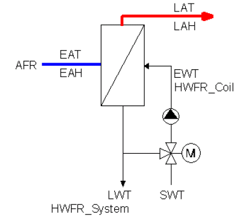

**Figure 4 – Schematic Diagram of Heating Coil with Constant Water Flow Rate (Part II - Figure 4-6, Felsmann 2008)**

**Table 4 – Heating Coil Comparative Test Cases (Part II - Table 4-3, Felsmann 2008)**


**Table 5 – Heating Coil Nominal Performance Data (Part II - Table 4-2, Felsmann 2008)**

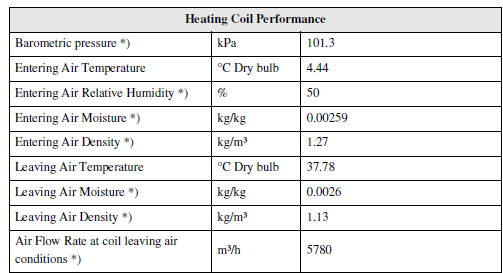


Data marked with an (*) were calculated from manufacturer’s data

-   The heating coil is processing 100% outside air with no
    recirculation through the coil

-   A TMY2 weather file for Des Moines, Iowa was provided for use in
    simulating all test cases

The following outputs are to be provided for each simulation time
increment:

- EAT Entering air dry-bulb temperature, °C  
- EArH Entering air relative humidity, %  
- EAH Entering air humidity ratio, kg/kg  
- LAT Discharge/Leaving air dry-bulb temperature, °C  
- LArH Discharge/Leaving air relative humidity, %  
- LAH Discharge/Leaving air humidity ratio, kg/kg  
- AFR Air flow rate, $\frac{m^3}{h}$  
- EWT Heating water coil entering water temperature, °C  
- LWT Heating water coil leaving water temperature, °C  
- HWFRcoil Heating water flow rate through the coil, $\frac{l}{s}$  
- UA Overall UA-value of the coil, $\frac{kW}{K}$
- HLT Total heating load, kW  
- HLS Sensible heating load, kW  

The Overall UA was to be calculated as:

> $UA=\frac{CLS}{\Delta T_m}$
> 
> where
>
> 


# Results and Discussion

## Modeling Methodology

In order to generate the required cooling coil and heating coil load
each hour of the simulation period as required by the specification, the
EnergyPlus user must model a thermal zone, HVAC system including cooling
coil and heating coil, and plant equipment including chilled water
cooling equipment and hot water heating equipment. For this test suite,
a one zone building was modeled with an adiabatic building shell, no
windows and no internal loads.

### Cooling Coil Tests

Since the specification for the comparative cooling coil tests requires
that the air handling system be VAV for some cases, the HVAC system was
modeled as a variable volume system using the AirTerminal:SingleDuct:VAV:NoReheat object in EnergyPlus with input
parameters set as shown below:

    AirTerminal:SingleDuct:VAV:NoReheat,  
    ZONE ONE VAV Reheat, !- Name  
    COMPACT HVAC-ALWAYS 1, !- Availability Schedule Name  
    ZONE ONE Supply Inlet, !- Air Outlet Node Name  
    ZONE ONE Zone Equip Inlet, !- Air Inlet Node Name  
    0.8333, !- Maximum Air Flow Rate {m3/s}  
    Constant, !- Zone Minimum Air Flow Input Method  
    1.; !- Zone Minimum Air Flow Fraction

The VAV system as described in the specification is not a typical fully
variable volume air flow system but is referred to in Section 4.4.2 of the
specification as “Quasi-Variable Air Volume” since the air flow rate was either
2000 $\frac{m^3}{h}$ or 5000 $\frac{m^3}{h}$ depending on the time of day. The
VAV system modeled in EnergyPlus was therefore forced to operate as a constant
volume system by setting the zone minimum air flow fraction to 1.0. For Cases
CC100 and CC120 the maximum air flow rate was set to 3000 $\frac{m^3}{h}$
(0.8333 $\frac{m^3}{s}$ ). For Cases CC200 and CC220 where supply air flow
changed from 2000 $\frac{m^3}{h}$ (0.5555 $\frac{m^3}{s}$ ) to 5000
$\frac{m^3}{h}$ (1.3889 $\frac{m^3}{s}$ ) depending on time of day, two
separate simulations were performed, one at the high flow rate and one at the
low flow rate for the entire simulation period, and then the appropriate
results were linked into the results spreadsheet. The supply fan heat added to
the air stream was forced to be 0.0 by setting the fan delta pressure to 0.0.
The VAV system supply air flow was set to 100% outdoor air as follows with the
min and max flow rates set accordingly for each test case:

    Controller:OutdoorAir,  
    SYSTEM-1 OA Controller, !- Name  
    SYSTEM-1 Relief Air Outlet, !- Relief Air Outlet Node Name  
    SYSTEM-1 Air Loop Inlet, !- Return Air Node Name  
    SYSTEM-1 Mixed Air Outlet, !- Mixed Air Node Name  
    SYSTEM-1 Outside Air Inlet, !- Actuator Node Name  
    0.8333, !- Minimum Outdoor Air Flow Rate {m3/s}  
    0.8333, !- Maximum Outdoor Air Flow Rate {m3/s}  
    NoEconomizer, !- Economizer Control Type  
    ModulateFlow, !- Economizer Control Action Type  
    , !- Economizer Maximum Limit Dry-Bulb Temp. {C}  
    , !- Economizer Maximum Limit Enthalpy {J/kg}  
    , !- Economizer Maximum Limit Dewpoint Temp. {C}  
    , !- Electronic Enthalpy Limit Curve Name  
    , !- Economizer Minimum Limit Dry-Bulb Temp. {C}  
    NoLockout, !- Lockout Type  
    ProportionalMinimum, !- Minimum Limit Type  
    COMPACT SYSTEM-1 Outside Air Sched; !- Minimum Outdoor Air Schedule Name

The cooling coil was modeled using the Coil:Cooling:Water object in EnergyPlus with input parameters set as shown below:

    Coil:Cooling:Water,  
    SYSTEM-1 Cooling Coil, !- Name  
    COMPACT HVAC-ALWAYS 1, !- Availability Schedule Name  
    0.00177, !- Design Water Flow Rate {m3/s}  
    1.54778, !- Design Air Flow Rate {m3/s}\
    6.67, !- Design Inlet Water Temperature {C}  
    27.78, !- Design Inlet Air Temperature {C}  
    12.50, !- Design Outlet Air Temperature {C}  
    0.0104, !- Design Inlet Air Humidity Ratio {kg-H2O/kg-air}  
    0.0087, !- Design Outlet Air Humidity Ratio {kg-H2O/kg-air}  
    SYSTEM-1 Cooling Coil ChW Inlet, !- Water Inlet Node Name  
    SYSTEM-1 Cooling Coil ChW Outlet, !- Water Outlet Node Name  
    SYSTEM-1 Supply Fan Outlet, !- Air Inlet Node Name  
    SYSTEM-1 Cooling Coil Outlet, !- Air Outlet Node Name  
    DetailedAnalysis, !- Type of Analysis
    CrossFlow, !- Heat Exchanger Configuration  
    ; !- Condensate Collection Water Storage Tank Name

The coil design parameters were taken from Table 2 in Section 1 of this
report.

EnergyPlus has two models available for simulating a water cooling coil:

1.  Coil:Cooling:Water  
    This coil model has the ability to give detailed output with
    simplified inputs. Inputs for complicated coil geometry are not
    required. Instead, the coil requires thermodynamic inputs such as
    temperatures, mass flow rates and humidity ratios. This model uses
    the NTU-effectiveness approach to model heat transfer and has two
    types of flow arrangements, cross-flow and counter-flow. For this
    test series the CROSSFLOW arrangement was used. This EnergyPlus
    cooling coil model allows the user to choose between a Simple
    Analysis method or Detailed Analysis method. The difference between
    the two methods being, the Simple Analysis assumes that the coil is
    either all-dry or all-wet while the Detailed Analysis method checks
    for part-wet and part-dry operation and reports the surface area wet
    fraction of the coil. Both the Simple Analysis and Detailed Analysis
    options were simulated for this test series but only the results for
    the Simple Analysis are reported here.

2.  Coil:Cooling:Water:DetailedGeometry\
    This model requires the user to input the detailed coil geometry in
    terms of tube outside and inside surface area, coil depth, fin
    diameter and thickness, tube inside and outside diameter, tube and
    fin thermal conductivity, fin spacing, tube depth spacing, and
    number of tube rows. Since none of these details were available for
    the cooling coil from the specification, this cooling coil model was
    not used for these tests.


### Heating Coil Tests

The air handling system for the comparative heating coil tests were
structured in a manner similar to the cooling coil tests except that for
the constant volume air flow cases (Cases HX100 and HX120) the air flow
rate was 4500 $\frac{m^3}{h}$ (1.25 $\frac{m^3}{s}$ ). This required that the HVAC system object and the outside air controller object be changed as indicated below.

    AirTerminal:SingleDuct:VAV:NoReheat,  
    ZONE ONE VAV Reheat, !- Name  
    COMPACT HVAC-ALWAYS 1, !- Availability Schedule Name  
    ZONE ONE Supply Inlet, !- Air Outlet Node Name  
    ZONE ONE Zone Equip Inlet, !- Air Inlet Node Name  
    1.25, !- Maximum Air Flow Rate {m3/s}  
    Constant, !- Zone Minimum Air Flow Input Method  
    1.; !- Zone Minimum Air Flow Fraction  

    Controller:OutdoorAir,  
    SYSTEM-1 OA Controller, !- Name  
    SYSTEM-1 Relief Air Outlet, !- Relief Air Outlet Node Name  
    SYSTEM-1 Air Loop Inlet, !- Return Air Node Name  
    SYSTEM-1 Mixed Air Outlet, !- Mixed Air Node Name  
    SYSTEM-1 Outside Air Inlet, !- Actuator Node Name  
    1.25, !- Minimum Outdoor Air Flow Rate {m3/s}  
    1.25, !- Maximum Outdoor Air Flow Rate {m3/s}  
    NoEconomizer, !- Economizer Control Type  
    ModulateFlow, !- Economizer Control Action Type  
    , !- Economizer Maximum Limit Dry-Bulb Temp. {C}  
    , !- Economizer Maximum Limit Enthalpy {J/kg}  
    , !- Economizer Maximum Limit Dewpoint Temp. {C}  
    , !- Electronic Enthalpy Limit Curve Name  
    , !- Economizer Minimum Limit Dry-Bulb Temp. {C}  
    NoLockout, !- Lockout Type  
    ProportionalMinimum, !- Minimum Limit Type  
    COMPACT SYSTEM-1 Outside Air Sched; !- Minimum Outdoor Air Schedule Name

To model the heating coil, the following EnergyPlus object was used with
input parameters set as shown below.

    Coil:Heating:Water,  
    SYSTEM-1 Heating Coil, !- Name  
    COMPACT HVAC-BOILER, !- Availability Schedule Name  
    autosize, !- U-Factor Times Area Value {W/K}  
    0.00133, !- Maximum Water Flow Rate {m3/s}  
    SYSTEM-1 Heating Coil HW Inlet, !- Water Inlet Node Name  
    SYSTEM-1 Heating Coil HW Outlet, !- Water Outlet Node Name  
    SYSTEM-1 Supply Fan Outlet, !- Air Inlet Node Name  
    SYSTEM-1 Heating Coil Outlet, !- Air Outlet Node Name  
     UFactorTimesAreaAndDesignWaterFlowRate, !- Performance Input Method  
    autosize, !- Rated Capacity {W}  
    82.28, !- Rated Inlet Water Temperature {C}  
    4.44, !- Rated Inlet Air Temperature {C}  
    71.22, !- Rated Outlet Water Temperature {C}  
    37.78; !- Rated Outlet Air Temperature {C}  

The rated coil parameters were taken from Table 4 in Section 1 of this
report.

The input object Coil:Heating:Water provides a model that uses an
NTU–effectiveness model of a static heat exchanger. The model is an inlet –
outlet model: given the inlet conditions and flow rates and the UA, the
effectiveness is calculated using the formula for the effectiveness of a
cross-flow heat exchanger with both fluid streams unmixed. The effectiveness
then allows the calculation of the outlet conditions from the inlet conditions.

The inputs to the model are: (1) the current inlet temperatures and flow
rates of the air and water fluid streams and (2) the UA of the coil. The
design UA of the coil was calculated by EnergyPlus using the heating coil performance data provided in Table 4 of Section 1 as 1.1108 kW/K. The resulting hourly UA of the heating coil which was calculated directly in the results spreadsheet using the heating coil output and the air and water inlet and outlet water temperatures for each hour
varies around the design UA depending on the air and water flow rates but being more sensitive to the air flow rate.

There are 2 alternative user inputs for the component: the user may input the design water volumetric flow rate and the UA directly; or the user may choose to input the more familiar design heating capacity plus design inlet and outlet temperatures and let the program calculate the design UA. The latter method was used for the tests described here.


## Modeling Difficulties

### Cooling Coil Tests

Only eight of the Cooling Coil Comparative Test cases (CC100, CC120,
CC140, CC160, CC200, CC220, CC240 and CC260) described in Section 1.3.1
could be modeled by EnergyPlus. The other cooling coil comparative cases
(cases CC300 through CC460) and the Cooling Coil Empirical Test could
not be modeled by EnergyPlus due to the following reason:

-  They required the use a varying water supply temperature to the
    cooling coils with the water flow rate remaining constant.
    EnergyPlus will allow different water supply temperatures but
    currently cannot *control* the supply temperature of the water
    entering the coil to meet the load.

Prior to EnergyPlus version 7.0.0.026, EnergyPlus did not have the capability to model glycol solutions as part of the chilled water loops and therefore an approximation using water as the chilled water fluid was used by adjusting the cooling loop water flow rate. The use of a 35% Ethylene Glycol solution was approximated in the simulations by
adjusting the input design water flow rate of the cooling coil based on
the ratio of specific heats and densities of water and the glycol
solution using the data provided in Table 2-4 of Part I of the
specification. This was arrived at as follows:

> $\frac{0.00177 \frac{m^3}{s} * 3.5543 \frac{kJ}{kgK} * 1054.08 \frac{kg}{m^3}}{4.180 \frac{kJ}{kgK} * 998.2 \frac{kg}{m^3}}= 0.001589 \frac{m^3}{s}$

One of the new features of EnergyPlus version 7.0.0.036 release was the
ability to simulate chilled water loops the use either ethylene glycol
or propylene glycol mixtures so the above approximation is no longer
needed. An additional feature added the EnergyPlus version 7.0.0.036 was
the ability to model variable UA conditions for the cooling coil.

Cases CC200, CC220, CC240 and CC260 all required that the supply air
flow rate be fixed at two different values depending on the time of day:
2000 $\frac{m^3}{h}$ from 6 p.m. to 7 a.m. and 5000 $\frac{m^3}{h}$ from 7 a.m. to 6 p.m. This was modeled in EnergyPlus by two separate simulations, one at 2000 $\frac{m^3}{h}$ for the full simulation period and one at 5000 $\frac{m^3}{h}$ for the full simulation period. The results summarized in the spreadsheet then linked to the proper hourly results from the two separate EnergyPlus runs. This does not introduce errors at the transitions because the cooling coil input air stream was always 100% outdoor air and not affected by the
zone conditions.


### Heating Coil Tests

Only four of the Heating Coil Comparative Test cases (HX100, HX120,
HX200 and HX220) described in Part II, Section 4.5 of the specification
were able to be modeled by EnergyPlus, and these were modeled with water
as the heating fluid. The other heating coil comparative cases could not
be modeled by EnergyPlus due to the following reason:

- They required the use a varying water supply temperature to the
    heating coils with the water flow rate remaining constant.
    EnergyPlus will allow different water supply temperatures but
    currently cannot *control* the supply temperature of the water
    entering the coil to meet the load.

Cases HX200 and HX220 both required that the supply air flow rate be
fixed at two different values depending on the time of day: 2000 $\frac{m^3}{h}$
from 6 p.m. to 7 a.m. and 5000 $\frac{m^3}{h}$ from 7 a.m. to 6 p.m. This was
modeled in EnergyPlus by two separate simulations, one at 2000 $\frac{m^3}{h}$ for the full simulation period and one at 5000 $\frac{m^3}{h}$ for the full simulation period. The results summarized in the spreadsheet then linked to the proper hourly results from the two separate EnergyPlus runs. This does not introduce errors at the transitions because the heating coil input air stream was always 100% outdoor air and not affected by the zone
conditions.


## Results for Cooling Coil Tests

### Cooling Coil Test Results as Reported in IEA Final Report

EnergyPlus 2.2.0.023 results for the cooling coil comparative tests that
were submitted as part of the final round of testing and which are
reported in the IEA final report are presented in Table 6 – Results of
Cooling Coil Tests. Figures 5 through 7 are reproductions of charts from
the IEA final report showing the amount of total, sensible and latent
cooling energy predicted by the various programs for the period from May
through September to maintain the air leaving the cooling coil at the
given set point temperature. Deviations between programs were normally
less than 10%. EnergyPlus results are shown for only test cases CC100,
CC120, CC200 and CC220 and were within the range of other program
results except for test case CC200 latent cooling where EnergyPlus is
setting the upper boundary of results.

When comparing hourly results between programs for specific day types,
e.g., test case CC100 on a hot dry day where the cooling load is less
than the nominal load for the cooling coil (Figure 8), the agreement
between programs is very good. For test case CC200 however, on a hot
humid day (Figure 9) where the air flow rate is increased and the coil
is required to operate outside the nominal performance of the cooling
coil, the range of results between programs is much greater. Under these
conditions the leaving air set point temperature cannot be maintained.
These variations between programs are probably due to the differences in
the coil models used by the various programs. Other major differences
between the program coil models are evident when comparing the volume of
chilled water circulated through the cooling coil during the simulation
period (Figure 10) and comparing hourly water flow rates for specific
days (Figures 11 and 12). Another indication of variation in models is
indicated by the mean leaving water temperature as indicated in Figure
13. In the case of EnergyPlus where the water flow rates are lower and
leaving water temperatures are higher than other programs, this indicates that the EnergyPlus coil model has calculated a higher design UA value for the coil than the other programs.

**Table 6 Results of Cooling Coil Tests with EnergyPlus Version 2.2.0.023**


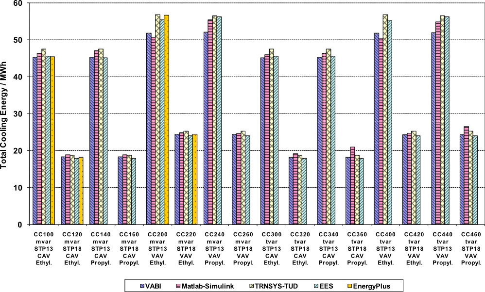

**Figure 5 – Cooling Coil Comparative Tests – Total Cooling Energy EnergyPlus v2.2.0.23 (Part I - Figure 6-35, Felsmann 2008)**

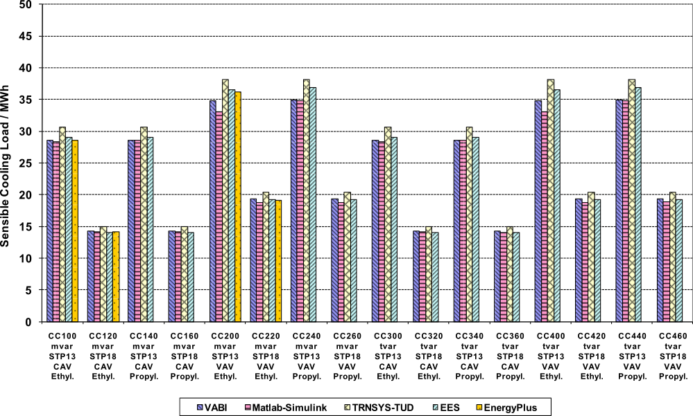

**Figure 6 – Cooling Coil Comparative Tests – Sensible Cooling Energy EnergyPlus v2.2.0.23 (Part I - Figure 6-38, Felsmann 2008)**

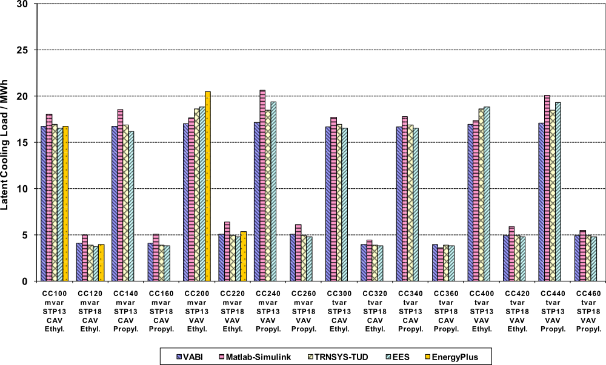

**Figure 7 – Cooling Coil Comparative Tests – Latent Cooling Energy EnergyPlus v2.2.0.23 (Part I - Figure 6-39, Felsmann 2008)**

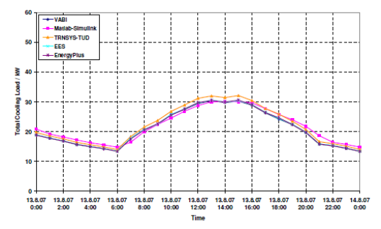

**Figure 8 – Cooling Coil Comparative Test CC100 – Total Cooling Load - August 13 (hot-dry), EnergyPlus v2.2.0.23 (Part I - Figure 6-36, Felsmann 2008)**

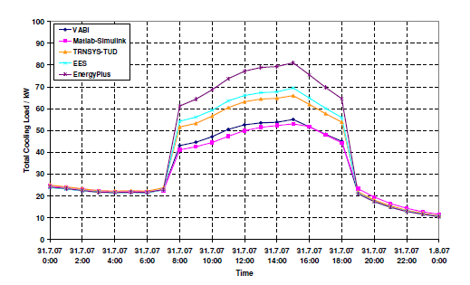

**Figure 9 – Cooling Coil Comparative Test CC200 – Total Cooling Load - July 31 (hot-humid) EnergyPlus v2.2.0.23 (Part I - Figure 6-37, Felsmann 2008)**

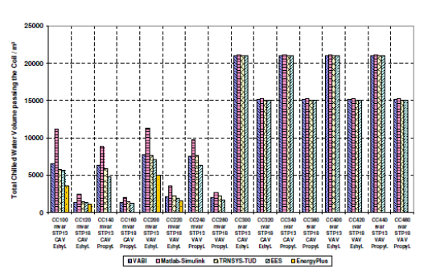

**Figure 10 – Cooling Coil Comparative Tests – Chilled Water Volume Circulated,  EnergyPlus v2.2.0.23 (Part I - Figure 6-41, Felsmann 2008)**

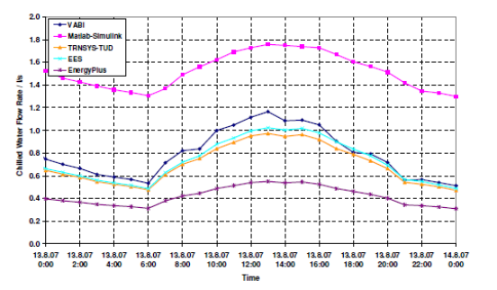

**Figure 11 – Cooling Coil Comparative Test CC100 – Chilled Water Flow Rate - August 13 (hot-dry),  EnergyPlus v2.2.0.23 (Part I - Figure 6-42, Felsmann 2008)**

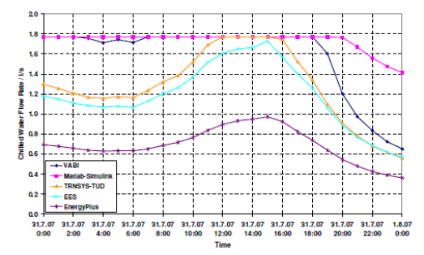

**Figure 12 – Cooling Coil Comparative Test CC100 – Chilled Water Flow Rate - July 31 (hot-humid), EnergyPlus v2.2.0.23 (Part I - Figure 6-43, Felsmann 2008)**

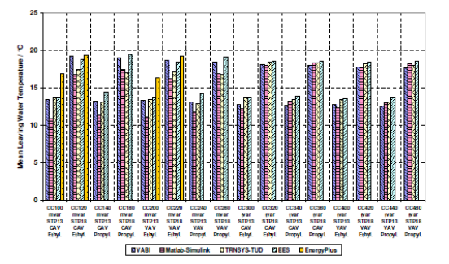

**Figure 13 – Cooling Coil Comparative Tests – Mean Leaving Water Temperature, EnergyPlus v2.2.0.23 (Part I - Figure 6-45, Felsmann 2008)**


### Cooling Coil Test Results with Latest Version of EnergyPlus

The results obtained for the cooling coil tests when simulated with the
latest release of EnergyPlus, version {{ engine.config["EnergyPlusVersion"] }}, are shown in Tables 7 (35%
Ethylene Glycol) and Table 8 (18% Propylene Glycol) and Figures 14
through 22. Cooling coil loads have remained essentially unchanged since
EnergyPlus version 3.0.0.028. Coil loads increased slightly compared to
those for EnergyPlus version 2.2.0.023 but EnergyPlus results are still
within the range of other programs except for the latent load of Case
CC200 which is still setting the upper boundary. With the addition of
the variable UA feature to EnergyPlus version 7.0.0.036, the cooling
loads changed by a very small amount (<0.02%) while the chilled water
flow rates changed significantly and now are in range of the other
programs. Numerous other charts comparing EnergyPlus v{{ engine.config["EnergyPlusVersion"] }} results with
other programs are included in Appendix A

**Table 7 Results of Cooling Coil Tests with EnergyPlus Version {{ engine.config["EnergyPlusVersion"] }}, Cases with 35% Ethylene Glycol Mixture**


```{exec_python}


engine.load_sheet('hcoilcomp_AllResults_May26_2008-EnergyPlusResultsOnlyB.xlsx', 'HX100')
engine.load_sheet('hcoilcomp_AllResults_May26_2008-EnergyPlusResultsOnlyB.xlsx', 'HX120')
engine.load_sheet('hcoilcomp_AllResults_May26_2008-EnergyPlusResultsOnlyB.xlsx', 'HX200')
engine.load_sheet('hcoilcomp_AllResults_May26_2008-EnergyPlusResultsOnlyB.xlsx', 'HX220')
engine.load_sheet('hcoilcomp_AllResults_May26_2008-EnergyPlusResultsOnlyB.xlsx', 'HX300')
engine.load_sheet('hcoilcomp_AllResults_May26_2008-EnergyPlusResultsOnlyB.xlsx', 'HX320')
engine.load_sheet('hcoilcomp_AllResults_May26_2008-EnergyPlusResultsOnlyB.xlsx', 'HX400')
engine.load_sheet('hcoilcomp_AllResults_May26_2008-EnergyPlusResultsOnlyB.xlsx', 'HX420')


engine.load_sheet('coilcomp_AllResults_May26_2008-With EplusResults-ShortenedB.xlsx', 'Case100')
engine.load_sheet('coilcomp_AllResults_May26_2008-With EplusResults-ShortenedB.xlsx', 'Case120')
engine.load_sheet('coilcomp_AllResults_May26_2008-With EplusResults-ShortenedB.xlsx', 'Case140')
engine.load_sheet('coilcomp_AllResults_May26_2008-With EplusResults-ShortenedB.xlsx', 'Case160')
engine.load_sheet('coilcomp_AllResults_May26_2008-With EplusResults-ShortenedB.xlsx', 'Case200')
engine.load_sheet('coilcomp_AllResults_May26_2008-With EplusResults-ShortenedB.xlsx', 'Case220')
engine.load_sheet('coilcomp_AllResults_May26_2008-With EplusResults-ShortenedB.xlsx', 'Case240')
engine.load_sheet('coilcomp_AllResults_May26_2008-With EplusResults-ShortenedB.xlsx', 'Case260')
```

{{ engine.create_table_from_excel_range('IEA Cooling Coil Results-EnergyPlus-SimpleSolution.xlsx', 'Summary Results-EthyleneGlycol', 'A1:J66', [0,1,2,3,4,5,6,7,8,9,10,11]) }}


**Table 8 Results of Cooling Coil Tests with EnergyPlus Version {{ engine.config["EnergyPlusVersion"] }}, Cases with 18% Propylene Glycol Mixture**

{{ engine.create_table_from_excel_range('IEA Cooling Coil Results-EnergyPlus-SimpleSolution.xlsx', 'Summary Results-PropyleneGlycol', 'A1:J66', [0,1,2,3,4,5,6,7,8,9,10,11]) }}

{{ engine.write_chart('ColumnClustered', 'CLT', '', [], 'Total Cooling Energy / MWh', 'coilcomp_AllResults_May26_2008-With EplusResults-ShortenedB.xlsx', 'Summary', 'B5:G21', "(C5,B6:B21,C6:C21,1);(D5,B6:B21,D6:D21,2);(E5,B6:B21,E6:E21,3);(F5,B6:B21,F6:F21,4);(G5,B6:B21,G6:G21,5);", []) }}

**Figure 14 – Cooling Coil Comparative Tests – Total Cooling Energy, EnergyPlus v{{ engine.config["EnergyPlusVersion"] }}**

{{ engine.write_chart('ColumnClustered', 'CLS', '', [], 'Sensible Cooling Load / MWh', 'coilcomp_AllResults_May26_2008-With EplusResults-ShortenedB.xlsx', 'Summary', 'B82:G98', "(C82,B83:B98,C83:C98,1);(D82,B83:B98,D83:D98,2);(E82,B83:B98,E83:E98,3);(F82,B83:B98,F83:F98,4);(G82,B83:B98,G83:G98,5);", []) }}

**Figure 15 – Cooling Coil Comparative Tests – Sensible Cooling Energy, EnergyPlus v{{ engine.config["EnergyPlusVersion"] }}**

{{ engine.write_chart('ColumnClustered', 'CLL', '', [], 'Latent Cooling Load / MWh', 'coilcomp_AllResults_May26_2008-With EplusResults-ShortenedB.xlsx', 'Summary', 'B102:G118', "(C102,B103:B118,C103:C118,1);(D102,B103:B118,D103:D118,2);(E102,B103:B118,E103:E118,3);(F102,B103:B118,F103:F118,4);(G102,B103:B118,G103:G118,5);", []) }}

**Figure 16 – Cooling Coil Comparative Tests – Latent Cooling Energy, EnergyPlus v{{ engine.config["EnergyPlusVersion"] }}**

{{ engine.write_chart('ScatterSmooth', 'CLT100_HotDry', '', [], 'Total Cooling Load / kW', 'coilcomp_AllResults_May26_2008-With EplusResults-ShortenedB.xlsx', 'Case100', 'A4:CZ3675', "('VABI', A4:A3675,Case100!P4:P3675,1);('Matlab-Simulink',Case100!A2499:A2522,Case100!AL2499:AL2522,2);('TRNSYS-TUD',Case100!A4:A3675,Case100!BH4:BH3675,3);('EES',Case100!A4:A3675,Case100!CD4:CD3675,4);(SummaryDiagnosis!G16,Case100!A4:A3675,Case100!CZ4:CZ3675,5);", ['Test Case CC100\nHotDry Day'], [], [], force_times=True) }}

**Figure 17 – Cooling Coil Comparative Test CC100 – Total Cooling Load -  August 13 (hot-dry), EnergyPlus v{{ engine.config["EnergyPlusVersion"] }}**

{{ engine.write_chart('ScatterSmooth', 'CLT200_HotHumid', '', [], 'Total Cooling Load / kW', 'coilcomp_AllResults_May26_2008-With EplusResults-ShortenedB.xlsx', 'Case200', 'A4:CN3675', "('VABI', A4:A3675,Case200!P4:P3675,1);('Matlab-Simulink',Case200!A2187:A2210,Case200!AI2187:AI2210,2);('TRNSYS-TUD',Case200!A4:A3675,Case200!BB4:BB3675,3);('EES',Case200!A4:A3675,Case200!BU4:BU3675,4);(SummaryDiagnosis!G16,Case200!A4:A3675,Case200!CN4:CN3675,5);", ['Test Case CC200\nHotHumid Day'], [], [], force_times=True) }}

**Figure 18 – Cooling Coil Comparative Test CC200 – Total Cooling Load - July 31 (hot-humid), EnergyPlus v{{ engine.config["EnergyPlusVersion"] }}**

{{ engine.write_chart('ColumnClustered', 'ChilledWaterVolume', '', [], 'Total Chilled Water Volume passing the Coil / m³', 'coilcomp_AllResults_May26_2008-With EplusResults-ShortenedB.xlsx', 'Summary', 'B242:K258', "(C242,B243:B258,C243:C258,1);(E242,B243:B258,E243:E258,2);(G242,B243:B258,G243:G258,3);(I242,B243:B258,I243:I258,4);(K242,B243:B258,K243:K258,5);", []) }}

**Figure 19 – Cooling Coil Comparative Tests – Chilled Water Volume Circulated, EnergyPlus v{{ engine.config["EnergyPlusVersion"] }}**

{{ engine.write_chart('ScatterSmooth', 'ChWFR100_HotDry', '', [], 'Chilled Water Flow Rate / l/s', 'coilcomp_AllResults_May26_2008-With EplusResults-ShortenedB.xlsx', 'Case100', 'A4:CX3675', "('VABI', A4:A3675,Case100!N4:N3675,1);('Matlab-Simulink',Case100!A2499:A2522,Case100!AJ2499:AJ2522,2);('TRNSYS-TUD',Case100!A4:A3675,Case100!BF4:BF3675,3);('EES',Case100!A4:A3675,Case100!CB4:CB3675,4);(SummaryDiagnosis!G16,Case100!A4:A3675,Case100!CX4:CX3675,5);", ['Test Case CC100\nHotDry Day'], [], [], force_times=True) }}

**Figure 20 – Cooling Coil Comparative Test CC100 – Chilled Water Flow Rate - August 13 (hot-dry), EnergyPlus v{{ engine.config["EnergyPlusVersion"] }}**

{{ engine.write_chart('ScatterSmooth', 'ChWFR100_HotHumid', '', [], 'Chilled Water Flow Rate / l/s', 'coilcomp_AllResults_May26_2008-With EplusResults-ShortenedB.xlsx', 'Case100', 'A4:CX3675', "('VABI', A4:A3675,Case100!N4:N3675,1);('Matlab-Simulink',Case100!A2187:A2210,Case100!AJ2187:AJ2210,2);('TRNSYS-TUD',Case100!A4:A3675,Case100!BF4:BF3675,3);('EES',Case100!A4:A3675,Case100!CB4:CB3675,4);(SummaryDiagnosis!G16,Case100!A4:A3675,Case100!CX4:CX3675,5);", ['Test Case CC100\nHotHumid day'], [], [], force_times=True) }}


**Figure 21 – Cooling Coil Comparative Test CC100 – Chilled Water Flow Rate - July 31 (hot-humid), EnergyPlus v{{ engine.config["EnergyPlusVersion"] }}**

{{ engine.write_chart('ColumnClustered', 'MeanLeavingWaterTemp', '', [], 'Mean Leaving Water Temperature / °C', 'coilcomp_AllResults_May26_2008-With EplusResults-ShortenedB.xlsx', 'Summary', 'B182:K198', "(C182,B183:B198,C183:C198,1);(E182,B183:B198,E183:E198,2);(G182,B183:B198,G183:G198,3);(I182,B183:B198,I183:I198,4);(K182,B183:B198,K183:K198,5);", []) }}

**Figure 22 – Cooling Coil Comparative Tests – Mean Leaving Water Temperature, EnergyPlus v{{ engine.config["EnergyPlusVersion"] }}**


## Results for Heating Coil Tests

### Heating Coil Test Results as Reported in IEA Final Report

EnergyPlus 2.2.0.023 results for the heating coil comparative tests that
were submitted as part of the final round of testing and which are
reported in the IEA final report are presented in Table 9 – Results of
Heating Coil Tests. Figure 23 is a reproduction of a chart from the IEA
final report showing the amount of total heating energy predicted by the
various programs for the period from October through April to maintain
the air leaving the heating coil at the given set point temperature.
Deviations between programs were normally less than 5% indicating good
agreement between programs. Figures 24 – 25 show hourly results for test
cases HX100 and HX200 for the coldest day during the simulation. Here
again the results of the various programs are very similar.

Major differences between programs can be seen when looking at the
control variable hot water mass flow rate. Figure 26 shows the total hot
water volume circulated through the heating coil during the simulation
period while Figures 27 and 28 show the hourly hot water flow rate through the heating coil for test cases HX100 and HX200. EnergyPlus hot water flow is always much less than for other programs even though Figure 23 indicates that EnergyPlus supplied about the same amount of heating load and maintained the same mean discharge air temperature
(Figure 29) and mean entering water temperature (Figure 30) compared to
other programs. This occurred because the EnergyPlus coil model calculated a higher design UA (Figure 32) than the other programs which is reflected in the lower mean leaving water temperature as indicated in Figure 31.

**Table 9 Results of Heating Coil Tests with EnergyPlus Version 2.2.0.023**


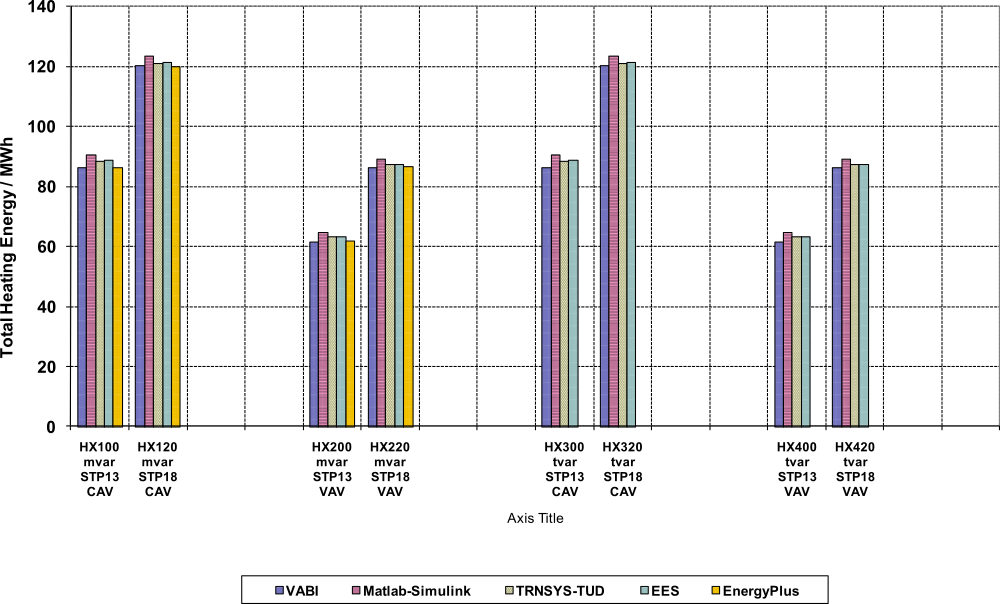

**Figure 23 – Heating Coil Comparative Tests – Total Heating Energy, EnergyPlus v2.2.0.23 (Part II - Figure 6-11, Felsmann 2008)**

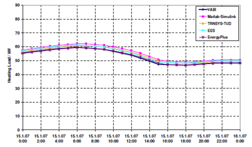

**Figure 24 – Heating Coil Comparative Test HX100 – Heating Load - Jan 15 (coldest day), EnergyPlus v2.2.0.23 (Part II - Figure 6-12, Felsmann 2008)**

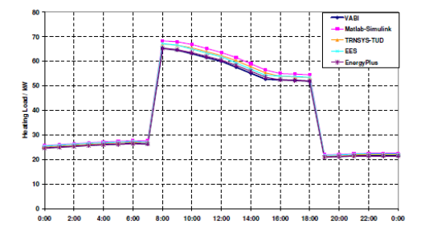

**Figure 25 – Heating Coil Comparative Test HX200 – Heating Load - Jan 15 (coldest day),  EnergyPlus v2.2.0.23 (Part II - Figure 6-13, Felsmann 2008)**

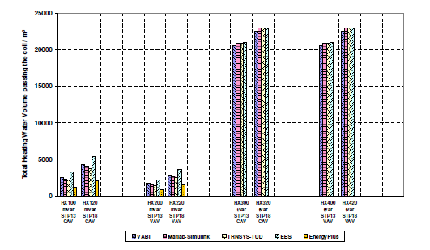

**Figure 26 – Heating Coil Comparative Test – Hot Water Volume Circulated,  EnergyPlus v2.2.0.23 (Part II - Figure 6-14, Felsmann 2008)**

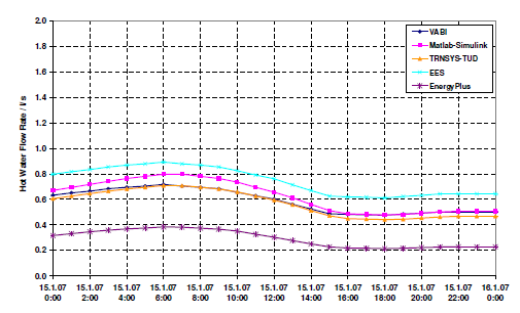

**Figure 27 – Heating Coil Comparative Test HX100– Hot Water Flow Rate - Jan 15 (coldest day),  EnergyPlus v2.2.0.23 (Part II - Figure 6-15, Felsmann 2008)**

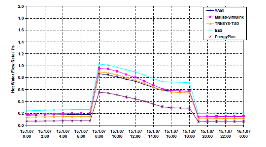

**Figure 28 – Heating Coil Comparative Test HX200– Hot Water Flow Rate - Jan 15 (coldest day),  EnergyPlus v2.2.0.23 (Part II - Figure 6-16, Felsmann 2008)**

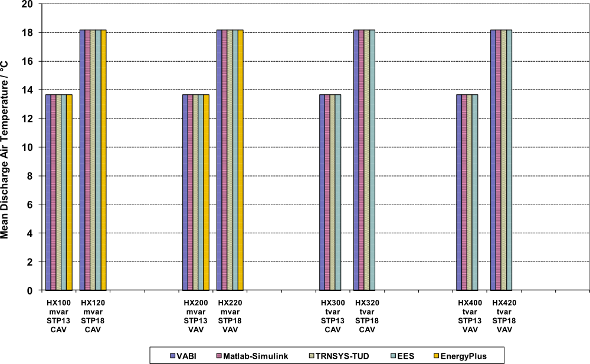

**Figure 29 – Heating Coil Comparative Tests – Mean Discharge Air Temperature,  EnergyPlus v2.2.0.23 (Felsmann 2008)**

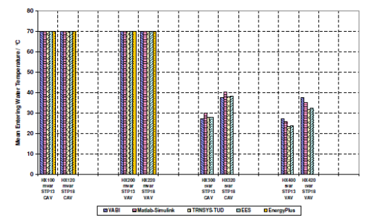

**Figure 30 – Heating Coil Comparative Tests– Mean Entering Water Temperature, EnergyPlus v2.2.0.23 (Part II - Figure 6-17, Felsmann 2008)**


**Figure 31 – Heating Coil Comparative Tests– Mean Leaving Water Temperature,  EnergyPlus v2.2.0.23 (Part II - Figure 6-18, Felsmann 2008)**

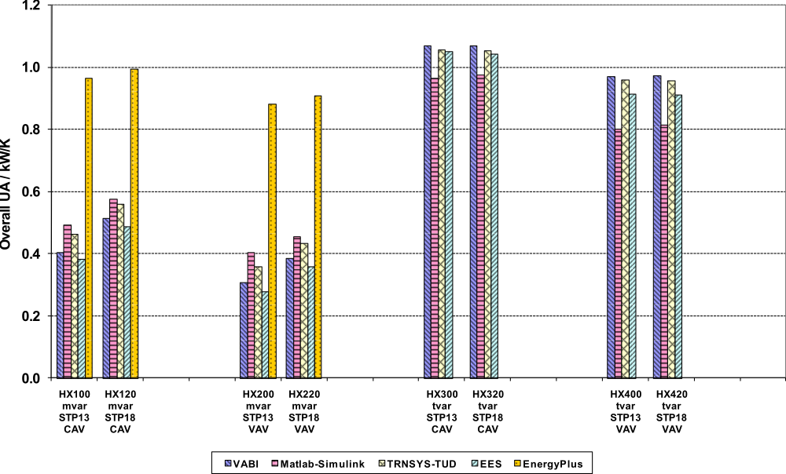

**Figure 32 – Heating Coil Comparative Tests– Overall UA,  EnergyPlus v2.2.0.23 (Felsmann 2008)**


### Heating Coil Test Results with latest Version of EnergyPlus

The results obtained for the heating coil tests when simulated with the
latest release of EnergyPlus, version {{ engine.config["EnergyPlusVersion"] }}, are shown in Table 10 and
Figures 33 through 42. Heating coil loads have remained essentially
unchanged since EnergyPlus version 2.2.0.023 although there were small
changes in the heating coil annual loads (<0.1%) due to significant
improvements in Overall UA as seen in Figure 42 which brought EnergyPlus
results more closely into the range of other programs. This change in UA
results were due to changes to the EnergyPlus heating coil model in
EnergyPlus version 6.0.0.023 which incorporated variable UA simulations.
Significant changes also occurred in mean hot water flow (Figures 36
through 38) and annual mean leaving water temperature (Figure 41) where
EnergyPlus results are above the other programs. Numerous other charts
comparing EnergyPlus v{{ engine.config["EnergyPlusVersion"] }} results with other programs are included in
Appendix B

**Table 10 Results of Heating Coil Tests with EnergyPlus Version {{ engine.config["EnergyPlusVersion"] }}**

{{ engine.create_table_from_excel_range('IEA Heating Coil Results-EnergyPlus.xlsx', 'Summary Results', 'A1:H67', [0,1,2,3,4,5,6,7,8,9,10,11]) }}


{{ engine.write_chart('ColumnClustered', 'HLT', '', [], 'Total Heating Energy / MWh', 'hcoilcomp_AllResults_May26_2008-EnergyPlusResultsOnlyB.xlsx', 'Summary', 'B2:G18', "(C2,B3:B18,C3:C18,1);(D2,B3:B18,D3:D18,2);(E2,B3:B18,E3:E18,3);(F2,B3:B18,F3:F18,4);(G2,B3:B18,G3:G18,5);", []) }}

**Figure 33 – Heating Coil Comparative Tests – Total Heating Energy, EnergyPlus v{{ engine.config["EnergyPlusVersion"] }}**

{{ engine.write_chart('ScatterSmooth', 'HLT100_ColdestDay', '', [], 'Heating Load / kW', 'hcoilcomp_AllResults_May26_2008-EnergyPlusResultsOnlyB.xlsx', 'HX100', 'A3:CN5091', "('VABI',A4:A5091,'HX100'!P4:P5091,1);('Matlab-Simulink','HX100'!A2548:A2570,'HX100'!AI2548:AI2570,2);('TRNSYS-TUD','HX100'!A4:A5091,'HX100'!BB4:BB5091,3);('EES','HX100'!A4:A5091,'HX100'!BU4:BU5091,4);(SummaryDiagnosis!G3,'HX100'!A4:A5091,'HX100'!CN4:CN5091,5);", ['Test Case HX100\nColdest Day'], [], [], force_times=True) }}

**Figure 34 – Heating Coil Comparative Test HX100 – Heating Load - Jan 15 (coldest day), EnergyPlus v{{ engine.config["EnergyPlusVersion"] }}**

{{ engine.write_chart('ScatterSmooth', 'HLT200_ColdestDay', '', [], 'Heating Load / kW', 'hcoilcomp_AllResults_May26_2008-EnergyPlusResultsOnlyB.xlsx', 'HX200', 'A3:CN5091', "('VABI',A4:A5091,'HX200'!P4:P5091,1);('Matlab-Simulink','HX200'!A2548:A2570,'HX200'!AI2548:AI2570,2);('TRNSYS-TUD','HX200'!A4:A5091,'HX200'!BB4:BB5091,3);('EES','HX200'!A4:A5091,'HX200'!BU4:BU5091,4);(SummaryDiagnosis!G3,'HX200'!A4:A5091,'HX200'!CN4:CN5091,5);", ['Test Case HX200\nColdest Day'], [], [], force_times=True) }}

**Figure 35 – Heating Coil Comparative Test HX200 – Heating Load - Jan 15 (coldest day), EnergyPlus v{{ engine.config["EnergyPlusVersion"] }}**

{{ engine.write_chart('ColumnClustered', 'HWFRVol`', '', [], 'Total Heating Water Volume passing the coil / m³', 'hcoilcomp_AllResults_May26_2008-EnergyPlusResultsOnlyB.xlsx', 'Summary', 'B196:L212', "(C196,B197:B212,D197:D212,1);(E196,B197:B212,F197:F212,2);(G196,B197:B212,H197:H212,3);(I196,B197:B212,J197:J212,4);(K196,B197:B212,L197:L212,5);", []) }}

**Figure 36 – Heating Coil Comparative Test – Hot Water Volume Circulated, EnergyPlus v{{ engine.config["EnergyPlusVersion"] }}**

{{ engine.write_chart('ScatterSmooth', 'HWFR100_ColdestDay', '', [], 'Hot Water Flow Rate / l/s', 'hcoilcomp_AllResults_May26_2008-EnergyPlusResultsOnlyB.xlsx', 'HX100', 'A3:CL5091', "('VABI',A4:A5091,'HX100'!N4:N5091,1);('Matlab-Simulink','HX100'!A2548:A2570,'HX100'!AG2548:AG2570,2);('TRNSYS-TUD','HX100'!A4:A5091,'HX100'!AZ4:AZ5091,3);('EES','HX100'!A4:A5091,'HX100'!BS4:BS5091,4);(SummaryDiagnosis!G3,'HX100'!A4:A5091,'HX100'!CL4:CL5091,5);", ['Test Case HX100\nColdest Day'], [], [], force_times=True) }}

**Figure 37 – Heating Coil Comparative Test HX100– Hot Water Flow Rate - Jan 15 (coldest day), EnergyPlus v{{ engine.config["EnergyPlusVersion"] }}**

{{ engine.write_chart('ScatterSmooth', 'HWFR200_ColdestDay', '', [], 'Hot Water Flow Rate / l/s', 'hcoilcomp_AllResults_May26_2008-EnergyPlusResultsOnlyB.xlsx', 'HX200', 'A3:CL5091', "('VABI',A4:A5091,'HX200'!N4:N5091,1);('Matlab-Simulink','HX200'!A2548:A2570,'HX200'!AG2548:AG2570,2);('TRNSYS-TUD','HX200'!A4:A5091,'HX200'!AZ4:AZ5091,3);('EES','HX200'!A4:A5091,'HX200'!BS4:BS5091,4);(SummaryDiagnosis!G3,'HX200'!A4:A5091,'HX200'!CL4:CL5091,5);", ['Test Case HX200\nColdest Day'], [], [], force_times=True) }}

**Figure 38 – Heating Coil Comparative Test HX200– Hot Water Flow Rate - Jan 15 (coldest day), EnergyPlus v{{ engine.config["EnergyPlusVersion"] }}**

{{ engine.write_chart('ColumnClustered', 'DATmean`', '', [], 'Mean Discharge Air Temperature / °C', 'hcoilcomp_AllResults_May26_2008-EnergyPlusResultsOnlyB.xlsx', 'Summary', 'B78:L94', "(C78,B79:B94,D79:D94,1);(E78,B79:B94,F79:F94,2);(G78,B79:B94,H79:H94,3);(I78,B79:B94,J79:J94,4);(K78,B79:B94,L79:L94,5);", []) }}

**Figure 39 – Heating Coil Comparative Tests – Mean Discharge Air Temperature, EnergyPlus v{{ engine.config["EnergyPlusVersion"] }}**

{{ engine.write_chart('ColumnClustered', 'EWTmean`', '', [], 'Mean Entering Water Temperature / °C', 'hcoilcomp_AllResults_May26_2008-EnergyPlusResultsOnlyB.xlsx', 'Summary', 'B136:L172', "(C136,B137:B152,D157:D172,1);(E136,B137:B152,F157:F172,2);(G136,B137:B152,H157:H172,3);(I136,B137:B152,J157:J172,4);(K136,B137:B152,L157:L172,5);", []) }}

**Figure 40 – Heating Coil Comparative Tests– Mean Entering Water Temperature, EnergyPlus v{{ engine.config["EnergyPlusVersion"] }}**

{{ engine.write_chart('ColumnClustered', 'LWTmean', '', [], 'Mean Leaving Water Temperature / °C', 'hcoilcomp_AllResults_May26_2008-EnergyPlusResultsOnlyB.xlsx', 'Summary', 'B136:K152', "(C136,B137:B152,C137:C152,1);(E136,B137:B152,E137:E152,2);(G136,B137:B152,G137:G152,3);(I136,B137:B152,I137:I152,4);(K136,B137:B152,K137:K152,5);", []) }}

**Figure 41 – Heating Coil Comparative Tests– Mean Leaving Water Temperature, EnergyPlus v{{ engine.config["EnergyPlusVersion"] }}**

{{ engine.write_chart('ColumnClustered', 'UA_Value`', '', [], 'Overall UA / kW/K', 'hcoilcomp_AllResults_May26_2008-EnergyPlusResultsOnlyB.xlsx', 'Summary', 'B255:K271', "(C255,B256:B271,D256:D271,1);(E255,B256:B271,F256:F271,2);(G255,B256:B271,H256:H271,3);(I255,B256:B271,J256:J271,4);(K255,B256:B271,K256:K271,5);", []) }}

**Figure 42 – Heating Coil Comparative Tests– Overall UA, EnergyPlus v{{ engine.config["EnergyPlusVersion"] }}**

## Summary of Changes that Occurred Between Versions of EnergyPlus

This section documents modifications that were made to the EnergyPlus
code or changes that were made in the modeling approach. Since the first
reporting of EnergyPlus results for the IEA Mechanical Equipment Control
Strategies for a Chilled Water and a Hot Water System with EnergyPlus
version 2.2.0.023 back in June 2008, further capabilities and improvements have been added to EnergyPlus with new releases beginning in November 2008 (Version 3.0.0.028) and continuing through the current release in September 2014 (version {{ engine.config["EnergyPlusVersion"] }}). The table below summarizes pertinent input file and code changes that were made as the testing
progressed with each new release of EnergyPlus.


**Summary of Pertinent EnergyPlus Changes that were Implemented Since Original Testing with Version 2.2.0.023**

{{ engine.create_table_from_yaml("EnergyPlusChanges.yaml", ["Version", "Input-File-Changes", "Code-Changes"]) }}


The changes as summarized in the table above for the hot water heating
coil in Versions 6.0.0.023 and 8.2.0 resulted in only very small changes
in the heating coil sensible load but did cause significant changes in
hot water flow rates and hot water leaving temperatures as can be seen
by comparing Figures 27 with 37, Figures 28 with 38, and Figures 31 with
41.

The change in the water cooling coil algorithm in Version 7.0.0.036
reduced the annual cooling coil loads with the biggest impact on the
annual latent cooling load which decreased by as much 3.2% for Case
CC200. Other significant changes also occurred in with the chilled water
flow rate and leaving coil water temperature.

The cooling coil maximum water flow rate in versions prior to 7.1.0 had been incorrectly specified at 0.001589 $\frac{m}{s}$ . In version 7.1.0.012 this was changed to the specified water flow rate of 0.00177 $\frac{m}{s}$ after which the EnergyPlus maximum water flow rates matched those from other programs.

# Conclusions

EnergyPlus Version {{ engine.config["EnergyPlusVersion"] }} was used to model a
range of water cooling coil and water heating coil tests specified in *IEA
Mechanical Equipment & Control Strategies for a Chilled Water and a Hot Water
System* (Felsmann 2008). The ability of EnergyPlus to model a chilled water
cooling coil and hot water heating coil and predict resultant loads discharge
air and water temperatures were tested using a suite of 8 chilled water coil
tests and 4 hot water coil tests which included variable water flow rates,
constant and variable air flow rates and two different discharge air set point
temperatures. The results predicted by EnergyPlus were compared to the results
from 4 other programs that participated in an International Energy Agency
project which was completed in 2008.

For the eight chilled water coil tests, EnergyPlus results for total, sensible and latent annual cooling loads were within the range of results of other programs. When comparing hourly results for a hot dry day and hot humid day, coil water flow rates and leaving water
temperatures are now within bounds when compared to other programs as is
the mean UA value for the coil compared to other programs.

For the four hot water coil tests, the results for total heating between
the 5 programs varied by less than 5% overall. Major differences between
programs did occur however when looking at the control variable hot water mass flow rate. EnergyPlus hot water flow was always higher than for other programs even though EnergyPlus supplied about the same amount of heating load and maintained the same mean discharge air temperature and mean entering water temperature compared to other programs. This occurred because the EnergyPlus coil model calculated a lower design UA
than the other programs which is reflected in a higher mean leaving
water temperature.

As of EnergyPlus version 7.0.0.036 the ability to fully model glycol
solutions in all EnergyPlus plant components was implemented.


# References

EnergyPlus {{ engine.year() }}. U.S. Department of Energy, Energy Efficiency and
Renewable Energy, Office of Building Technologies.
[www.energyplus.gov](http://www.energyplus.gov)

Felsmann 2008. *IEA Mechanical Equipment & Control Strategies for a Chilled Water and a Hot Water System*, Technical University of Dresden, Germany, June 18, 2008.

# Appendix A

**Charts Comparing EnergyPlus {{ engine.config["EnergyPlusVersion"] }} Results with Other Whole Building Energy Simulation Programs for Chilled Water Coil Tests(Excerpted from files provided as part of Felsmann 2008 and updated with EnergyPlus {{ engine.config["EnergyPlusVersion"] }} results)**


```{exec_python}


engine.write_chart('ColumnClustered', 'CLT', '', [], 'Total Cooling Energy / MWh', 'coilcomp_AllResults_May26_2008-With EplusResults-ShortenedB.xlsx', 'Summary', 'B5:G21', "(C5,B6:B21,C6:C21,1);(D5,B6:B21,D6:D21,2);(E5,B6:B21,E6:E21,3);(F5,B6:B21,F6:F21,4);(G5,B6:B21,G6:G21,5);", [])
engine.write_chart('ColumnClustered', 'CLS', '', [], 'Sensible Cooling Load / MWh', 'coilcomp_AllResults_May26_2008-With EplusResults-ShortenedB.xlsx', 'Summary', 'B82:G98', "(C82,B83:B98,C83:C98,1);(D82,B83:B98,D83:D98,2);(E82,B83:B98,E83:E98,3);(F82,B83:B98,F83:F98,4);(G82,B83:B98,G83:G98,5);", [])
engine.write_chart('ColumnClustered', 'CLL', '', [], 'Latent Cooling Load / MWh', 'coilcomp_AllResults_May26_2008-With EplusResults-ShortenedB.xlsx', 'Summary', 'B102:G118', "(C102,B103:B118,C103:C118,1);(D102,B103:B118,D103:D118,2);(E102,B103:B118,E103:E118,3);(F102,B103:B118,F103:F118,4);(G102,B103:B118,G103:G118,5);", [])
engine.write_chart('ScatterSmooth', 'CLT100_HotDry', '', [], 'Total Cooling Load / kW', 'coilcomp_AllResults_May26_2008-With EplusResults-ShortenedB.xlsx', 'Case100', 'A4:CZ3675', "('VABI', A4:A3675,Case100!P4:P3675,1);('Matlab-Simulink',Case100!A2499:A2522,Case100!AL2499:AL2522,2);('TRNSYS-TUD',Case100!A4:A3675,Case100!BH4:BH3675,3);('EES',Case100!A4:A3675,Case100!CD4:CD3675,4);(SummaryDiagnosis!G16,Case100!A4:A3675,Case100!CZ4:CZ3675,5);", ['Test Case CC100\nHotDry Day'], [], [], force_times=True)
engine.write_chart('ScatterSmooth', 'CLT200_HotHumid', '', [], 'Total Cooling Load / kW', 'coilcomp_AllResults_May26_2008-With EplusResults-ShortenedB.xlsx', 'Case200', 'A4:CN3675', "('VABI', A4:A3675,Case200!P4:P3675,1);('Matlab-Simulink',Case200!A2187:A2210,Case200!AI2187:AI2210,2);('TRNSYS-TUD',Case200!A4:A3675,Case200!BB4:BB3675,3);('EES',Case200!A4:A3675,Case200!BU4:BU3675,4);(SummaryDiagnosis!G16,Case200!A4:A3675,Case200!CN4:CN3675,5);", ['Test Case CC200\nHotHumid Day'], [], [], force_times=True)
engine.write_chart('ColumnClustered', 'ChilledWaterVolume', '', [], 'Total Chilled Water Volume passing the Coil / m³', 'coilcomp_AllResults_May26_2008-With EplusResults-ShortenedB.xlsx', 'Summary', 'B242:K258', "(C242,B243:B258,C243:C258,1);(E242,B243:B258,E243:E258,2);(G242,B243:B258,G243:G258,3);(I242,B243:B258,I243:I258,4);(K242,B243:B258,K243:K258,5);", [])
engine.write_chart('ScatterSmooth', 'ChWFR100_HotDry', '', [], 'Chilled Water Flow Rate / l/s', 'coilcomp_AllResults_May26_2008-With EplusResults-ShortenedB.xlsx', 'Case100', 'A4:CX3675', "('VABI', A4:A3675,Case100!N4:N3675,1);('Matlab-Simulink',Case100!A2499:A2522,Case100!AJ2499:AJ2522,2);('TRNSYS-TUD',Case100!A4:A3675,Case100!BF4:BF3675,3);('EES',Case100!A4:A3675,Case100!CB4:CB3675,4);(SummaryDiagnosis!G16,Case100!A4:A3675,Case100!CX4:CX3675,5);", ['Test Case CC100\nHotDry Day'], [], [], force_times=True)
engine.write_chart('ScatterSmooth', 'ChWFR100_HotHumid', '', [], 'Chilled Water Flow Rate / l/s', 'coilcomp_AllResults_May26_2008-With EplusResults-ShortenedB.xlsx', 'Case100', 'A4:CX3675', "('VABI', A4:A3675,Case100!N4:N3675,1);('Matlab-Simulink',Case100!A2187:A2210,Case100!AJ2187:AJ2210,2);('TRNSYS-TUD',Case100!A4:A3675,Case100!BF4:BF3675,3);('EES',Case100!A4:A3675,Case100!CB4:CB3675,4);(SummaryDiagnosis!G16,Case100!A4:A3675,Case100!CX4:CX3675,5);", ['Test Case CC100\nHotHumid day'], [], [], force_times=True)
engine.write_chart('ColumnClustered', 'MeanLeavingWaterTemp', '', [], 'Mean Leaving Water Temperature / °C', 'coilcomp_AllResults_May26_2008-With EplusResults-ShortenedB.xlsx', 'Summary', 'B182:K198', "(C182,B183:B198,C183:C198,1);(E182,B183:B198,E183:E198,2);(G182,B183:B198,G183:G198,3);(I182,B183:B198,I183:I198,4);(K182,B183:B198,K183:K198,5);", [])
engine.write_chart('Scatter', 'CLTvsChWF100', '', 'Chilled Water Flow / l/s', 'Total Cooling Load / kW', 'coilcomp_AllResults_May26_2008-With EplusResults-ShortenedB.xlsx', 'Case100', 'G4:CZ3675', "('VABI', N4:N3675,Case100!P4:P3675,1);('Matlab-Simulink',Case100!AJ4:AJ3675,Case100!AL4:AL3675,2);('TRNSYS-TUD',Case100!BF4:BF3675,Case100!BH4:BH3675,3);('EES',Case100!CB4:CB3675,Case100!CD4:CD3675,4);(SummaryDiagnosis!G16,Case100!CX4:CX3675,Case100!CZ4:CZ3675,5);", ['Test Case CC100'], [], [], False)
engine.write_chart('Scatter', 'CLTvsChWF200', '', 'Chilled Water Flow / l/s', 'Total Cooling Load / kW', 'coilcomp_AllResults_May26_2008-With EplusResults-ShortenedB.xlsx', 'Case200', 'G4:CN3675', "('VABI', N4:N3675,Case200!P4:P3675,1);('Matlab-Simulink',Case200!AG4:AG3675,Case200!AI4:AI3675,2);('TRNSYS-TUD',Case200!AZ4:AZ3675,Case200!BB4:BB3675,3);('EES',Case200!BS4:BS3675,Case200!BU4:BU3675,4);(SummaryDiagnosis!G16,Case200!CL4:CL3675,Case200!CN4:CN3675,5);", ['Test Case CC200'], [], [], False)
engine.write_chart('Scatter', 'UAtot_vs_ChWF100', '', 'Chilled Water Flow / l/s', 'UAtot / kW/K', 'coilcomp_AllResults_May26_2008-With EplusResults-ShortenedB.xlsx', 'Case100', 'G4:DH3675', "('VABI', N4:N3675,Case100!X4:X3675,1);('Matlab-Simulink',Case100!AJ4:AJ3675,Case100!AT4:AT3675,2);('TRNSYS-TUD',Case100!BF4:BF3675,Case100!BP4:BP3675,3);('EES',Case100!CB4:CB3675,Case100!CL4:CL3675,4);(SummaryDiagnosis!G16,Case100!CX4:CX3675,Case100!DH4:DH3675,5);", ['Test Case CC100'], [], [], False)
engine.write_chart('Scatter', 'UAsens_vs_ChWF100', '', 'Chilled Water Flow / l/s', 'UAsens / kW/K', 'coilcomp_AllResults_May26_2008-With EplusResults-ShortenedB.xlsx', 'Case100', 'G4:DI3675', "('VABI', N4:N3675,Case100!Y4:Y3675,1);('Matlab-Simulink',Case100!AJ4:AJ3675,Case100!AU4:AU3675,2);('TRNSYS-TUD',Case100!BF4:BF3675,Case100!BQ4:BQ3675,3);('EES',Case100!CB4:CB3675,Case100!CM4:CM3675,4);(SummaryDiagnosis!G16,Case100!CX4:CX3675,Case100!DI4:DI3675,5);", ['Test Case CC100'], [], [], False)
engine.write_chart('Scatter', 'dTm_vs_ChWF100', '', 'Chilled Water Flow / l/s', 'dTm / K', 'coilcomp_AllResults_May26_2008-With EplusResults-ShortenedB.xlsx', 'Case100', 'G4:DG3675', "('VABI', N4:N3675,Case100!W4:W3675,1);('Matlab-Simulink',Case100!AJ4:AJ3675,Case100!AS4:AS3675,2);('TRNSYS-TUD',Case100!BF4:BF3675,Case100!BO4:BO3675,3);('EES',Case100!CB4:CB3675,Case100!CK4:CK3675,4);(SummaryDiagnosis!G16,Case100!CX4:CX3675,Case100!DG4:DG3675,5);", ['Test Case CC100'], [], [], False)
engine.write_chart('Scatter', 'Condens_vs_ChWF100', '', 'Chilled Water Flow / l/s', 'Condensation mass flow rate / kg/h', 'coilcomp_AllResults_May26_2008-With EplusResults-ShortenedB.xlsx', 'Case100', 'G4:DJ3675', "('VABI', N4:N3675,Case100!Z4:Z3675,1);('Matlab-Simulink',Case100!AJ4:AJ3675,Case100!AV4:AV3675,2);('TRNSYS-TUD',Case100!BF4:BF3675,Case100!BR4:BR3675,3);('EES',Case100!CB4:CB3675,Case100!CN4:CN3675,4);(SummaryDiagnosis!G16,Case100!CX4:CX3675,Case100!DJ4:DJ3675,5);", ['Test Case CC100'], [], [], False)
engine.write_chart('ColumnClustered', 'Climate vs CLT', '', [], 'Difference Total Cooling Load / MWh', 'coilcomp_AllResults_May26_2008-With EplusResults-ShortenedB.xlsx', 'SummaryDiagnosis', 'B16:G32', "(C16,B17:B32,C17:C32,1);(D16,B17:B32,D17:D32,2);(E16,B17:B32,E17:E32,3);(F16,B17:B32,F17:F32,4);(G16,B17:B32,G17:G32,5);", [])
engine.write_chart('ColumnClustered', 'LAT vs CLT', '', [], 'DTotal Cooling Load / MWh', 'coilcomp_AllResults_May26_2008-With EplusResults-ShortenedB.xlsx', 'SummaryDiagnosis', 'B3:G11', "(C3,B4:B11,C4:C11,1);(D3,B4:B11,D4:D11,2);(E3,B4:B11,E4:E11,3);(F3,B4:B11,F4:F11,4);(G3,B4:B11,G4:G11,5);", [])
engine.write_chart('ColumnClustered', 'LAT vs CLS', '', [], 'DSensible Cooling Load / MWh', 'coilcomp_AllResults_May26_2008-With EplusResults-ShortenedB.xlsx', 'SummaryDiagnosis', 'B3:M11', "(I3,B4:B11,I4:I11,1);(J3,B4:B11,J4:J11,2);(K3,B4:B11,K4:K11,3);(L3,B4:B11,L4:L11,4);(M3,B4:B11,M4:M11,5);", [])
engine.write_chart('ColumnClustered', 'LAT vs CLL', '', [], 'DLatent Cooling Load / MWh', 'coilcomp_AllResults_May26_2008-With EplusResults-ShortenedB.xlsx', 'SummaryDiagnosis', 'B3:S11', "(O3,B4:B11,O4:O11,1);(P3,B4:B11,P4:P11,2);(Q3,B4:B11,Q4:Q11,3);(R3,B4:B11,R4:R11,4);(S3,B4:B11,S4:S11,5);", [])
engine.write_chart('ColumnClustered', 'LAT vs ChWVol', '', [], 'DTotal Chilled Water Volume passing the Coil / (10³ x m³)', 'coilcomp_AllResults_May26_2008-With EplusResults-ShortenedB.xlsx', 'SummaryDiagnosis', 'B3:AC11', "(U3,B4:B11,U4:U11,1);(W3,B4:B11,W4:W11,2);(Y3,B4:B11,Y4:Y11,3);(AA3,B4:B11,AA4:AA11,4);(AC3,B4:B11,AC4:AC11,5);", [])
engine.write_chart('ColumnClustered', 'LAT vs ChWVol´', '', [], 'DTotal Chilled Water Volume passing the Coil / (10³ x m³)', 'coilcomp_AllResults_May26_2008-With EplusResults-ShortenedB.xlsx', 'SummaryDiagnosis', 'B3:AD11', "(U3,B4:B11,V4:V11,1);(W3,B4:B11,X4:X11,2);(Y3,B4:B11,Z4:Z11,3);(AA3,B4:B11,AB4:AB11,4);(AC3,B4:B11,AD4:AD11,5);", [])
engine.write_chart('ColumnClustered', 'AFR vs CLT', '', [], 'DTotal Cooling Load / MWh', 'coilcomp_AllResults_May26_2008-With EplusResults-ShortenedB.xlsx', 'SummaryDiagnosis', 'B63:G71', "(C63,B64:B71,C64:C71,1);(D63,B64:B71,D64:D71,2);(E63,B64:B71,E64:E71,3);(F63,B64:B71,F64:F71,4);(G63,B64:B71,G64:G71,5);", [])
engine.write_chart('ColumnClustered', 'AFR vs CLS', '', [], 'DSensible Cooling Load / MWh', 'coilcomp_AllResults_May26_2008-With EplusResults-ShortenedB.xlsx', 'SummaryDiagnosis', 'B63:M71', "(I63,B64:B71,I64:I71,1);(J63,B64:B71,J64:J71,2);(K63,B64:B71,K64:K71,3);(L63,B64:B71,L64:L71,4);(M63,B64:B71,M64:M71,5);", [])
engine.write_chart('ColumnClustered', 'AFR vs CLL', '', [], 'DLatent Cooling Load / MWh', 'coilcomp_AllResults_May26_2008-With EplusResults-ShortenedB.xlsx', 'SummaryDiagnosis', 'B63:S71', "(O63,B64:B71,O64:O71,1);(P63,B64:B71,P64:P71,2);(Q63,B64:B71,Q64:Q71,3);(R63,B64:B71,R64:R71,4);(S63,B64:B71,S64:S71,5);", [])
engine.write_chart('ColumnClustered', 'AFR vs ChWVol', '', [], 'Difference Total Chilled Water Volume passing the Coil / (10³ x m³)', 'coilcomp_AllResults_May26_2008-With EplusResults-ShortenedB.xlsx', 'SummaryDiagnosis', 'B63:Y71', "(U63,B64:B71,U64:U71,1);(V63,B64:B71,V64:V71,2);(W63,B64:B71,W64:W71,3);(X63,B64:B71,X64:X71,4);(Y63,B64:B71,Y64:Y71,5);", [])
engine.write_chart('ColumnClustered', 'CLTmax', '', [], 'Max. Total Cooling Load / kW', 'coilcomp_AllResults_May26_2008-With EplusResults-ShortenedB.xlsx', 'Summary', 'B62:L78', "(C62,B63:B78,D63:D78,1);(E62,B63:B78,F63:F78,2);(G62,B63:B78,H63:H78,3);(I62,B63:B78,J63:J78,4);(K62,B63:B78,L63:L78,5);", [])
engine.write_chart('ColumnClustered', 'CLT_HotDry', '', [], 'Total Cooling Load / MWh', 'coilcomp_AllResults_May26_2008-With EplusResults-ShortenedB.xlsx', 'Summary', 'B24:G40', "(C24,B25:B40,C25:C40,1);(D24,B25:B40,D25:D40,2);(E24,B25:B40,E25:E40,3);(F24,B25:B40,F25:F40,4);(G24,B25:B40,G25:G40,5);", ['HotDry Day'])
engine.write_chart('ColumnClustered', 'CLT_HotHumid', '', [], 'Total Cooling Load / MWh', 'coilcomp_AllResults_May26_2008-With EplusResults-ShortenedB.xlsx', 'Summary', 'B43:G59', "(C43,B44:B59,C44:C59,1);(D43,B44:B59,D44:D59,2);(E43,B44:B59,E44:E59,3);(F43,B44:B59,F44:F59,4);(G43,B44:B59,G44:G59,5);", ['HotHumid Day'])
engine.write_chart('ScatterSmooth', 'CLT100_HotHumid', '', [], 'Total Cooling Load / kW', 'coilcomp_AllResults_May26_2008-With EplusResults-ShortenedB.xlsx', 'Case100', 'A4:CZ3675', "('VABI', A4:A3675,Case100!P4:P3675,1);('Matlab-Simulink',Case100!A2187:A2210,Case100!AL2187:AL2210,2);('TRNSYS-TUD',Case100!A4:A3675,Case100!BH4:BH3675,3);('EES',Case100!A4:A3675,Case100!CD4:CD3675,4);(SummaryDiagnosis!G16,Case100!A4:A3675,Case100!CZ4:CZ3675,5);", ['Test Case CC100\nHotHumid Day'], [], [], force_times=True)
engine.write_chart('ScatterSmooth', 'CLT200_HotDry', '', [], 'Total Cooling Load / kW', 'coilcomp_AllResults_May26_2008-With EplusResults-ShortenedB.xlsx', 'Case200', 'A4:CN3675', "('VABI', A4:A3675,Case200!P4:P3675,1);('Matlab-Simulink',Case200!A4:A3675,Case200!AI4:AI3675,2);('TRNSYS-TUD',Case200!A2499:A2522,Case200!BB2499:BB2522,3);('EES',Case200!A4:A3675,Case200!BU4:BU3675,4);(SummaryDiagnosis!G16,Case200!A4:A3675,Case200!CN4:CN3675,5);", ['Test Case CC200\nHotDry Day'], [], [], force_times=True)
engine.write_chart('ScatterSmooth', 'CLL100_HotHumid', '', [], 'Latent Cooling Load / kW', 'coilcomp_AllResults_May26_2008-With EplusResults-ShortenedB.xlsx', 'Case100', 'A4:DB3675', "('VABI', A4:A3675,Case100!R4:R3675,1);('Matlab-Simulink',Case100!A2187:A2210,Case100!AN2187:AN2210,2);('TRNSYS-TUD',Case100!A4:A3675,Case100!BJ4:BJ3675,3);('EES',Case100!A4:A3675,Case100!CF4:CF3675,4);(SummaryDiagnosis!G16,Case100!A4:A3675,Case100!DB4:DB3675,5);", ['Test Case 100\nHotHumid Day'], [], [], force_times=True)
engine.write_chart('ScatterSmooth', 'CLL200_HotHumid', '', [], 'Latent Cooling Load / kW', 'coilcomp_AllResults_May26_2008-With EplusResults-ShortenedB.xlsx', 'Case200', 'A4:CP3675', "('VABI', A4:A3675,Case200!R4:R3675,1);('Matlab-Simulink',Case200!A2187:A2210,Case200!AK2187:AK2210,2);('TRNSYS-TUD',Case200!A4:A3675,Case200!BD4:BD3675,3);('EES',Case200!A4:A3675,Case200!BW4:BW3675,4);(SummaryDiagnosis!G16,Case200!A4:A3675,Case200!CP4:CP3675,5);", ['Test Case CC200\nHotHumid Day'], [], [], force_times=True)
engine.write_chart('ColumnClustered', 'DATmean', '', [], 'Mean Discharge Air Temperature / °C', 'coilcomp_AllResults_May26_2008-With EplusResults-ShortenedB.xlsx', 'Summary', 'B122:G138', "(C122,B123:B138,C123:C138,1);(D122,B123:B138,D123:D138,2);(E122,B123:B138,E123:E138,3);(F122,B123:B138,F123:F138,4);(G122,B123:B138,G123:G138,5);", [])
engine.write_chart('ColumnClustered', 'DATmin', '', [], 'Min. Discharge Air Temperature / °C', 'coilcomp_AllResults_May26_2008-With EplusResults-ShortenedB.xlsx', 'Summary', 'B141:K157', "(C141,B142:B157,C142:C157,1);(E141,B142:B157,E142:E157,2);(G141,B142:B157,G142:G157,3);(I141,B142:B157,I142:I157,4);(K141,B142:B157,K142:K157,5);", [])
engine.write_chart('ColumnClustered', 'DATmax', '', [], 'Max. Discharge Air Temperature / °C', 'coilcomp_AllResults_May26_2008-With EplusResults-ShortenedB.xlsx', 'Summary', 'B141:L157', "(C141,B142:B157,D142:D157,1);(E141,B142:B157,F142:F157,2);(G141,B142:B157,H142:H157,3);(I141,B142:B157,J142:J157,4);(K141,B142:B157,L142:L157,5);", [])
engine.write_chart('ColumnClustered', 'CondensateAccum', '', [], 'Accumulated Condensate / kg', 'coilcomp_AllResults_May26_2008-With EplusResults-ShortenedB.xlsx', 'Summary', 'B281:G297', "(C281,B282:B297,C282:C297,1);(D281,B282:B297,D282:D297,2);(E281,B282:B297,E282:E297,3);(F281,B282:B297,F282:F297,4);(G281,B282:B297,G282:G297,5);", [])
engine.write_chart('ScatterSmooth', 'Condensate100_HotDry', '', [], 'Condensation mass flow rate / kg', 'coilcomp_AllResults_May26_2008-With EplusResults-ShortenedB.xlsx', 'Case100', 'A4:DJ3675', "('VABI', A4:A3675,Case100!Z4:Z3675,1);('Matlab-Simulink',Case100!A2499:A2522,Case100!AV2499:AV2522,2);('TRNSYS-TUD',Case100!A4:A3675,Case100!BR4:BR3675,3);('EES',Case100!A4:A3675,Case100!CN4:CN3675,4);(SummaryDiagnosis!G16,Case100!A4:A3675,Case100!DJ4:DJ3675,5);", ['Test Case CC100\nHotDry Day'], [], [], force_times=True)
engine.write_chart('ScatterSmooth', 'Condensate200_HotDry', '', [], 'Condensation mass flow rate / kg', 'coilcomp_AllResults_May26_2008-With EplusResults-ShortenedB.xlsx', 'Case200', 'A4:CU3675', "('VABI', A4:A3675,Case200!W4:W3675,1);('Matlab-Simulink',Case200!A2499:A2522,Case200!AP2499:AP2522,2);('TRNSYS-TUD',Case200!A4:A3675,Case200!BI4:BI3675,3);('EES',Case200!A4:A3675,Case200!CB4:CB3675,4);(SummaryDiagnosis!G16,Case200!A4:A3675,Case200!CU4:CU3675,5);", ['Test Case CC200\nHotDry Day'], [], [], force_times=True)
engine.write_chart('ColumnClustered', 'ChilledWaterVolume`', '', [], 'Total Chilled Water Volume passing the Coil / m³', 'coilcomp_AllResults_May26_2008-With EplusResults-ShortenedB.xlsx', 'Summary', 'B242:L258', "(C242,B243:B258,D243:D258,1);(E242,B243:B258,F243:F258,2);(G242,B243:B258,H243:H258,3);(I242,B243:B258,J243:J258,4);(K242,B243:B258,L243:L258,5);", [])
engine.write_chart('ScatterSmooth', 'ChWFR200_HotHumid', '', [], 'Chilled Water Flow Rate / l/s', 'coilcomp_AllResults_May26_2008-With EplusResults-ShortenedB.xlsx', 'Case200', 'A4:CL3675', "('VABI', A4:A3675,Case200!N4:N3675,1);('Matlab-Simulink',Case200!A2187:A2210,Case200!AG2187:AG2210,2);('TRNSYS-TUD',Case200!A4:A3675,Case200!AZ4:AZ3675,3);('EES',Case200!A4:A3675,Case200!BS4:BS3675,4);(SummaryDiagnosis!G16,Case200!A4:A3675,Case200!CL4:CL3675,5);", ['Test Case CC200\nHotHumid Day'], [], [], force_times=True)
engine.write_chart('ScatterSmooth', 'ChWFR200_HotDry', '', [], 'Chilled Water Flow Rate / l/s', 'coilcomp_AllResults_May26_2008-With EplusResults-ShortenedB.xlsx', 'Case200', 'A4:CL3675', "('VABI', A4:A3675,Case200!N4:N3675,1);('Matlab-Simulink',Case200!A2499:A2522,Case200!AG2499:AG2522,2);('TRNSYS-TUD',Case200!A4:A3675,Case200!AZ4:AZ3675,3);('EES',Case200!A4:A3675,Case200!BS4:BS3675,4);(SummaryDiagnosis!G16,Case200!A4:A3675,Case200!CL4:CL3675,5);", ['Test Case CC200\nHotDry Day'], [], [], force_times=True)
engine.write_chart('ColumnClustered', 'MaxChilledWaterFlow', '', [], 'Maximum Chilled Water Flow / l/s', 'coilcomp_AllResults_May26_2008-With EplusResults-ShortenedB.xlsx', 'Summary', 'B261:T277', "(C261,B262:B277,D262:D277,1);(G261,B262:B277,H262:H277,2);(K261,B262:B277,L262:L277,3);(O261,B262:B277,P262:P277,4);(S261,B262:B277,T262:T277,5);", [])
engine.write_chart('ColumnClustered', 'MeanEnteringWaterTemp`', '', [], 'Mean Entering Water Temperature / °C', 'coilcomp_AllResults_May26_2008-With EplusResults-ShortenedB.xlsx', 'Summary', 'B202:L218', "(C202,B203:B218,D203:D218,1);(E202,B203:B218,F203:F218,2);(G202,B203:B218,H203:H218,3);(I202,B203:B218,J203:J218,4);(K202,B203:B218,L203:L218,5);", [])
engine.write_chart('ColumnClustered', 'MinEnteringWaterTemp', '', [], 'Minimum Entering Water Temperature / °C', 'coilcomp_AllResults_May26_2008-With EplusResults-ShortenedB.xlsx', 'Summary', 'B222:S238', "(C222,B223:B238,C223:C238,1);(G222,B223:B238,G223:G238,2);(K222,B223:B238,K223:K238,3);(O222,B223:B238,O223:O238,4);(S222,B223:B238,S223:S238,5);", [])
engine.write_chart('ColumnClustered', 'MinEnteringWaterTemp`', '', [], 'Minimum Entering Water Temperature / °C', 'coilcomp_AllResults_May26_2008-With EplusResults-ShortenedB.xlsx', 'Summary', 'B222:U238', "(C222,B223:B238,E223:E238,1);(G222,B223:B238,I223:I238,2);(K222,B223:B238,M223:M238,3);(O222,B223:B238,Q223:Q238,4);(S222,B223:B238,U223:U238,5);", [])
engine.write_chart('ColumnClustered', 'MaxEnteringWaterTemp', '', [], 'Maximum Entering Water Temperature / °C', 'coilcomp_AllResults_May26_2008-With EplusResults-ShortenedB.xlsx', 'Summary', 'B222:T238', "(C222,B223:B238,D223:D238,1);(G222,B223:B238,H223:H238,2);(K222,B223:B238,L223:L238,3);(O222,B223:B238,P223:P238,4);(S222,B223:B238,T223:T238,5);", [])
engine.write_chart('ColumnClustered', 'MeanLeavingWaterTemp`', '', [], 'Mean Leaving Water Temperature / °C', 'coilcomp_AllResults_May26_2008-With EplusResults-ShortenedB.xlsx', 'Summary', 'B182:L198', "(C182,B183:B198,D183:D198,1);(E182,B183:B198,F183:F198,2);(G182,B183:B198,H183:H198,3);(I182,B183:B198,J183:J198,4);(K182,B183:B198,L183:L198,5);", [])
engine.write_chart('ScatterSmooth', 'LWT100_HotHumid', '', [], 'Leaving Water Temperature / °C', 'coilcomp_AllResults_May26_2008-With EplusResults-ShortenedB.xlsx', 'Case100', 'A4:CW3675', "('VABI', A4:A3675,Case100!M4:M3675,1);('Matlab-Simulink',Case100!A2187:A2210,Case100!AI2187:AI2210,2);('TRNSYS-TUD',Case100!A4:A3675,Case100!BE4:BE3675,3);('EES',Case100!A4:A3675,Case100!CA4:CA3675,4);(SummaryDiagnosis!G16,Case100!A4:A3675,Case100!CW4:CW3675,5);", ['Test Case CC100\nHotHumid day'], [], [], force_times=True)
engine.write_chart('ScatterSmooth', 'LWT200_HotHumid', '', [], 'Leaving Water Temperature / °C', 'coilcomp_AllResults_May26_2008-With EplusResults-ShortenedB.xlsx', 'Case200', 'A4:CK3675', "('VABI', A4:A3675,Case200!M4:M3675,1);('Matlab-Simulink',Case200!A2187:A2210,Case200!AF2187:AF2210,2);('TRNSYS-TUD',Case200!A4:A3675,Case200!AY4:AY3675,3);('EES',Case200!A4:A3675,Case200!BR4:BR3675,4);(SummaryDiagnosis!G16,Case200!A4:A3675,Case200!CK4:CK3675,5);", ['Test Case CC200\nHotHumid day'], [], [], force_times=True)
engine.write_chart('ScatterSmooth', 'LWT100_HotDry', '', [], 'Leaving Water Temperature / °C', 'coilcomp_AllResults_May26_2008-With EplusResults-ShortenedB.xlsx', 'Case100', 'A4:CW3675', "('VABI', A4:A3675,Case100!M4:M3675,1);('Matlab-Simulink',Case100!A2499:A2522,Case100!AI2499:AI2522,2);('TRNSYS-TUD',Case100!A4:A3675,Case100!BE4:BE3675,3);('EES',Case100!A4:A3675,Case100!CA4:CA3675,4);(SummaryDiagnosis!G16,Case100!A4:A3675,Case100!CW4:CW3675,5);", ['Test Case CC100\nHotDry Day'], [], [], force_times=True)
engine.write_chart('ScatterSmooth', 'LWT200_HotDry', '', [], 'Leaving Water Temperature / °C', 'coilcomp_AllResults_May26_2008-With EplusResults-ShortenedB.xlsx', 'Case200', 'A4:CK3675', "('VABI', A4:A3675,Case200!M4:M3675,1);('Matlab-Simulink',Case200!A2499:A2522,Case200!AF2499:AF2522,2);('TRNSYS-TUD',Case200!A4:A3675,Case200!AY4:AY3675,3);('EES',Case200!A4:A3675,Case200!BR4:BR3675,4);(SummaryDiagnosis!G16,Case200!A4:A3675,Case200!CK4:CK3675,5);", ['Test Case CC200\nHotDry Day'], [], [], force_times=True)
engine.write_chart('ColumnClustered', 'HoursUnderShoot', '', [], 'Hours of Undershooting Discharge Air Temperature Set Point', 'coilcomp_AllResults_May26_2008-With EplusResults-ShortenedB.xlsx', 'Summary', 'B161:L177', "(D161,B162:B177,D162:D177,1);(F161,B162:B177,F162:F177,2);(H161,B162:B177,H162:H177,3);(J161,B162:B177,J162:J177,4);(L161,B162:B177,L162:L177,5);", [])
engine.write_chart('ColumnClustered', 'HoursOverShoot', '', [], 'Hours of Overshooting Discharge Air Temperature Set Point', 'coilcomp_AllResults_May26_2008-With EplusResults-ShortenedB.xlsx', 'Summary', 'B161:M177', "(D161,B162:B177,E162:E177,1);(F161,B162:B177,G162:G177,2);(H161,B162:B177,I162:I177,3);(J161,B162:B177,K162:K177,4);(L161,B162:B177,M162:M177,5);", [])
engine.write_chart('ColumnClustered', 'MeanUA', '', [], 'UA-Value / kW/K', 'coilcomp_AllResults_May26_2008-With EplusResults-ShortenedB.xlsx', 'Summary', 'B301:K317', "(C301,B302:B317,C302:C317,1);(E301,B302:B317,E302:E317,2);(G301,B302:B317,G302:G317,3);(I301,B302:B317,I302:I317,4);(K301,B302:B317,K302:K317,5);", [])
engine.write_chart('ColumnClustered', 'MeanUA`', '', [], 'UA-Value / kW/K', 'coilcomp_AllResults_May26_2008-With EplusResults-ShortenedB.xlsx', 'Summary', 'B301:L317', "(C301,B302:B317,D302:D317,1);(E301,B302:B317,F302:F317,2);(G301,B302:B317,H302:H317,3);(I301,B302:B317,J302:J317,4);(K301,B302:B317,L302:L317,5);", [])
engine.write_chart('ColumnClustered', 'Diagnosis100May3_1500', '', 'Model inputs / outputs', 'Temperature / °C (EAT, EWT, LAT, LWT)  \nRelative air humidity / % (EArH)\nAir flow rate / 10² m³/h (AFR) \nChilled water flow rate / 10-1l/s (ChWFR)  \nCooling load / kW (CLT, CLS, CLL)', 'coilcomp_AllResults_May26_2008-With EplusResults-ShortenedB.xlsx', 'Summary', 'C1:DB3682', "('Manufacturer',C1:L1,Summary!C2:L2,1);('VABI',Summary!C1:L1,(Case100!E3682,Case100!F3682,Case100!L3682,Case100!K3682,Case100!N3682,Case100!H3682,Case100!M3682,Case100!P3682,Case100!Q3682,Case100!R3682),2);('Matlab-Simulink',Summary!C1:L1,(Case100!AA3682,Case100!AB3682,Case100!AH3682,Case100!AG3682,Case100!AJ3682,Case100!AD3682,Case100!AI3682,Case100!AL3682,Case100!AM3682,Case100!AN3682),3);('TRNSYS-TUD',Summary!C1:L1,(Case100!AW3682,Case100!AX3682,Case100!BD3682,Case100!BC3682,Case100!BF3682,Case100!AZ3682,Case100!BE3682,Case100!BH3682,Case100!BI3682,Case100!BJ3682),4);('EES',Summary!C1:L1,(Case100!BS3682,Case100!BT3682,Case100!BZ3682,Case100!BY3682,Case100!CB3682,Case100!BV3682,Case100!CA3682,Case100!CD3682,Case100!CE3682,Case100!CF3682),5);(SummaryDiagnosis!G16,Summary!C1:L1,(Case100!CO3682,Case100!CP3682,Case100!CV3682,Case100!CU3682,Case100!CX3682,Case100!CR3682,Case100!CW3682,Case100!CZ3682,Case100!DA3682,Case100!DB3682),6);", ['Test Case CC100\nMay 3 1500'])
engine.write_chart('ColumnClustered', 'Diagnosis100May30_1700', '', 'Model inputs / outputs', 'Temperature / °C (EAT, EWT, LAT, LWT)  \nRelative air humidity / % (EArH)\nAir flow rate / 10² m³/h (AFR) \nChilled water flow rate / 10-1l/s (ChWFR)  \nCooling load / kW (CLT, CLS, CLL)', 'coilcomp_AllResults_May26_2008-With EplusResults-ShortenedB.xlsx', 'Summary', 'C1:DB3683', "('Manufacturer',C1:L1,Summary!C2:L2,1);('VABI',Summary!C1:L1,(Case100!E3683,Case100!F3683,Case100!L3683,Case100!K3683,Case100!N3683,Case100!H3683,Case100!M3683,Case100!P3683,Case100!Q3683,Case100!R3683),2);('Matlab-Simulink',Summary!C1:L1,(Case100!AA3683,Case100!AB3683,Case100!AH3683,Case100!AG3683,Case100!AJ3683,Case100!AD3683,Case100!AI3683,Case100!AL3683,Case100!AM3683,Case100!AN3683),3);('TRNSYS-TUD',Summary!C1:L1,(Case100!AW3683,Case100!AX3683,Case100!BD3683,Case100!BC3683,Case100!BF3683,Case100!AZ3683,Case100!BE3683,Case100!BH3683,Case100!BI3683,Case100!BJ3683),4);('EES',Summary!C1:L1,(Case100!BS3683,Case100!BT3683,Case100!BZ3683,Case100!BY3683,Case100!CB3683,Case100!BV3683,Case100!CA3683,Case100!CD3683,Case100!CE3683,Case100!CF3683),5);(SummaryDiagnosis!G16,Summary!C1:L1,(Case100!CO3683,Case100!CP3683,Case100!CV3683,Case100!CU3683,Case100!CX3683,Case100!CR3683,Case100!CW3683,Case100!CZ3683,Case100!DA3683,Case100!DB3683),6);", ['Test Case CC100\nMay 30 1700'])
engine.write_chart('ColumnClustered', 'Diagnosis100May31_1100', '', 'Model inputs / outputs', 'Temperature / °C (EAT, EWT, LAT, LWT)  \nRelative air humidity / % (EArH)\nAir flow rate / 10² m³/h (AFR) \nChilled water flow rate / 10-1l/s (ChWFR)  \nCooling load / kW (CLT, CLS, CLL)', 'coilcomp_AllResults_May26_2008-With EplusResults-ShortenedB.xlsx', 'Summary', 'C1:DB3684', "('Manufacturer',C1:L1,Summary!C2:L2,1);('VABI',Summary!C1:L1,(Case100!E3684,Case100!F3684,Case100!L3684,Case100!K3684,Case100!N3684,Case100!H3684,Case100!M3684,Case100!P3684,Case100!Q3684,Case100!R3684),2);('Matlab-Simulink',Summary!C1:L1,(Case100!AA3684,Case100!AB3684,Case100!AH3684,Case100!AG3684,Case100!AJ3684,Case100!AD3684,Case100!AI3684,Case100!AL3684,Case100!AM3684,Case100!AN3684),3);('TRNSYS-TUD',Summary!C1:L1,(Case100!AW3684,Case100!AX3684,Case100!BD3684,Case100!BC3684,Case100!BF3684,Case100!AZ3684,Case100!BE3684,Case100!BH3684,Case100!BI3684,Case100!BJ3684),4);('EES',Summary!C1:L1,(Case100!BS3684,Case100!BT3684,Case100!BZ3684,Case100!BY3684,Case100!CB3684,Case100!BV3684,Case100!CA3684,Case100!CD3684,Case100!CE3684,Case100!CF3684),5);(SummaryDiagnosis!G16,Summary!C1:L1,(Case100!CO3684,Case100!CP3684,Case100!CV3684,Case100!CU3684,Case100!CX3684,Case100!CR3684,Case100!CW3684,Case100!CZ3684,Case100!DA3684,Case100!DB3684),6);", ['Test Case CC100\nMay 31 1100'])
engine.write_chart('ColumnClustered', 'Diagnosis100July1_1400', '', 'Model inputs / outputs', 'Temperature / °C (EAT, EWT, LAT, LWT)  \nRelative air humidity / % (EArH)\nAir flow rate / 10² m³/h (AFR) \nChilled water flow rate / 10-1l/s (ChWFR)  \nCooling load / kW (CLT, CLS, CLL)', 'coilcomp_AllResults_May26_2008-With EplusResults-ShortenedB.xlsx', 'Summary', 'C1:DB3685', "('Manufacturer',C1:L1,Summary!C2:L2,1);('VABI',Summary!C1:L1,(Case100!E3685,Case100!F3685,Case100!L3685,Case100!K3685,Case100!N3685,Case100!H3685,Case100!M3685,Case100!P3685,Case100!Q3685,Case100!R3685),2);('Matlab-Simulink',Summary!C1:L1,(Case100!AA3685,Case100!AB3685,Case100!AH3685,Case100!AG3685,Case100!AJ3685,Case100!AD3685,Case100!AI3685,Case100!AL3685,Case100!AM3685,Case100!AN3685),3);('TRNSYS-TUD',Summary!C1:L1,(Case100!AW3685,Case100!AX3685,Case100!BD3685,Case100!BC3685,Case100!BF3685,Case100!AZ3685,Case100!BE3685,Case100!BH3685,Case100!BI3685,Case100!BJ3685),4);('EES',Summary!C1:L1,(Case100!BS3685,Case100!BT3685,Case100!BZ3685,Case100!BY3685,Case100!CB3685,Case100!BV3685,Case100!CA3685,Case100!CD3685,Case100!CE3685,Case100!CF3685),5);(SummaryDiagnosis!G16,Summary!C1:L1,(Case100!CO3685,Case100!CP3685,Case100!CV3685,Case100!CU3685,Case100!CX3685,Case100!CR3685,Case100!CW3685,Case100!CZ3685,Case100!DA3685,Case100!DB3685),6);", ['Test Case CC100\nJuly 1 1400'])
engine.write_chart('ColumnClustered', 'Diagnosis100July24_1800', '', 'Model inputs / outputs', 'Temperature / °C (EAT, EWT, LAT, LWT)  \nRelative air humidity / % (EArH)\nAir flow rate / 10² m³/h (AFR) \nChilled water flow rate / 10-1l/s (ChWFR)  \nCooling load / kW (CLT, CLS, CLL)', 'coilcomp_AllResults_May26_2008-With EplusResults-ShortenedB.xlsx', 'Summary', 'C1:DB3686', "('Manufacturer',C1:L1,Summary!C2:L2,1);('VABI',Summary!C1:L1,(Case100!E3686,Case100!F3686,Case100!L3686,Case100!K3686,Case100!N3686,Case100!H3686,Case100!M3686,Case100!P3686,Case100!Q3686,Case100!R3686),2);('Matlab-Simulink',Summary!C1:L1,(Case100!AA3686,Case100!AB3686,Case100!AH3686,Case100!AG3686,Case100!AJ3686,Case100!AD3686,Case100!AI3686,Case100!AL3686,Case100!AM3686,Case100!AN3686),3);('TRNSYS-TUD',Summary!C1:L1,(Case100!AW3686,Case100!AX3686,Case100!BD3686,Case100!BC3686,Case100!BF3686,Case100!AZ3686,Case100!BE3686,Case100!BH3686,Case100!BI3686,Case100!BJ3686),4);('EES',Summary!C1:L1,(Case100!BS3686,Case100!BT3686,Case100!BZ3686,Case100!BY3686,Case100!CB3686,Case100!BV3686,Case100!CA3686,Case100!CD3686,Case100!CE3686,Case100!CF3686),5);(SummaryDiagnosis!G16,Summary!C1:L1,(Case100!CO3686,Case100!CP3686,Case100!CV3686,Case100!CU3686,Case100!CX3686,Case100!CR3686,Case100!CW3686,Case100!CZ3686,Case100!DA3686,Case100!DB3686),6);", ['Test Case CC100\nJuly 24 1800'])
engine.write_chart('ColumnClustered', 'Diagnosis100July29_1100', '', 'Model inputs / outputs', 'Temperature / °C (EAT, EWT, LAT, LWT)  \nRelative air humidity / % (EArH)\nAir flow rate / 10² m³/h (AFR) \nChilled water flow rate / 10-1l/s (ChWFR)  \nCooling load / kW (CLT, CLS, CLL)', 'coilcomp_AllResults_May26_2008-With EplusResults-ShortenedB.xlsx', 'Summary', 'C1:DB3687', "('Manufacturer',C1:L1,Summary!C2:L2,1);('VABI',Summary!C1:L1,(Case100!E3687,Case100!F3687,Case100!L3687,Case100!K3687,Case100!N3687,Case100!H3687,Case100!M3687,Case100!P3687,Case100!Q3687,Case100!R3687),2);('Matlab-Simulink',Summary!C1:L1,(Case100!AA3687,Case100!AB3687,Case100!AH3687,Case100!AG3687,Case100!AJ3687,Case100!AD3687,Case100!AI3687,Case100!AL3687,Case100!AM3687,Case100!AN3687),3);('TRNSYS-TUD',Summary!C1:L1,(Case100!AW3687,Case100!AX3687,Case100!BD3687,Case100!BC3687,Case100!BF3687,Case100!AZ3687,Case100!BE3687,Case100!BH3687,Case100!BI3687,Case100!BJ3687),4);('EES',Summary!C1:L1,(Case100!BS3687,Case100!BT3687,Case100!BZ3687,Case100!BY3687,Case100!CB3687,Case100!BV3687,Case100!CA3687,Case100!CD3687,Case100!CE3687,Case100!CF3687),5);(SummaryDiagnosis!G16,Summary!C1:L1,(Case100!CO3687,Case100!CP3687,Case100!CV3687,Case100!CU3687,Case100!CX3687,Case100!CR3687,Case100!CW3687,Case100!CZ3687,Case100!DA3687,Case100!DB3687),6);", ['Test Case CC100\nJuly 29 1100'])
engine.write_chart('ColumnClustered', 'Diagnosis200May3_1500', '', 'Model inputs / outputs', 'Temperature / °C (EAT, EWT, LAT, LWT)  \nRelative air humidity / % (EArH)\nAir flow rate / 10² m³/h (AFR) \nChilled water flow rate / 10-1l/s (ChWFR)  \nCooling load / kW (CLT, CLS, CLL)', 'coilcomp_AllResults_May26_2008-With EplusResults-ShortenedB.xlsx', 'Summary', 'C1:CP3682', "('Manufacturer',C1:L1,Summary!C2:L2,1);('VABI',Summary!C1:L1,(Case200!E3682,Case200!F3682,Case200!L3682,Case200!K3682,Case200!N3682,Case200!H3682,Case200!M3682,Case200!P3682,Case200!Q3682,Case200!R3682),2);('Matlab-Simulink',Summary!C1:L1,(Case200!X3682,Case200!Y3682,Case200!AE3682,Case200!AD3682,Case200!AG3682,Case200!AA3682,Case200!AF3682,Case200!AI3682,Case200!AJ3682,Case200!AK3682),3);('TRNSYS-TUD',Summary!C1:L1,(Case200!AQ3682,Case200!AR3682,Case200!AX3682,Case200!AW3682,Case200!AZ3682,Case200!AT3682,Case200!AY3682,Case200!BB3682,Case200!BC3682,Case200!BD3682),4);('EES',Summary!C1:L1,(Case200!BJ3682,Case200!BK3682,Case200!BQ3682,Case200!BP3682,Case200!BS3682,Case200!BM3682,Case200!BR3682,Case200!BU3682,Case200!BV3682,Case200!BW3682),5);(SummaryDiagnosis!G16,Summary!C1:L1,(Case200!CC3682,Case200!CD3682,Case200!CJ3682,Case200!CI3682,Case200!CL3682,Case200!CF3682,Case200!CK3682,Case200!CN3682,Case200!CO3682,Case200!CP3682),6);", ['Test Case CC200\nMay 3 1500'])
engine.write_chart('ColumnClustered', 'Diagnosis200May30_1700', '', 'Model inputs / outputs', 'Temperature / °C (EAT, EWT, LAT, LWT)  \nRelative air humidity / % (EArH)\nAir flow rate / 10² m³/h (AFR) \nChilled water flow rate / 10-1l/s (ChWFR)  \nCooling load / kW (CLT, CLS, CLL)', 'coilcomp_AllResults_May26_2008-With EplusResults-ShortenedB.xlsx', 'Summary', 'C1:CP3683', "('Manufacturer',C1:L1,Summary!C2:L2,1);('VABI',Summary!C1:L1,(Case200!E3683,Case200!F3683,Case200!L3683,Case200!K3683,Case200!N3683,Case200!H3683,Case200!M3683,Case200!P3683,Case200!Q3683,Case200!R3683),2);('Matlab-Simulink',Summary!C1:L1,(Case200!X3683,Case200!Y3683,Case200!AE3683,Case200!AD3683,Case200!AG3683,Case200!AA3683,Case200!AF3683,Case200!AI3683,Case200!AJ3683,Case200!AK3683),3);('TRNSYS-TUD',Summary!C1:L1,(Case200!AQ3683,Case200!AR3683,Case200!AX3683,Case200!AW3683,Case200!AZ3683,Case200!AT3683,Case200!AY3683,Case200!BB3683,Case200!BC3683,Case200!BD3683),4);('EES',Summary!C1:L1,(Case200!BJ3683,Case200!BK3683,Case200!BQ3683,Case200!BP3683,Case200!BS3683,Case200!BM3683,Case200!BR3683,Case200!BU3683,Case200!BV3683,Case200!BW3683),5);(SummaryDiagnosis!G16,Summary!C1:L1,(Case200!CC3683,Case200!CD3683,Case200!CJ3683,Case200!CI3683,Case200!CL3683,Case200!CF3683,Case200!CK3683,Case200!CN3683,Case200!CO3683,Case200!CP3683),6);", ['Test Case CC200\nMay 30 1700'])
engine.write_chart('ColumnClustered', 'DiagnosticM1_CC200May31_1100', '', 'Model inputs / outputs', 'Temperature / °C (EAT, EWT, LAT, LWT)  \nRelative air humidity / % (EArH)\nAir flow rate / 10² m³/h (AFR) \nChilled water flow rate / 10-1l/s (ChWFR)  \nCooling load / kW (CLT, CLS, CLL)', 'coilcomp_AllResults_May26_2008-With EplusResults-ShortenedB.xlsx', 'Summary', 'C1:CP3684', "('Manufacturer',C1:L1,Summary!C2:L2,1);('VABI',Summary!C1:L1,(Case200!E3684,Case200!F3684,Case200!L3684,Case200!K3684,Case200!N3684,Case200!H3684,Case200!M3684,Case200!P3684,Case200!Q3684,Case200!R3684),2);('Matlab-Simulink',Summary!C1:L1,(Case200!X3684,Case200!Y3684,Case200!AE3684,Case200!AD3684,Case200!AG3684,Case200!AA3684,Case200!AF3684,Case200!AI3684,Case200!AJ3684,Case200!AK3684),3);('TRNSYS-TUD',Summary!C1:L1,(Case200!AQ3684,Case200!AR3684,Case200!AX3684,Case200!AW3684,Case200!AZ3684,Case200!AT3684,Case200!AY3684,Case200!BB3684,Case200!BC3684,Case200!BD3684),4);('EES',Summary!C1:L1,(Case200!BJ3684,Case200!BK3684,Case200!BQ3684,Case200!BP3684,Case200!BS3684,Case200!BM3684,Case200!BR3684,Case200!BU3684,Case200!BV3684,Case200!BW3684),5);(SummaryDiagnosis!G16,Summary!C1:L1,(Case200!CC3684,Case200!CD3684,Case200!CJ3684,Case200!CI3684,Case200!CL3684,Case200!CF3684,Case200!CK3684,Case200!CN3684,Case200!CO3684,Case200!CP3684),6);", ['Test Case CC200\nMay 31  1100'])
engine.write_chart('ColumnClustered', 'Diagnosis200July1_1400', '', 'Model inputs / outputs', 'Temperature / °C (EAT, EWT, LAT, LWT)  \nRelative air humidity / % (EArH)\nAir flow rate / 10² m³/h (AFR) \nChilled water flow rate / 10-1l/s (ChWFR)  \nCooling load / kW (CLT, CLS, CLL)', 'coilcomp_AllResults_May26_2008-With EplusResults-ShortenedB.xlsx', 'Summary', 'C1:CP3685', "('Manufacturer',C1:L1,Summary!C2:L2,1);('VABI',Summary!C1:L1,(Case200!E3685,Case200!F3685,Case200!L3685,Case200!K3685,Case200!N3685,Case200!H3685,Case200!M3685,Case200!P3685,Case200!Q3685,Case200!R3685),2);('Matlab-Simulink',Summary!C1:L1,(Case200!X3685,Case200!Y3685,Case200!AE3685,Case200!AD3685,Case200!AG3685,Case200!AA3685,Case200!AF3685,Case200!AI3685,Case200!AJ3685,Case200!AK3685),3);('TRNSYS-TUD',Summary!C1:L1,(Case200!AQ3685,Case200!AR3685,Case200!AX3685,Case200!AW3685,Case200!AZ3685,Case200!AT3685,Case200!AY3685,Case200!BB3685,Case200!BC3685,Case200!BD3685),4);('EES',Summary!C1:L1,(Case200!BJ3685,Case200!BK3685,Case200!BQ3685,Case200!BP3685,Case200!BS3685,Case200!BM3685,Case200!BR3685,Case200!BU3685,Case200!BV3685,Case200!BW3685),5);(SummaryDiagnosis!G16,Summary!C1:L1,(Case200!CC3685,Case200!CD3685,Case200!CJ3685,Case200!CI3685,Case200!CL3685,Case200!CF3685,Case200!CK3685,Case200!CN3685,Case200!CO3685,Case200!CP3685),6);", ['Test Case CC200\nJuly 1 1400'])
engine.write_chart('ColumnClustered', 'Diagnosis200July24_1800', '', 'Model inputs / outputs', 'Temperature / °C (EAT, EWT, LAT, LWT)  \nRelative air humidity / % (EArH)\nAir flow rate / 10² m³/h (AFR) \nChilled water flow rate / 10-1l/s (ChWFR)  \nCooling load / kW (CLT, CLS, CLL)', 'coilcomp_AllResults_May26_2008-With EplusResults-ShortenedB.xlsx', 'Summary', 'C1:CP3686', "('Manufacturer',C1:L1,Summary!C2:L2,1);('VABI',Summary!C1:L1,(Case200!E3686,Case200!F3686,Case200!L3686,Case200!K3686,Case200!N3686,Case200!H3686,Case200!M3686,Case200!P3686,Case200!Q3686,Case200!R3686),2);('Matlab-Simulink',Summary!C1:L1,(Case200!X3686,Case200!Y3686,Case200!AE3686,Case200!AD3686,Case200!AG3686,Case200!AA3686,Case200!AF3686,Case200!AI3686,Case200!AJ3686,Case200!AK3686),3);('TRNSYS-TUD',Summary!C1:L1,(Case200!AQ3686,Case200!AR3686,Case200!AX3686,Case200!AW3686,Case200!AZ3686,Case200!AT3686,Case200!AY3686,Case200!BB3686,Case200!BC3686,Case200!BD3686),4);('EES',Summary!C1:L1,(Case200!BJ3686,Case200!BK3686,Case200!BQ3686,Case200!BP3686,Case200!BS3686,Case200!BM3686,Case200!BR3686,Case200!BU3686,Case200!BV3686,Case200!BW3686),5);(SummaryDiagnosis!G16,Summary!C1:L1,(Case200!CC3686,Case200!CD3686,Case200!CJ3686,Case200!CI3686,Case200!CL3686,Case200!CF3686,Case200!CK3686,Case200!CN3686,Case200!CO3686,Case200!CP3686),6);", ['Test Case CC200\nJuly 24 1800'])
engine.write_chart('ColumnClustered', 'Diagnosis200Juy29_1100', '', 'Model inputs / outputs', 'Temperature / °C (EAT, EWT, LAT, LWT)  \nRelative air humidity / % (EArH)\nAir flow rate / 10² m³/h (AFR) \nChilled water flow rate / 10-1l/s (ChWFR)  \nCooling load / kW (CLT, CLS, CLL)', 'coilcomp_AllResults_May26_2008-With EplusResults-ShortenedB.xlsx', 'Summary', 'C1:CP3687', "('Manufacturer',C1:L1,Summary!C2:L2,1);('VABI',Summary!C1:L1,(Case200!E3687,Case200!F3687,Case200!L3687,Case200!K3687,Case200!N3687,Case200!H3687,Case200!M3687,Case200!P3687,Case200!Q3687,Case200!R3687),2);('Matlab-Simulink',Summary!C1:L1,(Case200!X3687,Case200!Y3687,Case200!AE3687,Case200!AD3687,Case200!AG3687,Case200!AA3687,Case200!AF3687,Case200!AI3687,Case200!AJ3687,Case200!AK3687),3);('TRNSYS-TUD',Summary!C1:L1,(Case200!AQ3687,Case200!AR3687,Case200!AX3687,Case200!AW3687,Case200!AZ3687,Case200!AT3687,Case200!AY3687,Case200!BB3687,Case200!BC3687,Case200!BD3687),4);('EES',Summary!C1:L1,(Case200!BJ3687,Case200!BK3687,Case200!BQ3687,Case200!BP3687,Case200!BS3687,Case200!BM3687,Case200!BR3687,Case200!BU3687,Case200!BV3687,Case200!BW3687),5);(SummaryDiagnosis!G16,Summary!C1:L1,(Case200!CC3687,Case200!CD3687,Case200!CJ3687,Case200!CI3687,Case200!CL3687,Case200!CF3687,Case200!CK3687,Case200!CN3687,Case200!CO3687,Case200!CP3687),6);", ['Test Case CC200\nJuly 29 1100'])
engine.write_chart('ColumnClustered', 'DiagnosticM2_EAT-', '', 'Model inputs / outputs', 'DTemperature / °C (EAT, EWT, LAT, LWT)  \nDRelative air humidity / % (EArH)\nDAir flow rate / 10² m³/h (AFR) \nDChilled water flow rate / 10-1l/s (ChWFR)  \nDCooling load / kW (CLT, CLS, CLL)', 'coilcomp_AllResults_May26_2008-With EplusResults-ShortenedB.xlsx', 'Summary', 'C1:CN77', "('VABI', C1:L1,(SummaryDiagnosis!C77,SummaryDiagnosis!D77,SummaryDiagnosis!J77,SummaryDiagnosis!I77,SummaryDiagnosis!L77,SummaryDiagnosis!F77,SummaryDiagnosis!K77,SummaryDiagnosis!N77,SummaryDiagnosis!O77,SummaryDiagnosis!P77),1);('Matlab-Simulink',Summary!C1:L1,(SummaryDiagnosis!V77,SummaryDiagnosis!W77,SummaryDiagnosis!AC77,SummaryDiagnosis!AB77,SummaryDiagnosis!AE77,SummaryDiagnosis!Y77,SummaryDiagnosis!AD77,SummaryDiagnosis!AG77,SummaryDiagnosis!AH77,SummaryDiagnosis!AI77),2);('TRNSYS-TUD',Summary!C1:L1,(SummaryDiagnosis!AO77,SummaryDiagnosis!AP77,SummaryDiagnosis!AV77,SummaryDiagnosis!AU77,SummaryDiagnosis!AX77,SummaryDiagnosis!AR77,SummaryDiagnosis!AW77,SummaryDiagnosis!AZ77,SummaryDiagnosis!BA77,SummaryDiagnosis!BB77),3);('EES',Summary!C1:L1,(SummaryDiagnosis!BH77,SummaryDiagnosis!BI77,SummaryDiagnosis!BO77,SummaryDiagnosis!BN77,SummaryDiagnosis!BQ77,SummaryDiagnosis!BK77,SummaryDiagnosis!BP77,SummaryDiagnosis!BS77,SummaryDiagnosis!BT77,SummaryDiagnosis!BU77),4);(SummaryDiagnosis!G16,Summary!C1:L1,(SummaryDiagnosis!CA77,SummaryDiagnosis!CB77,SummaryDiagnosis!CH77,SummaryDiagnosis!CG77,SummaryDiagnosis!CJ77,SummaryDiagnosis!CD77,SummaryDiagnosis!CI77,SummaryDiagnosis!CL77,SummaryDiagnosis!CM77,SummaryDiagnosis!CN77),5);", ['M2 Check: Entering Air Temperature Decrease Sensitivity', 'M2 CC200 May3  15:00 - CC200 May31 11:00'])
engine.write_chart('ColumnClustered', 'DiagnosticM3_EAT+', '', 'Model inputs / outputs', 'DTemperature / °C (EAT, EWT, LAT, LWT)  \nDRelative air humidity / % (EArH)\nDAir flow rate / 10² m³/h (AFR) \nDChilled water flow rate / 10-1l/s (ChWFR)  \nDCooling load / kW (CLT, CLS, CLL)', 'coilcomp_AllResults_May26_2008-With EplusResults-ShortenedB.xlsx', 'Summary', 'C1:CN78', "('VABI', C1:L1,(SummaryDiagnosis!C78,SummaryDiagnosis!D78,SummaryDiagnosis!J78,SummaryDiagnosis!I78,SummaryDiagnosis!L78,SummaryDiagnosis!F78,SummaryDiagnosis!K78,SummaryDiagnosis!N78,SummaryDiagnosis!O78,SummaryDiagnosis!P78),1);('Matlab-Simulink',Summary!C1:L1,(SummaryDiagnosis!V78,SummaryDiagnosis!W78,SummaryDiagnosis!AC78,SummaryDiagnosis!AB78,SummaryDiagnosis!AE78,SummaryDiagnosis!Y78,SummaryDiagnosis!AD78,SummaryDiagnosis!AG78,SummaryDiagnosis!AH78,SummaryDiagnosis!AI78),2);('TRNSYS-TUD',Summary!C1:L1,(SummaryDiagnosis!AO78,SummaryDiagnosis!AP78,SummaryDiagnosis!AV78,SummaryDiagnosis!AU78,SummaryDiagnosis!AX78,SummaryDiagnosis!AR78,SummaryDiagnosis!AW78,SummaryDiagnosis!AZ78,SummaryDiagnosis!BA78,SummaryDiagnosis!BB78),3);('EES',Summary!C1:L1,(SummaryDiagnosis!BH78,SummaryDiagnosis!BI78,SummaryDiagnosis!BO78,SummaryDiagnosis!BN78,SummaryDiagnosis!BQ78,SummaryDiagnosis!BK78,SummaryDiagnosis!BP78,SummaryDiagnosis!BS78,SummaryDiagnosis!BT78,SummaryDiagnosis!BU78),4);(SummaryDiagnosis!G16,Summary!C1:L1,(SummaryDiagnosis!CA78,SummaryDiagnosis!CB78,SummaryDiagnosis!CH78,SummaryDiagnosis!CG78,SummaryDiagnosis!CJ78,SummaryDiagnosis!CD78,SummaryDiagnosis!CI78,SummaryDiagnosis!CL78,SummaryDiagnosis!CM78,SummaryDiagnosis!CN78),5);", ['M3 Check: Entering Air Temperature Increase Sensitivity', 'M3 CC200 July1  14:00 - CC200 May31 11:00'])
engine.write_chart('ColumnClustered', 'DiagnosticM4_EArH-', '', 'Model inputs / outputs', 'DTemperature / °C (EAT, EWT, LAT, LWT)  \nDRelative air humidity / % (EArH)\nDAir flow rate / 10² m³/h (AFR) \nDChilled water flow rate / 10-1l/s (ChWFR)  \nDCooling load / kW (CLT, CLS, CLL)', 'coilcomp_AllResults_May26_2008-With EplusResults-ShortenedB.xlsx', 'Summary', 'C1:CN79', "('VABI', C1:L1,(SummaryDiagnosis!C79,SummaryDiagnosis!D79,SummaryDiagnosis!J79,SummaryDiagnosis!I79,SummaryDiagnosis!L79,SummaryDiagnosis!F79,SummaryDiagnosis!K79,SummaryDiagnosis!N79,SummaryDiagnosis!O79,SummaryDiagnosis!P79),1);('Matlab-Simulink',Summary!C1:L1,(SummaryDiagnosis!V79,SummaryDiagnosis!W79,SummaryDiagnosis!AC79,SummaryDiagnosis!AB79,SummaryDiagnosis!AE79,SummaryDiagnosis!Y79,SummaryDiagnosis!AD79,SummaryDiagnosis!AG79,SummaryDiagnosis!AH79,SummaryDiagnosis!AI79),2);('TRNSYS-TUD',Summary!C1:L1,(SummaryDiagnosis!AO79,SummaryDiagnosis!AP79,SummaryDiagnosis!AV79,SummaryDiagnosis!AU79,SummaryDiagnosis!AX79,SummaryDiagnosis!AR79,SummaryDiagnosis!AW79,SummaryDiagnosis!AZ79,SummaryDiagnosis!BA79,SummaryDiagnosis!BB79),3);('EES',Summary!C1:L1,(SummaryDiagnosis!BH79,SummaryDiagnosis!BI79,SummaryDiagnosis!BO79,SummaryDiagnosis!BN79,SummaryDiagnosis!BQ79,SummaryDiagnosis!BK79,SummaryDiagnosis!BP79,SummaryDiagnosis!BS79,SummaryDiagnosis!BT79,SummaryDiagnosis!BU79),4);(SummaryDiagnosis!G16,Summary!C1:L1,(SummaryDiagnosis!CA79,SummaryDiagnosis!CB79,SummaryDiagnosis!CH79,SummaryDiagnosis!CG79,SummaryDiagnosis!CJ79,SummaryDiagnosis!CD79,SummaryDiagnosis!CI79,SummaryDiagnosis!CL79,SummaryDiagnosis!CM79,SummaryDiagnosis!CN79),5);", ['M4 Check: Entering Air Humidity Decrease Sensitivity', 'M4 CC200 May30  17:00 - CC200 May31 11:00'])
engine.write_chart('ColumnClustered', 'DiagnosticM5_EArH+', '', 'Model inputs / outputs', 'DTemperature / °C (EAT, EWT, LAT, LWT)  \nDRelative air humidity / % (EArH)\nDAir flow rate / 10² m³/h (AFR) \nDChilled water flow rate / 10-1l/s (ChWFR)  \nDCooling load / kW (CLT, CLS, CLL)', 'coilcomp_AllResults_May26_2008-With EplusResults-ShortenedB.xlsx', 'Summary', 'C1:CN80', "('VABI', C1:L1,(SummaryDiagnosis!C80,SummaryDiagnosis!D80,SummaryDiagnosis!J80,SummaryDiagnosis!I80,SummaryDiagnosis!L80,SummaryDiagnosis!F80,SummaryDiagnosis!K80,SummaryDiagnosis!N80,SummaryDiagnosis!O80,SummaryDiagnosis!P80),1);('Matlab-Simulink',Summary!C1:L1,(SummaryDiagnosis!V80,SummaryDiagnosis!W80,SummaryDiagnosis!AC80,SummaryDiagnosis!AB80,SummaryDiagnosis!AE80,SummaryDiagnosis!Y80,SummaryDiagnosis!AD80,SummaryDiagnosis!AG80,SummaryDiagnosis!AH80,SummaryDiagnosis!AI80),2);('TRNSYS-TUD',Summary!C1:L1,(SummaryDiagnosis!AO80,SummaryDiagnosis!AP80,SummaryDiagnosis!AV80,SummaryDiagnosis!AU80,SummaryDiagnosis!AX80,SummaryDiagnosis!AR80,SummaryDiagnosis!AW80,SummaryDiagnosis!AZ80,SummaryDiagnosis!BA80,SummaryDiagnosis!BB80),3);('EES',Summary!C1:L1,(SummaryDiagnosis!BH80,SummaryDiagnosis!BI80,SummaryDiagnosis!BO80,SummaryDiagnosis!BN80,SummaryDiagnosis!BQ80,SummaryDiagnosis!BK80,SummaryDiagnosis!BP80,SummaryDiagnosis!BS80,SummaryDiagnosis!BT80,SummaryDiagnosis!BU80),4);(SummaryDiagnosis!G16,Summary!C1:L1,(SummaryDiagnosis!CA80,SummaryDiagnosis!CB80,SummaryDiagnosis!CH80,SummaryDiagnosis!CG80,SummaryDiagnosis!CJ80,SummaryDiagnosis!CD80,SummaryDiagnosis!CI80,SummaryDiagnosis!CL80,SummaryDiagnosis!CM80,SummaryDiagnosis!CN80),5);", ['M5 Check: Entering Air Humidity Increase Sensitivity', 'M5 CC200 July29  11:00 - CC200 May31 11:00'])
engine.write_chart('ColumnClustered', 'DiagnosticM6_LAT+', '', 'Model inputs / outputs', 'DTemperature / °C (EAT, EWT, LAT, LWT)  \nDRelative air humidity / % (EArH)\nDAir flow rate / 10² m³/h (AFR) \nDChilled water flow rate / 10-1l/s (ChWFR)  \nDCooling load / kW (CLT, CLS, CLL)', 'coilcomp_AllResults_May26_2008-With EplusResults-ShortenedB.xlsx', 'Summary', 'C1:CN81', "('VABI', C1:L1,(SummaryDiagnosis!C81,SummaryDiagnosis!D81,SummaryDiagnosis!J81,SummaryDiagnosis!I81,SummaryDiagnosis!L81,SummaryDiagnosis!F81,SummaryDiagnosis!K81,SummaryDiagnosis!N81,SummaryDiagnosis!O81,SummaryDiagnosis!P81),1);('Matlab-Simulink',Summary!C1:L1,(SummaryDiagnosis!V81,SummaryDiagnosis!W81,SummaryDiagnosis!AC81,SummaryDiagnosis!AB81,SummaryDiagnosis!AE81,SummaryDiagnosis!Y81,SummaryDiagnosis!AD81,SummaryDiagnosis!AG81,SummaryDiagnosis!AH81,SummaryDiagnosis!AI81),2);('TRNSYS-TUD',Summary!C1:L1,(SummaryDiagnosis!AO81,SummaryDiagnosis!AP81,SummaryDiagnosis!AV81,SummaryDiagnosis!AU81,SummaryDiagnosis!AX81,SummaryDiagnosis!AR81,SummaryDiagnosis!AW81,SummaryDiagnosis!AZ81,SummaryDiagnosis!BA81,SummaryDiagnosis!BB81),3);('EES',Summary!C1:L1,(SummaryDiagnosis!BH81,SummaryDiagnosis!BI81,SummaryDiagnosis!BO81,SummaryDiagnosis!BN81,SummaryDiagnosis!BQ81,SummaryDiagnosis!BK81,SummaryDiagnosis!BP81,SummaryDiagnosis!BS81,SummaryDiagnosis!BT81,SummaryDiagnosis!BU81),4);(SummaryDiagnosis!G16,Summary!C1:L1,(SummaryDiagnosis!CA81,SummaryDiagnosis!CB81,SummaryDiagnosis!CH81,SummaryDiagnosis!CG81,SummaryDiagnosis!CJ81,SummaryDiagnosis!CD81,SummaryDiagnosis!CI81,SummaryDiagnosis!CL81,SummaryDiagnosis!CM81,SummaryDiagnosis!CN81),5);", ['M6 Check: Leaving Air Temperature Increase Sensitivity', 'M6 CC220 May31 11:00 - CC200 May31 11:00'])
engine.write_chart('ColumnClustered', 'DiagnosticM7_AFR-', '', 'Model inputs / outputs', 'DTemperature / °C (EAT, EWT, LAT, LWT)  \nDRelative air humidity / % (EArH)\nDAir flow rate / 10² m³/h (AFR) \nDChilled water flow rate / 10-1l/s (ChWFR)  \nDCooling load / kW (CLT, CLS, CLL)', 'coilcomp_AllResults_May26_2008-With EplusResults-ShortenedB.xlsx', 'Summary', 'C1:CN82', "('VABI', C1:L1,(SummaryDiagnosis!C82,SummaryDiagnosis!D82,SummaryDiagnosis!J82,SummaryDiagnosis!I82,SummaryDiagnosis!L82,SummaryDiagnosis!F82,SummaryDiagnosis!K82,SummaryDiagnosis!N82,SummaryDiagnosis!O82,SummaryDiagnosis!P82),1);('Matlab-Simulink',Summary!C1:L1,(SummaryDiagnosis!V82,SummaryDiagnosis!W82,SummaryDiagnosis!AC82,SummaryDiagnosis!AB82,SummaryDiagnosis!AE82,SummaryDiagnosis!Y82,SummaryDiagnosis!AD82,SummaryDiagnosis!AG82,SummaryDiagnosis!AH82,SummaryDiagnosis!AI82),2);('TRNSYS-TUD',Summary!C1:L1,(SummaryDiagnosis!AO82,SummaryDiagnosis!AP82,SummaryDiagnosis!AV82,SummaryDiagnosis!AU82,SummaryDiagnosis!AX82,SummaryDiagnosis!AR82,SummaryDiagnosis!AW82,SummaryDiagnosis!AZ82,SummaryDiagnosis!BA82,SummaryDiagnosis!BB82),3);('EES',Summary!C1:L1,(SummaryDiagnosis!BH82,SummaryDiagnosis!BI82,SummaryDiagnosis!BO82,SummaryDiagnosis!BN82,SummaryDiagnosis!BQ82,SummaryDiagnosis!BK82,SummaryDiagnosis!BP82,SummaryDiagnosis!BS82,SummaryDiagnosis!BT82,SummaryDiagnosis!BU82),4);(SummaryDiagnosis!G16,Summary!C1:L1,(SummaryDiagnosis!CA82,SummaryDiagnosis!CB82,SummaryDiagnosis!CH82,SummaryDiagnosis!CG82,SummaryDiagnosis!CJ82,SummaryDiagnosis!CD82,SummaryDiagnosis!CI82,SummaryDiagnosis!CL82,SummaryDiagnosis!CM82,SummaryDiagnosis!CN82),5);", ['M7 Check: Air Flow Rate  Decrease Sensitivity', 'M7 CC100 May31 11:00 - CC200 May31 11:00'])

```

# Appendix B

**Charts Comparing EnergyPlus {{ engine.config["EnergyPlusVersion"] }} Results with Other Whole Building Energy Simulation Programs for Hot Water Coil Tests (Excerpted from files provided as part of Felsmann 2008 and updated with EnergyPlus {{ engine.config["EnergyPlusVersion"] }} results)** 


```{exec_python}


engine.write_chart('ColumnClustered', 'HLT', '', [], 'Total Heating Energy / MWh', 'hcoilcomp_AllResults_May26_2008-EnergyPlusResultsOnlyB.xlsx', 'Summary', 'B2:G18', "(C2,B3:B18,C3:C18,1);(D2,B3:B18,D3:D18,2);(E2,B3:B18,E3:E18,3);(F2,B3:B18,F3:F18,4);(G2,B3:B18,G3:G18,5);", [])
engine.write_chart('ColumnClustered', 'HLS', '', [], 'Sensible Heating Load / MWh', 'hcoilcomp_AllResults_May26_2008-EnergyPlusResultsOnlyB.xlsx', 'Summary', 'B40:G56', "(C40,B41:B56,C41:C56,1);(D40,B41:B56,D41:D56,2);(E40,B41:B56,E41:E56,3);(F40,B41:B56,F41:F56,4);(G40,B41:B56,G41:G56,5);", [])
engine.write_chart('ScatterSmooth', 'HLT100_ColdestDay', '', [], 'Heating Load / kW', 'hcoilcomp_AllResults_May26_2008-EnergyPlusResultsOnlyB.xlsx', 'HX100', 'A3:CN5091', "('VABI',A4:A5091,'HX100'!P4:P5091,1);('Matlab-Simulink','HX100'!A2548:A2570,'HX100'!AI2548:AI2570,2);('TRNSYS-TUD','HX100'!A4:A5091,'HX100'!BB4:BB5091,3);('EES','HX100'!A4:A5091,'HX100'!BU4:BU5091,4);(SummaryDiagnosis!G3,'HX100'!A4:A5091,'HX100'!CN4:CN5091,5);", ['Test Case HX100\nColdest Day'], [], [], force_times=True)
engine.write_chart('ScatterSmooth', 'HLT200_ColdestDay', '', [], 'Heating Load / kW', 'hcoilcomp_AllResults_May26_2008-EnergyPlusResultsOnlyB.xlsx', 'HX200', 'A3:CN5091', "('VABI',A4:A5091,'HX200'!P4:P5091,1);('Matlab-Simulink','HX200'!A2548:A2570,'HX200'!AI2548:AI2570,2);('TRNSYS-TUD','HX200'!A4:A5091,'HX200'!BB4:BB5091,3);('EES','HX200'!A4:A5091,'HX200'!BU4:BU5091,4);(SummaryDiagnosis!G3,'HX200'!A4:A5091,'HX200'!CN4:CN5091,5);", ['Test Case HX200\nColdest Day'], [], [], force_times=True)
engine.write_chart('ColumnClustered', 'HWFRVol`', '', [], 'Total Heating Water Volume passing the coil / m³', 'hcoilcomp_AllResults_May26_2008-EnergyPlusResultsOnlyB.xlsx', 'Summary', 'B196:L212', "(C196,B197:B212,D197:D212,1);(E196,B197:B212,F197:F212,2);(G196,B197:B212,H197:H212,3);(I196,B197:B212,J197:J212,4);(K196,B197:B212,L197:L212,5);", [])
engine.write_chart('ScatterSmooth', 'HWFR100_ColdestDay', '', [], 'Hot Water Flow Rate / l/s', 'hcoilcomp_AllResults_May26_2008-EnergyPlusResultsOnlyB.xlsx', 'HX100', 'A3:CL5091', "('VABI',A4:A5091,'HX100'!N4:N5091,1);('Matlab-Simulink','HX100'!A2548:A2570,'HX100'!AG2548:AG2570,2);('TRNSYS-TUD','HX100'!A4:A5091,'HX100'!AZ4:AZ5091,3);('EES','HX100'!A4:A5091,'HX100'!BS4:BS5091,4);(SummaryDiagnosis!G3,'HX100'!A4:A5091,'HX100'!CL4:CL5091,5);", ['Test Case HX100\nColdest Day'], [], [], force_times=True)
engine.write_chart('ScatterSmooth', 'HWFR200_ColdestDay', '', [], 'Hot Water Flow Rate / l/s', 'hcoilcomp_AllResults_May26_2008-EnergyPlusResultsOnlyB.xlsx', 'HX200', 'A3:CL5091', "('VABI',A4:A5091,'HX200'!N4:N5091,1);('Matlab-Simulink','HX200'!A2548:A2570,'HX200'!AG2548:AG2570,2);('TRNSYS-TUD','HX200'!A4:A5091,'HX200'!AZ4:AZ5091,3);('EES','HX200'!A4:A5091,'HX200'!BS4:BS5091,4);(SummaryDiagnosis!G3,'HX200'!A4:A5091,'HX200'!CL4:CL5091,5);", ['Test Case HX200\nColdest Day'], [], [], force_times=True)
engine.write_chart('ColumnClustered', 'DATmean`', '', [], 'Mean Discharge Air Temperature / °C', 'hcoilcomp_AllResults_May26_2008-EnergyPlusResultsOnlyB.xlsx', 'Summary', 'B78:L94', "(C78,B79:B94,D79:D94,1);(E78,B79:B94,F79:F94,2);(G78,B79:B94,H79:H94,3);(I78,B79:B94,J79:J94,4);(K78,B79:B94,L79:L94,5);", [])
engine.write_chart('ColumnClustered', 'EWTmean`', '', [], 'Mean Entering Water Temperature / °C', 'hcoilcomp_AllResults_May26_2008-EnergyPlusResultsOnlyB.xlsx', 'Summary', 'B136:L172', "(C136,B137:B152,D157:D172,1);(E136,B137:B152,F157:F172,2);(G136,B137:B152,H157:H172,3);(I136,B137:B152,J157:J172,4);(K136,B137:B152,L157:L172,5);", [])
engine.write_chart('ColumnClustered', 'LWTmean', '', [], 'Mean Leaving Water Temperature / °C', 'hcoilcomp_AllResults_May26_2008-EnergyPlusResultsOnlyB.xlsx', 'Summary', 'B136:K152', "(C136,B137:B152,C137:C152,1);(E136,B137:B152,E137:E152,2);(G136,B137:B152,G137:G152,3);(I136,B137:B152,I137:I152,4);(K136,B137:B152,K137:K152,5);", [])
engine.write_chart('ColumnClustered', 'UA_Value`', '', [], 'Overall UA / kW/K', 'hcoilcomp_AllResults_May26_2008-EnergyPlusResultsOnlyB.xlsx', 'Summary', 'B255:K271', "(C255,B256:B271,D256:D271,1);(E255,B256:B271,F256:F271,2);(G255,B256:B271,H256:H271,3);(I255,B256:B271,J256:J271,4);(K255,B256:B271,K256:K271,5);", [])
engine.write_chart('ColumnClustered', 'M1-T1>LAT vs HLT', '', [], 'Difference Total Heating Load / MWh', 'hcoilcomp_AllResults_May26_2008-EnergyPlusResultsOnlyB.xlsx', 'SummaryDiagnosis', 'B3:G11', "(C3,B4:B11,C4:C11,1);(D3,B4:B11,D4:D11,2);(E3,B4:B11,E4:E11,3);(F3,B4:B11,F4:F11,4);(G3,B4:B11,G4:G11,5);", [])
engine.write_chart('ColumnClustered', 'M1-T1>LAT vs LWT`', '', [], 'D Mean Leaving Water Temperature / K', 'hcoilcomp_AllResults_May26_2008-EnergyPlusResultsOnlyB.xlsx', 'SummaryDiagnosis', 'B3:AH11', "(Y3,B4:B11,Z4:Z11,1);(AA3,B4:B11,AB4:AB11,2);(AC3,B4:B11,AD4:AD11,3);(AE3,B4:B11,AF4:AF11,4);(AG3,B4:B11,AH4:AH11,5);", [])
engine.write_chart('ColumnClustered', 'M1-T1>LAT vs HWVol', '', [], 'DTotal Heating Water Volume passing the Coil / m³', 'hcoilcomp_AllResults_May26_2008-EnergyPlusResultsOnlyB.xlsx', 'SummaryDiagnosis', 'B3:V11', "(N3,B4:B11,N4:N11,1);(P3,B4:B11,P4:P11,2);(R3,B4:B11,R4:R11,3);(T3,B4:B11,T4:T11,4);(G3,B4:B11,V4:V11,5);", [])
engine.write_chart('ColumnClustered', 'M1-T1>LAT vs HWVol`', '', [], 'DTotal Heating Water Volume passing the Coil / m³', 'hcoilcomp_AllResults_May26_2008-EnergyPlusResultsOnlyB.xlsx', 'SummaryDiagnosis', 'B3:W11', "(N3,B4:B11,O4:O11,1);(P3,B4:B11,Q4:Q11,2);(R3,B4:B11,S4:S11,3);(T3,B4:B11,U4:U11,4);(G3,B4:B11,W4:W11,5);", ['M1-T1>'])
engine.write_chart('ColumnClustered', 'M3-T3>AFR vs HWVol', '', [], 'DTotal Heating Water Volume passing the Coil / m³', 'hcoilcomp_AllResults_May26_2008-EnergyPlusResultsOnlyB.xlsx', 'SummaryDiagnosis', 'B3:U35', "(M27,B28:B35,M28:M35,1);(O27,B28:B35,O28:O35,2);(Q27,B28:B35,Q28:Q35,3);(S27,B28:B35,S28:S35,4);(G3,B28:B35,U28:U35,5);", [])
engine.write_chart('ColumnClustered', 'M3-T3>AFR vs HWVol`', '', [], 'DTotal Heating Water Volume passing the Coil / m³', 'hcoilcomp_AllResults_May26_2008-EnergyPlusResultsOnlyB.xlsx', 'SummaryDiagnosis', 'B3:V35', "(M27,B28:B35,N28:N35,1);(O27,B28:B35,P28:P35,2);(Q27,B28:B35,R28:R35,3);(S27,B28:B35,T28:T35,4);(G3,B28:B35,V28:V35,5);", [])
engine.write_chart('ColumnClustered', 'M2-T2>AFR vs UA`', '', [], 'DOverall UA / kW/K', 'hcoilcomp_AllResults_May26_2008-EnergyPlusResultsOnlyB.xlsx', 'SummaryDiagnosis', 'B3:AG35', "(X27,B28:B35,Y28:Y35,1);(Z27,B28:B35,AA28:AA35,2);(AB27,B28:B35,AC28:AC35,3);(AD27,B28:B35,AE28:AE35,4);(G3,B28:B35,AG28:AG35,5);", [])
engine.write_chart('ColumnClustered', 'HLTmin', '', [], 'Min. Total Heating Load / kW', 'hcoilcomp_AllResults_May26_2008-EnergyPlusResultsOnlyB.xlsx', 'Summary', 'B21:K37', "(C21,B22:B37,C22:C37,1);(E21,B22:B37,E22:E37,2);(G21,B22:B37,G22:G37,3);(I21,B22:B37,I22:I37,4);(K21,B22:B37,K22:K37,5);", [])
engine.write_chart('ColumnClustered', 'HLTmax', '', [], 'Max. Total Heating Load / kW', 'hcoilcomp_AllResults_May26_2008-EnergyPlusResultsOnlyB.xlsx', 'Summary', 'B21:L37', "(C21,B22:B37,D22:D37,1);(E21,B22:B37,F22:F37,2);(G21,B22:B37,H22:H37,3);(I21,B22:B37,J22:J37,4);(K21,B22:B37,L22:L37,5);", [])
engine.write_chart('ScatterSmooth', 'HLT200_AvgDay', '', [], 'Heating Load / kW', 'hcoilcomp_AllResults_May26_2008-EnergyPlusResultsOnlyB.xlsx', 'HX200', 'A3:CN5091', "('VABI',A4:A5091,'HX200'!P4:P5091,1);('Matlab-Simulink','HX200'!A2236:A2258,'HX200'!AI2236:AI2258,2);('TRNSYS-TUD','HX200'!A4:A5091,'HX200'!BB4:BB5091,3);('EES','HX200'!A4:A5091,'HX200'!BU4:BU5091,4);(SummaryDiagnosis!G3,'HX200'!A4:A5091,'HX200'!CN4:CN5091,5);", ['Test Case HX200\nAverage Day'], [], [], force_times=True)
engine.write_chart('ScatterSmooth', 'EAT200_ColdestDay', '', [], 'Entering Air Temperature / °C', 'hcoilcomp_AllResults_May26_2008-EnergyPlusResultsOnlyB.xlsx', 'HX200', 'A3:CC5091', "('VABI',A4:A5091,'HX200'!E4:E5091,1);('Matlab-Simulink','HX200'!A2548:A2570,'HX200'!X2548:X2570,2);('TRNSYS-TUD','HX200'!A4:A5091,'HX200'!AQ4:AQ5091,3);('EES','HX200'!A4:A5091,'HX200'!BJ4:BJ5091,4);(SummaryDiagnosis!G3,'HX200'!A4:A5091,'HX200'!CC4:CC5091,5);", ['Test Case HX200\nColdest Day'], [], [], force_times=True)
engine.write_chart('ScatterSmooth', 'DAT200_ColdestDay', '', [], 'Discharge Air Temperature / °C', 'hcoilcomp_AllResults_May26_2008-EnergyPlusResultsOnlyB.xlsx', 'HX200', 'A3:CF5091', "('VABI',A4:A5091,'HX200'!H4:H5091,1);('Matlab-Simulink','HX200'!A2548:A2570,'HX200'!AA2548:AA2570,2);('TRNSYS-TUD','HX200'!A4:A5091,'HX200'!AT4:AT5091,3);('EES','HX200'!A4:A5091,'HX200'!BM4:BM5091,4);(SummaryDiagnosis!G3,'HX200'!A4:A5091,'HX200'!CF4:CF5091,5);", ['Test Case HX200\nColdest Day'], [], [], force_times=True)
engine.write_chart('ColumnClustered', 'DATmean', '', [], 'Mean Discharge Air Temperature / °C', 'hcoilcomp_AllResults_May26_2008-EnergyPlusResultsOnlyB.xlsx', 'Summary', 'B78:K94', "(C78,B79:B94,C79:C94,1);(E78,B79:B94,E79:E94,2);(G78,B79:B94,G79:G94,3);(I78,B79:B94,I79:I94,4);(K78,B79:B94,K79:K94,5);", [])
engine.write_chart('ColumnClustered', 'DATmin', '', [], 'Min. Discharge Air Temperature / °C', 'hcoilcomp_AllResults_May26_2008-EnergyPlusResultsOnlyB.xlsx', 'Summary', 'B97:K113', "(C97,B98:B113,C98:C113,1);(E97,B98:B113,E98:E113,2);(G97,B98:B113,G98:G113,3);(I97,B98:B113,I98:I113,4);(K97,B79:B94,K98:K113,5);", [])
engine.write_chart('ColumnClustered', 'DATmax', '', [], 'Max. Discharge Air Temperature / °C', 'hcoilcomp_AllResults_May26_2008-EnergyPlusResultsOnlyB.xlsx', 'Summary', 'B97:L113', "(C97,B98:B113,D98:D113,1);(E97,B98:B113,F98:F113,2);(G97,B98:B113,H98:H113,3);(I97,B98:B113,J98:J113,4);(K97,B79:B94,L98:L113,5);", [])
engine.write_chart('ColumnClustered', 'EWTmin', '', [], 'Min. Entering Water Temperature / °C', 'hcoilcomp_AllResults_May26_2008-EnergyPlusResultsOnlyB.xlsx', 'Summary', 'B176:K192', "(C176,B177:B192,C177:C192,1);(E176,B177:B192,E177:E192,2);(G176,B177:B192,G177:G192,3);(I176,B177:B192,I177:I192,4);(K176,B177:B192,K177:K192,5);", [])
engine.write_chart('ColumnClustered', 'EWTmax', '', [], 'Max. Entering Water Temperature / °C', 'hcoilcomp_AllResults_May26_2008-EnergyPlusResultsOnlyB.xlsx', 'Summary', 'B176:L192', "(C176,B177:B192,D177:D192,1);(E176,B177:B192,F177:F192,2);(G176,B177:B192,H177:H192,3);(I176,B177:B192,J177:J192,4);(K176,B177:B192,L177:L192,5);", [])
engine.write_chart('ColumnClustered', 'LWTmean`', '', [], 'Mean Leaving Water Temperature / °C', 'hcoilcomp_AllResults_May26_2008-EnergyPlusResultsOnlyB.xlsx', 'Summary', 'B136:L152', "(C136,B137:B152,D137:D152,1);(E136,B137:B152,F137:F152,2);(G136,B137:B152,H137:H152,3);(I136,B137:B152,J137:J152,4);(K136,B137:B152,L137:L152,5);", [])
engine.write_chart('ScatterSmooth', 'LWT100_ColdestDay', '', [], 'Leaving Water Temperature / °C', 'hcoilcomp_AllResults_May26_2008-EnergyPlusResultsOnlyB.xlsx', 'HX100', 'A3:CK5091', "('VABI',A4:A5091,'HX100'!M4:M5091,1);('Matlab-Simulink','HX100'!A2548:A2570,'HX100'!AF2548:AF2570,2);('TRNSYS-TUD','HX100'!A4:A5091,'HX100'!AY4:AY5091,3);('EES','HX100'!A4:A5091,'HX100'!BR4:BR5091,4);(SummaryDiagnosis!G3,'HX100'!A4:A5091,'HX100'!CK4:CK5091,5);", ['Test Case HX100\nColdest Day'], [], [], force_times=True)
engine.write_chart('ScatterSmooth', 'LWT200_ColdestDay', '', [], 'Leaving Water Temperature / °C', 'hcoilcomp_AllResults_May26_2008-EnergyPlusResultsOnlyB.xlsx', 'HX200', 'A3:CK5091', "('VABI',A4:A5091,'HX200'!M4:M5091,1);('Matlab-Simulink','HX200'!A2548:A2570,'HX200'!AF2548:AF2570,2);('TRNSYS-TUD','HX200'!A4:A5091,'HX200'!AY4:AY5091,3);('EES','HX200'!A4:A5091,'HX200'!BR4:BR5091,4);(SummaryDiagnosis!G3,'HX200'!A4:A5091,'HX200'!CK4:CK5091,5);", ['Test Case HX200\nColdest Day'], [], [], force_times=True)
engine.write_chart('ScatterSmooth', 'LWT200_AvgDay', '', [], 'Leaving Water Temperature / °C', 'hcoilcomp_AllResults_May26_2008-EnergyPlusResultsOnlyB.xlsx', 'HX200', 'A3:CK5091', "('VABI',A4:A5091,'HX200'!M4:M5091,1);('Matlab-Simulink','HX200'!A2236:A2258,'HX200'!AF2236:AF2258,2);('TRNSYS-TUD','HX200'!A4:A5091,'HX200'!AY4:AY5091,3);('EES','HX200'!A4:A5091,'HX200'!BR4:BR5091,4);(SummaryDiagnosis!G3,'HX200'!A4:A5091,'HX200'!CK4:CK5091,5);", ['Test Case HX200\nAverage Day'], [], [], force_times=True)
engine.write_chart('ScatterSmooth', 'HWFR200_AvgDay', '', [], 'Hot Water Flow Rate / l/s', 'hcoilcomp_AllResults_May26_2008-EnergyPlusResultsOnlyB.xlsx', 'HX200', 'A3:CL5091', "('VABI',A4:A5091,'HX200'!N4:N5091,1);('Matlab-Simulink','HX200'!A2236:A2258,'HX200'!AG2236:AG2258,2);('TRNSYS-TUD','HX200'!A4:A5091,'HX200'!AZ4:AZ5091,3);('EES','HX200'!A4:A5091,'HX200'!BS4:BS5091,4);(SummaryDiagnosis!G3,'HX200'!A4:A5091,'HX200'!CL4:CL5091,5);", ['Test Case HX200\nAverage Day'], [], [], force_times=True)
engine.write_chart('ColumnClustered', 'HWFRmin', '', [], 'Min. Heating Water Flow / l/s', 'hcoilcomp_AllResults_May26_2008-EnergyPlusResultsOnlyB.xlsx', 'Summary', 'B215:K231', "(C215,B216:B231,C216:C231,1);(E215,B216:B231,E216:E231,2);(G215,B216:B231,G216:G231,3);(I215,B216:B231,I216:I231,4);(K215,B216:B231,K216:K231,5);", [])
engine.write_chart('ColumnClustered', 'HWFRmax', '', [], 'Max. Heating Water Flow / l/s', 'hcoilcomp_AllResults_May26_2008-EnergyPlusResultsOnlyB.xlsx', 'Summary', 'B215:L231', "(C215,B216:B231,D216:D231,1);(E215,B216:B231,F216:F231,2);(G215,B216:B231,H216:H231,3);(I215,B216:B231,J216:J231,4);(K215,B216:B231,L216:L231,5);", [])
engine.write_chart('ColumnClustered', 'HWFRVol', '', [], 'Total Heating Water Volume passing the coil / m³', 'hcoilcomp_AllResults_May26_2008-EnergyPlusResultsOnlyB.xlsx', 'Summary', 'B196:K212', "(C196,B197:B212,C197:C212,1);(E196,B197:B212,E197:E212,2);(G196,B197:B212,G197:G212,3);(I196,B197:B212,I197:I212,4);(K196,B197:B212,K197:K212,5);", [])
engine.write_chart('ColumnClustered', 'HoursOvershooting', '', [], 'Hours of Overshooting Discharge Air Temperature Set Point', 'hcoilcomp_AllResults_May26_2008-EnergyPlusResultsOnlyB.xlsx', 'Summary', 'B116:M132', "(D116,B117:B132,E117:E132,1);(F116,B117:B132,G117:G132,2);(H116,B117:B132,I117:I132,3);(J116,B117:B132,K117:K132,4);(L116,B117:B132,M117:M132,5);", [])
engine.write_chart('ColumnClustered', 'HoursUndershooting', '', [], 'Hours of Undershooting Discharge Air Temperature Set Point', 'hcoilcomp_AllResults_May26_2008-EnergyPlusResultsOnlyB.xlsx', 'Summary', 'B116:L132', "(D116,B117:B132,D117:D132,1);(F116,B117:B132,F117:F132,2);(H116,B117:B132,H117:H132,3);(J116,B117:B132,J117:J132,4);(L116,B117:B132,L117:L132,5);", [])
engine.write_chart('ScatterSmooth', 'M2-T2>UA200_AvgDay', '', [], 'Overall UA / kW/K', 'hcoilcomp_AllResults_May26_2008-EnergyPlusResultsOnlyB.xlsx', 'HX200', 'A3:CM5091', "('VABI',A4:A5091,'HX200'!O4:O5091,1);('Matlab-Simulink','HX200'!A2236:A2258,'HX200'!AH2236:AH2258,2);('TRNSYS-TUD','HX200'!A4:A5091,'HX200'!BA4:BA5091,3);('EES','HX200'!A4:A5091,'HX200'!BT4:BT5091,4);(SummaryDiagnosis!G3,'HX200'!A4:A5091,'HX200'!CM4:CM5091,5);", ['Test Case HX200\nAverage Day'], [], [], force_times=True)
engine.write_chart('Scatter', 'M2-T2>UA100', '', 'Hot water flow rate / l/s', 'Overall UA / kW/K', 'hcoilcomp_AllResults_May26_2008-EnergyPlusResultsOnlyB.xlsx', 'HX100', 'G3:CU5091', "('VABI',V4:V5091,'HX100'!W4:W5091,1);('Matlab/Simulink','HX100'!AO4:AO5091,'HX100'!AP4:AP5091,2);('TRNSYS-TUD','HX100'!BH4:BH5091,'HX100'!BI4:BI5091,3);('EES','HX100'!CA4:CA5091,'HX100'!CB4:CB5091,4);(SummaryDiagnosis!G3,'HX100'!CT4:CT5091,'HX100'!CU4:CU5091,5);", ['Test Case HX100'], [], [], False)
engine.write_chart('Scatter', 'M2-T2>UA200', '', 'Hot water flow rate / l/s', 'Overall UA / kW/K', 'hcoilcomp_AllResults_May26_2008-EnergyPlusResultsOnlyB.xlsx', 'HX200', 'G3:CU5091', "('VABI',V4:V5091,'HX200'!W4:W5091,1);('Matlab/Simulink','HX200'!AO4:AO5091,'HX200'!AP4:AP5091,2);('TRNSYS-TUD','HX200'!BH4:BH5091,'HX200'!BI4:BI5091,3);('EES','HX200'!CA4:CA5091,'HX200'!CB4:CB5091,4);(SummaryDiagnosis!G3,'HX200'!CT4:CT5091,'HX200'!CU4:CU5091,5);", ['High airflow rate', 'Low airflow rate', 'Test Case HX200'], [], [], False)

```
